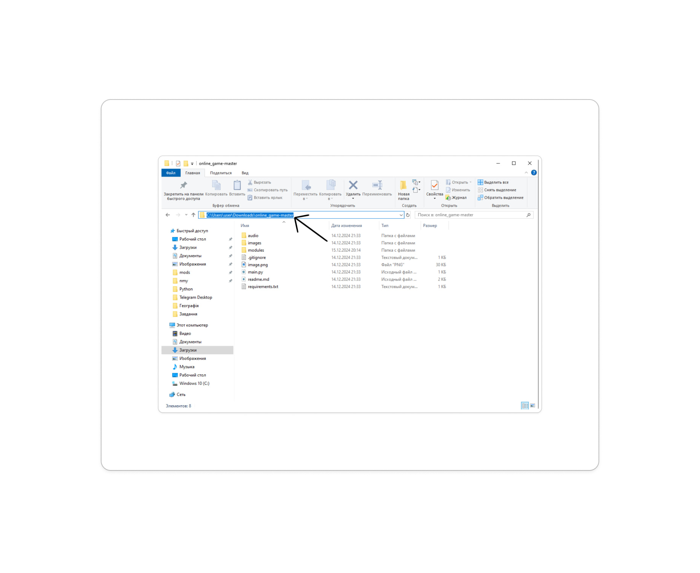

# Online game - Sea Battle

* [Ілля Епік / Illya Epik]
* [Денис Бондар / Denys Bondar]
* [Субач Максим / Subach Maksim]
* [Лебідь Ілля / Ilya Lebid]
* [Бобошко Ксюша/ Ksyusha Boboshko]

## Назва проекту: Онлайн гра морський бій/ name project: Online game sea battles

#### опис:
* Ця гра дозволяє грати у морський бій удвох на різних комп'ютерах.
##### description:
* This game allows two players to play the sea battles on different computers

#### модулі/modules:
+ pygame; модуль який дозволяе реалізувати саму гру / a module that enables game development.

+ pillow; модуль для роботи pygame / a module for working pygame
=======
+ random; вбудований модуль, який потрібен для генерації випадкових чисел / a built-in which used for generating random numbers.
+ os; вбудований модуль для пошуку абсолютного шляху / a built-in module for finding absolute paths
+ threading; вбудований модуль, який обробляє потоки для одночасних завдань / handles threads for concurrent tasks.
+ socket; вбудований модуль, який дозволяе реалізувати онлайн підключення / a built-in module for enabling online connections.

# інструкція для запуску:
1. Для початку потрібно встановити:
* Python останньої версії
- https://www.python.org/downloads/
2. Зайти на Git Hub
3. У репозиторії проекту натиснути зелену кнопку "Code"

4. Обрати "Завантажити ZIP"

* Для Windows
5. Перейти до завантаженого архіву та розархівувати його(Права кнопка миші -> "Витягнути до поточної папки".)
6. Зайти до розархівованої папки і скопіювати шлях:
- фото
7. Натиснути комбінацію Wind + R
8. Вписати у віконці:
- cmd
9. У терміналі прописати команду для переходу до файлу:
- cd <шлях>
10. Активувати гру зо допомогою команди:
- python main.py

* Для macOS
5. Перейти до завантаженого архіву та розархівувати його(двічі клацніть по архіву, щоб розпакувати його автоматично.)
6. Зайти до розпакованої папки і скопіювати її шлях:

7. Правою кнопкою миші на папку -> Оберіть "Get Info" -> Скопіюйте шлях у полі "Where".
8. Натисніть Command + Пробіл, введіть "Terminal" і натисніть Enter.
9. У терміналі прописати команду для переходу до файлу:
- cd <шлях>
10. Активувати гру зо допомогою команди:
- python3 main.py

## instructions for launch
1. First, you need to install:  
   * The latest version of Python  
   - [https://www.python.org/downloads/](https://www.python.org/downloads/)  
2. Go to GitHub.  
3. In the project repository, click the green "Code" button.  
     
4. Select "Download ZIP." 

* For Windows  
5. Navigate to the downloaded archive and extract it (Right-click -> "Extract to the current folder").  
6. Open the extracted folder and copy the path:  
    
7. Press the **Win + R** key combination.  
8. In the dialog box, enter:  
   **cmd**  
9. In the terminal, type the command:  
   **cd <path>** 
10. Then, type the command:  
   **python main.py** 

* For macOS  
5. Navigate to the downloaded archive and extract it (double-click the archive to unpack it automatically).  
6. Open the extracted folder and copy its path:  
   
7. Right-click on the folder -> Select "Get Info"-> Copy the path in the "Where" field.  
8. Press **Command + Space**, type "Terminal", and hit Enter.  
9. In the terminal, enter the command to navigate to the file:  
   **cd <path>**  
10. Launch the game using the command:  
   **python3 main.py**
   - 

# структура проекту / project structure:
* Перше вікно: введення IP-адреси/First window: IP address input
* Друге вікно: етап розташування кораблів/Second window: ship placement stage
* Третє вікно: етап битви/Third window: battle stage
* Четверте вікно: результат гри (програш чи перемога)/Fourth window: game result (lose or victory)

## повний опис файлів / a full description of files:
### Online_game/modules/main_window.py: створення головну екрану гри / create a main screen of game

```python
# імпортуємо модуль pygame
import pygame,threading
# ініціалізуємо pygame
pygame.init()
# імпортуємо наші модулі 
import modules.buttons as m_buttons
import modules.data as m_data
import modules.images
import modules.client as m_client
import modules.ships as m_ships
import modules.attack as m_attack
import modules.server as m_server
import modules.audio as m_audio


# 
class Screen():
    # ініціалізуємо screen
    def __init__(self):
        # создаємо таймер
        self.clock = pygame.time.Clock()
        # вказуємо ширину
        self.WIDTH= 1280
        # вказуємо висоту
        self.HEIGHT = 832
        # создаємо екран
        self.screen = pygame.display.set_mode(size= (self.WIDTH, self.HEIGHT))
        # задаємо назву нашому екрану
        pygame.display.set_caption('online game')
    # функція запуску
    def run(self):
        # задаємо правдиве значення грі
        game = True
        # цикл поки гра активна
        while game:
            # цикл всіх подій
            for event in pygame.event.get():
                # якщо вікно зачинено то 
                if event.type == pygame.QUIT:
                    # значення гри неправда
                    game = False
                    try:
                        # відключаємо клієнта
                        m_client.client.close()
                    except:
                        pass 
                # коли кнопка миші натиснута
                if event.type == pygame.MOUSEBUTTONDOWN:
                    if m_data.progression in "winlose":
                        m_buttons.revenge.button_start(event)
                        if m_buttons.out.button_start(event):
                            game = False
                            try:
                                # відключаємо клієнта
                                m_client.client.close()
                            except:
                                pass 
                    # якщо прогресс дорівнює меню то
                    if m_data.progression == "menu":
                        # вибір місця написання
                        m_buttons.input.activate(event) 
                        m_buttons.music.button_start(event)
                        # перехід в пре-гру етап
                        m_buttons.button_start.button_start(event)
                    # якщо прогресс дорівнює пре-грі то
                    if m_data.progression == "pre-game":
                        # преходить в гру
                        m_buttons.play.button_start(event)
                        # автоматична розтановка кораблів
                        m_buttons.auto.randomship(event.pos)
                        # поворот кораблів
                        m_buttons.rotate.button_start(event)
                        # цикл всіх кораблів
                        for ship in m_data.all_ships:
                            # виділення кораблів
                            ship.activate(event)
                    # якщо прогресс дорівнює грі то
                    if m_data.progression == "game":
                        # вибір місця атаки
                        m_attack.attack(event.pos)
                # якщо будь-яка клавіша натиснута то
                if event.type == pygame.KEYDOWN:
                    # додає символи до input
                    m_buttons.input.edit(event)
                    
                    
                    
            # цикл відображення всього що є в списку
            for sprite in m_data.list_blits[m_data.progression]:
                # відображення елементу
                sprite.blit(self.screen)
            if m_data.progression == "menu" and m_audio.track.stoped:
                pygame.draw.line(self.screen,(255,50,50),(42,115,),(120,43),10)
            # якщо знаходимось не в меню то
            if m_data.progression in "pre-game":
                # цикл для відображення всіх кораблів
                for ship in m_data.all_ships:
                    # саме відображення кораблів
                    ship.blit(self.screen)
                # for sprite in m_data.list_blits["game"]:
                #     if sprite.name in "miss, explosion":
                #         sprite.blit(self.screen)
            # оновлення екрану 
            pygame.display.flip()
            # фпс
            self.clock.tick(60)
# створення екземпляру классу
screen = Screen()
```


### Online_game/modules/attack.py: створення механіки атаки кораблів / 
```python
# імпортуємо необхідні модулі
import pygame 
import modules.data as m_data
import modules.images as m_images
import modules.client as m_client
import modules.audio as m_audio
# список клітинок без кораблів
list_miss = "05"
# список клітинок з кораблями
list_explosion = "1234"
# метод з атакою
def attack(pos: tuple):
    # створення глобальних змінних
    global list_miss, list_explosion
    # умова для повора кораблів
    # blits = True
    if m_data.turn:
        # цикл для ряду
        for row in range(10):
            # цикл для клітинки
            for cell in range(10):
                # створюємо хіт-бокс
                rect = pygame.Rect(725+55.7*cell, 
                                115+55.7*row,
                                55.7,
                                55.7)
                # перевірка на колізію
                if rect.collidepoint(pos):
                    image = m_images.Image(
                            progression = "game",
                            name = "",
                            x = 725+55.7*cell,
                            y = 115+55.7*row,
                            width= 55.7,
                            height=55.7
                    )
                    # for rows in m_data.enemy_field:
                    #     print(rows)
                    # 6 - explosion 7 - miss
                    # змінна ім'я зі значенням нічого
                    name = None
                    
                    
                    # умова для клітинок заповнених ворожими кораблями
                    if str(m_data.enemy_field[row][cell]) in list_explosion:
                        m_data.enemy_field[row][cell] = 6
                        # відправляє закодовані данні
                        image.name = 'explosion'
                        image.update_image()
                        m_data.list_explosions.append([image, row, cell])
                       
                        # import time
                        # time.sleep(0.1)
                        # відповідає за те яка клітинка створиться
                        name = "explosion"
                        # клітинка з вибухнувшим кораблем
                        # for ship in m_data.enemy_ships:
                        # список з клітинками в яких є кораблі

                        explosions = []
                        for row2 in m_data.enemy_field:
                            print(row2,'the best')
                        # цикл для ворожих кораблів
                        for ship in m_data.enemy_ships:
                            # перевіряє ворожий корабль
                            ship.check_enemy()
                            # список з клітинками кораблів
                            cells = []
                          
                            # цикл для додавання всіх клітинок корабля до cells
                            for count in range(int(ship.name)):
                                # якщо корабель стоїть горизонтально то
                                if ship.rotate %180 == 0 and m_data.enemy_field[ship.row][ship.cell+count] != int(ship.name[0]):
                                    # додається клітика
                                    cells.append([ship.row, ship.cell+count])
                                # інакше якщо корабель стоїть вертикалюно то
                                elif ship.rotate %180 != 0 and m_data.enemy_field[ship.row+count][ship.cell] != int(ship.name[0]):
                                    # додається клітинка
                                    cells.append([ship.row+count, ship.cell])
                            # 
                            if int(ship.name) == len(cells):
                                # 
                                # blits = False
                                for explosion in m_data.list_explosions:
                                    #
                                    for celll in cells:
                                        #
                                        if explosion[1] == celll[0] and explosion[2] == celll[1]:
                                            #
                                            explosions.append(explosion[0])
                        
                        for ex in explosions:
                            try:
                                #
                                # del m_data.list_blits['game'][ex]
                                m_data.list_blits['game'].remove(ex)
                                
                            except:
                                print('reoeroreoreoreooeroeroreeeeeeeeeeeeeeeeeeeeeeeeeeeeeeeee')
                                # pass
                    #
                    elif str(m_data.enemy_field[row][cell]) in list_miss:
                        #
                        m_data.enemy_field[row][cell] = 7
                        #
                        name = "miss"
                        image.name = 'miss'
                        image.update_image()
                        #
                        m_data.turn = False
                        #
                      
                    #
                    if name: 
                        m_client.send(f"attack:{row},{cell} {name}".encode())
                        #
                        
                        #
                        # if name == 'explosion':
                        #     #
                        #     print(image, row, cell)
                            
                            # m_audio.track.play()
                    # for ship in m_data.enemy_ships:
                        # перевіряє ворожий корабль
                        # ship.check_enemy()
    win_lose()
def win_lose():
    yes_no = True
    print(m_data.enemy_ships, 153)

    for ship in m_data.all_ships:
        if ship in m_data.enemy_ships:
            pass
        elif not ship.explosion:
            yes_no = False
    if yes_no and m_data.enemy_ships:
        m_data.progression = "lose"
        m_client.send("lose:".encode())
```


### Online_game/modules/buttons.py: створення необхідних кнопок для застосунку / 
```python
# імпорт чужих модулів для роботи
import pygame , socket
import threading, random
# імпорт наших модулів
import modules.audio as m_audio
from modules.images import Image
import modules.data as m_data
import modules.client as m_client 
import modules.server as m_server
from modules.ships import Ship,fill_field
# класс з кнопками
class Button(Image):
    # метод з створенням параметрів
    def __init__(self, fun = None, width = 100, height = 100, x= 0, y= 0, name = "", progression = "menu", text: str ="Button", size = 65):
        # задаємо параметри в класс зображень
        Image.__init__(self, width=width, height=height, x=x, y=y, name=name, progression=progression)
        # переносимо параметри в змінні
        self.WIDTH_BUT = width
        self.HEIGHT_BUT = height
        self.X = x
        self.Y = y
        self.function = fun
        self.TEXT = text  
        # створюємо параметри
        self.COLOR = (0, 0, 0)
        self.FONT = pygame.font.SysFont("OldEnglishText", size)
        self.rect = pygame.Rect(x,y,width,height)
    # метод з кнопкою старт
    def button_start(self, event):
        # якщо кнопка натиснута
        if self.rect.collidepoint(event.pos):
            # якщо функція корабль то
            if self.function == "ship":
                # цикл для всіх кораблів
                for ship in m_data.all_ships:
                    # якщо корабль виділен
                    if ship.select:
                        # поворот корабля   
                       ship.rotate_ship()
                        # виділення корабля
                       ship.select  = False
            elif self.function == "music":
                if m_audio.track.stoped:
                    m_audio.track.play()
                    # self.name = "music"
                else:
                    m_audio.track.stop()
                    # self.name = "music_off"
                # self.update_image()
            elif self.function == "win_lose":
                m_data.revenge = True
                m_data.progression = "pre-game"
                size_ship = "1"
                m_data.enemy_ships = []
                m_data.all_ships = []
                m_data.my_field = [
                    [0, 0, 0, 0, 0, 0, 0, 0, 0, 0],
                    [0, 0, 0, 0, 0, 0, 0, 0, 0, 0],
                    [0, 0, 0, 0, 0, 0, 0, 0, 0, 0],
                    [0, 0, 0, 0, 0, 0, 0, 0, 0, 0],
                    [0, 0, 0, 0, 0, 0, 0, 0, 0, 0],
                    [0, 0, 0, 0, 0, 0, 0, 0, 0, 0],
                    [0, 0, 0, 0, 0, 0, 0, 0, 0, 0],
                    [0, 0, 0, 0, 0, 0, 0, 0, 0, 0],
                    [0, 0, 0, 0, 0, 0, 0, 0, 0, 0],
                    [0, 0, 0, 0, 0, 0, 0, 0, 0, 0]
                ]

                # Створення списку, у якому зберігаеться усе поле ворога
                m_data.enemy_field = [
                    [0, 0, 0, 0, 0, 0, 0, 0, 0, 0],
                    [0, 0, 0, 0, 0, 0, 0, 0, 0, 0],
                    [0, 0, 0, 0, 0, 0, 0, 0, 0, 0],
                    [0, 0, 0, 0, 0, 0, 0, 0, 0, 0],
                    [0, 0, 0, 0, 0, 0, 0, 0, 0, 0],
                    [0, 0, 0, 0, 0, 0, 0, 0, 0, 0],
                    [0, 0, 0, 0, 0, 0, 0, 0, 0, 0],
                    [0, 0, 0, 0, 0, 0, 0, 0, 0, 0],
                    [0, 0, 0, 0, 0, 0, 0, 0, 0, 0],
                    [0, 0, 0, 0, 0, 0, 0, 0, 0, 0]
                ]
                m_data.turn = True
                # list_count = []
                m_data.list_blits["game"] = []
                m_data.list_explosions = []
                play_field = Image(width = 1280, height = 851, x = 0, y = 0, name = "play_field", progression = "game", edit = False)
                # for count in range(len(m_data.list_blits["game"])):
                #     if m_data.list_blits["game"][count].name in "miss, explosion":
                #         list_count += [count]
                # for count in range(len(list_count)):
                #     del m_data.list_blits["game"][list_count[-(count + 1)]]
                for count in range(10):
                    ship = Ship(x=59, y=115, name=size_ship)
                    ship.select = True
                    ship.place((684, 220))
                    ship.select = False
                    if count == 3:
                        size_ship = "2"
                    if count == 6:
                        size_ship = "3"
                    if count == 8:
                        size_ship = "4"
            elif self.function == "check":
                return True
            # інакше функція гра
            elif self.function == "play":

                # змінна да_ні дорівнює правді
                yes_no = True
                # цикл для стандартних клітинок
                for row in m_data.cells:
                    # цикл для клітинок в ряду
                    for cell in m_data.cells[row]:
                        # якщо кораблі не розставлені
                        if cell[0]:
                            # змінна да_ні змінюється на неправду 
                            yes_no =  False
                # якщо всі кораблі розставлені
                if yes_no:
                    # переходимо в гру
                    m_data.progression = "game"
                    print(m_data.my_field)
                    print('good')
                    if not m_data.revenge:
                        # активує клієнта одночасно з роботою кода
                        threading.Thread(target = m_client.activate).start()
                        print('asd')
                        # активує сервер
                        threading.Thread(target = m_server.activate,daemon=True).start()
                    else:
                        ships = "field:"
                        for ship in m_data.all_ships:
                            ships += f"{ship.name},{ship.row},{ship.cell},{ship.rotate} "
                        # визиваємо функцію для відправки даних на сервер
                        m_client.send(ships.encode())  
            else:
                # записання ip
                m_data.ip = input.TEXT.split(" ")[1]
                if m_data.ip == "":
                    m_data.ip = m_server.ip
                    
                # перехід в пре-гру"
                m_data.progression =  "pre-game"
                # if event.key == pygame.K_c:
                # for row in m_data.my_field:
                #     print(row)
    # метод відображення поверхні на головному окні
    def blit(self, screen):
        # якщо картинка задана 
        if self.name != "":
            # відображення картинки
            Image.blit(screen=screen, self = self)
        # задання розміру для тексту
        size = self.FONT.size(self.TEXT)
        # задаємо y для тексту
        y = self.y + self.height/2-size[1]/2
        # задаємо x для тексту
        x = self.x + self.width/2-size[0]/2
        # відображення тексту на екрані
        screen.blit(self.FONT.render(self.TEXT,True,(0,0,0)), (x, y))

# button = Button()
class Input(Image):
    def __init__(self, width: int, height: int,x = 0,y = 0, name = "", progression = "menu", color = (0,0,0), text = "ip: "):
        Image.__init__(self, width=width, height=height, x=x, y=y, name=name, progression=progression)
        self.COLOR = color
        self.FONT = pygame.font.SysFont("OldEnglishText", 65)
        self.TEXT = text 
        self.RENDER_TEXT = None
        self.enter = False
        self.edit("ok")
        self.rect = pygame.Rect(x,y,width,height)
        self.list = "0123456789."
    def blit(self, screen):
        Image.blit(screen=screen, self = self)
        size = self.FONT.size(self.TEXT)
        # кордината + половина высоты кнопки - половина высоты текста
        y = self.y + self.height/2 - size[1]/2
        x = self.x + self.width/2 - size[0]/2
        screen.blit(self.RENDER_TEXT, (x,y))
    def activate(self, event):
        if self.rect.collidepoint(event.pos):
            self.enter = True
        else:
            self.enter = False
        # print(self.enter)
    def edit(self,event):
        if self.enter:
            key = pygame.key.name(event.key)
            print(self.TEXT)
            if event.key == pygame.K_BACKSPACE and self.TEXT != "ip: ":
                
                # Убирает последний символ текста 
                self.TEXT = self.TEXT[:-1]
            elif key in self.list:
                # Добавляет символ который был нажат пользователем
                self.TEXT += key

        self.RENDER_TEXT = self.FONT.render(self.TEXT, True, self.COLOR)
class Auto(Image):
    def __init__(self, width: int, height: int, x: int, y: int, name='', progression: str = "pre-game"):
        super().__init__(width, height, x, y, name, progression)
        self.rect = pygame.Rect(x,y,width,height)
    def randomship(self, cor):
        # print("Hello")
        if self.rect.collidepoint(cor):
            count = 0
            count_ships = 0  
            m_data.my_field = [
                [0, 0, 0, 0, 0, 0, 0, 0, 0, 0],
                [0, 0, 0, 0, 0, 0, 0, 0, 0, 0],
                [0, 0, 0, 0, 0, 0, 0, 0, 0, 0],
                [0, 0, 0, 0, 0, 0, 0, 0, 0, 0],
                [0, 0, 0, 0, 0, 0, 0, 0, 0, 0],
                [0, 0, 0, 0, 0, 0, 0, 0, 0, 0],
                [0, 0, 0, 0, 0, 0, 0, 0, 0, 0],
                [0, 0, 0, 0, 0, 0, 0, 0, 0, 0],
                [0, 0, 0, 0, 0, 0, 0, 0, 0, 0],
                [0, 0, 0, 0, 0, 0, 0, 0, 0, 0]
            ]
            m_data.all_ships = []
            for row in m_data.cells:
                for cell in m_data.cells[row]:
                    cell[0] =  False
            # for ship in m_data.all_ships:
                
            while True:
                row = random.randint(0, 9)
                cell = random.randint(0, 9)
                rotate = random.randint(0, 4)
                count += 1
                if m_data.my_field[row][cell] ==  0:
                    ship = Ship(x = 59, y = 115, cell = cell, row = row, rotate = rotate * 90)
                    count_ships += 1
                    m_data.my_field[row][cell] = 1
                    fill_field(m_data.my_field)
                if count_ships == 4 or count > 1000:
                    break
                
            count_ships = 0
            while True:
                row = random.randint(0, 9)
                cell = random.randint(0, 9)
                rotate = random.randint(0, 4)
                count += 1
                try: 

                    if m_data.my_field[row][cell] == 0: 
                        if m_data.my_field[row][cell+1] == 0 and rotate % 2 == 0 or m_data.my_field[row+1][cell] == 0 and rotate % 2 == 1: 
                            ship = Ship(x = 59, y = 115, cell = cell, row = row, name= "2", rotate = rotate * 90)
                            count_ships += 1
                            fill_field(m_data.my_field)
                except:
                    pass
                if count_ships == 3 or count > 1000:
                    break

            count_ships = 0
            while True:
                row = random.randint(0, 9)
                cell = random.randint(0, 9)
                rotate = random.randint(0, 4)
                count += 1
                try:
                    if m_data.my_field[row][cell] == 0:
                        if m_data.my_field[row][cell+1] == 0 and rotate % 2 == 0 or m_data.my_field[row+1][cell] == 0 and rotate % 2 == 1:
                            if m_data.my_field[row][cell+2] == 0 and rotate % 2 == 0 or m_data.my_field[row+2][cell] == 0 and rotate % 2 == 1:
                                ship = Ship(x = 59, y = 115, cell = cell, row = row, name= "3", rotate= rotate * 90)
                                count_ships += 1
                                fill_field(m_data.my_field)
                except:
                    pass
                if count_ships == 2 or count > 1000:
                    break
            
            count_ships = 0
            while True:
                row = random.randint(0, 9)
                cell = random.randint(0, 9)
                rotate = random.randint(0, 4)
                count += 1
                try:
                    if m_data.my_field[row][cell] ==  0:
                        if m_data.my_field[row][cell+1] == 0 and rotate % 2 == 0 or m_data.my_field[row+1][cell] == 0 and rotate % 2 == 1:
                            if m_data.my_field[row][cell+2] == 0 and rotate % 2 == 0 or m_data.my_field[row+2][cell] == 0 and rotate % 2 == 1:
                                if m_data.my_field[row][cell+3] == 0 and rotate % 2 == 0 or m_data.my_field[row+3][cell] == 0 and rotate % 2 == 1:
                                    ship = Ship(x = 59, y = 115, cell = cell, row = row, name= "4", rotate= rotate * 90)
                                    count_ships += 1
                                    fill_field(m_data.my_field)
                except:
                    pass
                if count_ships == 1 or count > 1000:
                    for row1 in m_data.my_field:
                        print(row1)

                    break
            if count > 1000:
                self.randomship(cor)


input = Input(width = 551, height = 165, x = 366 , y = 531, name = "button_start")
button_start = Button(width = 402 , height = 120, x = 435, y = 343, name = "button_start", text= "Start Game")
hostname = socket.gethostname()
ip = socket.gethostbyname(hostname)
ip = Button(x = 981, y = 59, width = 281, height = 84, name = "button_start", text = ip, size = 50)
text_ip = Button(x = 981, y = 10, width = 281, height = 45, text = "user ip", size = 50)
m_data.list_blits["menu"].append(text_ip)
auto = Auto(width= 170, height= 58, x= 665, y= 610)
rotate = Button(fun= 'ship',  width = 225, height = 58, x= 886, y= 611, name = "", progression= "pre-game", text= "")
play = Button(x = 1000, y = 720, name = "", fun= 'play', width = 170, height = 60)
revenge = Button(height = 90, width = 372, x = 28, y = 600, text = "", progression = "win", fun= "win_lose")
out = Button(height = 80, width = 518, x = 0, y = 712, progression = "win", text = "", fun = "check")
music =Button(width = 76,height = 72,x = 42, y = 43, text = "", fun = "music", name =  "music")
m_data.list_blits["lose"].extend([revenge, out])
# m_data.list_blits["pre-game"].append(auto)
```

### Online_game/modules/ships.py: створення механік кораблів, грального поля 
```python
# імпортуємо файли
import modules.images as m_images
import modules.data as m_data
import modules.client as m_client

# імпортуємо модуль pygame
import pygame 

# создаемо з Кораблями
class Ship(m_images.Image):
    # Ініціалізація корабля, параметри координат, розміри та орієнтація
    def __init__(self, x: int, y: int, name='1', row=0, cell=0, field_cor=[59, 115], rotate=0, add=True):
        # Розміри корабля залежать від його імені (перший символ - це кількість клітин корабля)
        self.width = int(name[0]) * 50
        self.height = 50
        self.explosion = False
        # print(self.height)
        # Викликаємо конструктор батьківського класу (Image) для ініціалізації зображення
        super().__init__(self.width, self.height, x, y, name, "F", rotate)
        # Встановлюємо нові координати для корабля на полі
        self.x += (cell * 55.7)
        self.y += (row * 55.7)
        # Якщо корабель треба додати, додаємо його до загального списку кораблів
        if add:
            m_data.all_ships.append(self)
        # print(self.y)
        # Ініціалізація деяких змінних
        self.select = False  # Перевірка, чи вибрано корабель
        self.row = row
        self.cell = cell
        # Оновлюємо ігрове поле (записуємо розміри корабля)
        for count in range(int(name[0])):
            if rotate % 180 == 0:
                m_data.my_field[row][cell + count] = int(name[0])
            else:
                m_data.my_field[row + count][cell] = int(name[0])
        # Встановлюємо кордони корабля на полі
        self.field_cor = field_cor
        self.field = pygame.Rect(field_cor, (10 * 55.7, 10 * 55.7))
        self.rect = pygame.Rect(self.x, self.y, self.width, self.height)
        self.celled = None

    # Метод для перевірки, чи можна поставити корабель
    def check_enemy(self):
        yes_no = 0
        field = m_data.enemy_field
        cells = []
        for count in range(int(self.name[0])):
            # Перевіряємо горизонтальне або вертикальне розміщення корабля
            if self.rotate % 180 == 0 and m_data.enemy_field[self.row][self.cell + count] != int(self.name[0]):
                cells.append([self.row, self.cell + count])
                yes_no += 1
            elif self.rotate % 180 != 0 and m_data.enemy_field[self.row + count][self.cell] != int(self.name[0]):
                cells.append([self.row + count, self.cell])
                yes_no += 1
                
        # Якщо перевірка пройдена успішно, оновлюємо поле
        if yes_no == int(self.name[0]):
            if self in m_data.all_ships:
                pass
            else:
                self.explosion = True

                m_data.all_ships.append(self)
                
                m_client.send(f"explosion:{self.row},{self.cell}".encode())
                

                # print(cells)
                for celll in cells:
                    row = celll[0]
                    cell = celll[1]
                    # print(row, cell)
                    fill_field(field)
                    check(field=field, row=row + 1, cell=cell + 1, values=[5, 7])
                    check(field=field, row=row - 1, cell=cell - 1, values=[5, 7])
                    check(field=field, row=row - 1, cell=cell + 1, values=[5, 7])
                    check(field=field, row=row + 1, cell=cell - 1, values=[5, 7])
                    check(field=field, row=row + 1, cell=cell, values=[5, 7])
                    check(field=field, row=row, cell=cell + 1, values=[5, 7])
                    check(field=field, row=row - 1, cell=cell, values=[5, 7])
                    check(field=field, row=row, cell=cell - 1, values=[5, 7])

    # Метод активації корабля при натисканні
    def activate(self, event):
        if self.rect.collidepoint(event.pos):
            self.select = True
            self.name = self.name[0] + "_select"
            # print('eqw')
        else:
            self.place(event.pos)
            self.select = False
            self.name = self.name[0]
            #int(self.name[0]) => int(self.name[0])
        self.update_image()
    # Метод для обертання корабля
    def rotate_ship(self):
        # print(2132132312123123231213231)
        # Очищаємо місце для нового положення корабля на полі
        for count in range(int(self.name[0])):
            if self.rotate % 180 == 0:
                m_data.my_field[self.row][self.cell + count] = 0
            else:
                m_data.my_field[self.row + count][self.cell] = 0
        # Обираємо новий кут обертання
        self.rotate = self.rotate + 90
        fill_field(m_data.my_field)
        # Перевірка на можливість обертання корабля без зіткнень
        no_yes = True
        try:
            for count in range(int(self.name[0])):
                if self.rotate % 180 == 0:
                    if m_data.my_field[self.row][self.cell + count] != 0:
                        no_yes = False
                else:
                    if m_data.my_field[self.row + count][self.cell] != 0:
                        no_yes = False
        except:
            no_yes = False
        # Якщо обертання можливе, оновлюємо корабель
        if no_yes:
            self.update_image()
            if self.rotate % 180 == 0:
                self.rect = pygame.Rect(self.x, self.y, self.width, self.height)
            else:
                self.rect = pygame.Rect(self.x, self.y, self.height, self.width)
        else:
            self.rotate -= 90
        # Оновлюємо поле
        for count in range(int(self.name[0])):
            if self.rotate % 180 == 0:
                m_data.my_field[self.row][self.cell + count] = int(self.name[0])
            else:
                m_data.my_field[self.row + count][self.cell] = int(self.name[0])

    # Метод для зміщення корабля на нову позицію
    def place(self, pos):
        if self.select:
            # print(self.field.collidepoint(pos))
            for row in range(10):
                for cell in range(10):
                    yes_no = False
                    try:
                        yes_no_1 = True
                        for count in range(int(self.name[0])):
                            if self.rotate % 180 == 0:
                                if m_data.my_field[row][cell + count] != 0 and m_data.my_field[row][cell + count] != 5:
                                    yes_no_1 = False    
                            else:                                 
                                if m_data.my_field[row + count][cell] != 0 and m_data.my_field[row + count][cell] != 5:
                                    yes_no_1 = False   
                        if yes_no_1:
                            for count in range(int(self.name[0])):
                                if self.rotate % 180 == 0:
                                    m_data.my_field[self.row][self.cell + count] = 0
                                else:
                                    m_data.my_field[self.row + count][self.cell] = 0
                            fill_field(m_data.my_field)
                            for count in range(int(self.name[0])):
                                if self.rotate % 180 == 0:
                                    m_data.my_field[self.row][self.cell + count] = int(self.name[0])
                                else:
                                    m_data.my_field[self.row + count][self.cell] = int(self.name[0])
                            yes_no_1 = True
                            for count in range(int(self.name[0])):
                                if self.rotate % 180 == 0:
                                    if m_data.my_field[row][cell + count] != 0:
                                        yes_no_1 = False    
                                else:                                 
                                    if m_data.my_field[row + count][cell] != 0:
                                        yes_no_1 = False   
                            if yes_no_1:
                                yes_no = True
                            fill_field(m_data.my_field)
                    except:
                        print('errrrrrrrrrrrrrrrrrrrrrrrror')
                        # print("капибара")
                    if yes_no:
                        rect = pygame.Rect(
                            self.field_cor[0] + cell * 55.7,
                            self.field_cor[1] + row * 55.7,
                            55.7, 55.7)
                        if rect.collidepoint(pos):
                            print(m_data.cells,self.celled)
                            print()
                            for count in range(int(self.name[0])):
                                if self.rotate % 180 == 0:
                                    m_data.my_field[self.row][self.cell + count] = 0
                                else:
                                    m_data.my_field[self.row + count][self.cell] = 0
                            if self.celled != None:
                                m_data.cells[self.name[0]][self.celled][0] = False
                                self.celled = None
                            self.row = row
                            self.cell = cell
                            self.x = (cell * 55.7) + self.field_cor[0]
                            self.y = (row * 55.7) + self.field_cor[1]
                            self.rect = pygame.Rect(self.x, self.y, self.width, self.height)
                            for count in range(int(self.name[0])):
                                if self.rotate % 180 == 0:
                                    m_data.my_field[row][cell + count] = int(self.name[0])
                                else:
                                    m_data.my_field[row + count][cell] = int(self.name[0])
                            self.select = False
                            fill_field(m_data.my_field)
                            print(m_data.cells,self.celled)
                            return True
            count = 0
            for cell1 in m_data.cells[self.name[0]]:
                # print(cell1)
                if not cell1[0]:
                    cell1[0] = True
                    self.x = cell1[1][0]
                    self.y = cell1[1][1]
                    for count1 in range(int(self.name[0])):
                        if self.rotate % 180 == 0:
                            m_data.my_field[self.row][self.cell + count1] = 0
                        else:
                            m_data.my_field[self.row + count1][self.cell] = 0
                    # m_data.my_field[self.row][self.cell] = 0 
                    self.celled = count
                    self.rect = pygame.Rect(self.x, self.y, self.width, self.height)
                    for row in m_data.my_field:
                        print(row)      
                    break
                count += 1 
        fill_field(m_data.my_field)
        # print(m_data.cells)

        for row in m_data.my_field:
            print(row)
# Функція перевірки на полі для кожної клітинки
def check(field, row, cell, values=[0, 5]):
    if row != -1 and -1 != cell:
        if row != 10 and 10 != cell:
            # Перевірка значення в клітинці
            if field[row][cell] == values[0]:
                field[row][cell] = values[1]
                if values[1] == 7:
                    # print(11)
                    image = m_images.Image(
                        progression="game",
                        name="miss",
                        x=725 + 55.7 * cell,
                        y=115 + 55.7 * row,
                        width=55.7,
                        height=55.7
                    )
# Заповнюємо поле
def fill_field(field: list):
    clear_field(field)
    for row in range(10):
        for cell in range(10):
            cell_on_field = field[row][cell]
            if cell_on_field != 5 and cell_on_field != 0:
                check(field=field, row=row + 1, cell=cell + 1)
                check(field=field, row=row - 1, cell=cell - 1)
                check(field=field, row=row - 1, cell=cell + 1)
                check(field=field, row=row + 1, cell=cell - 1)
                
                check(field=field, row=row + 1, cell=cell)
                check(field=field, row=row, cell=cell + 1)
                check(field=field, row=row - 1, cell=cell)
                check(field=field, row=row, cell=cell - 1)
# Очищаємо поле від певних значень
def clear_field(field):
    for row in range(10):
        for cell in range(10):
            if field[row][cell] == 5:
                field[row][cell] = 0
# Створення кораблів та їх розміщення
size_ship = "1"
for count in range(10):
    ship = Ship(x=59, y=115, name=size_ship)
    ship.select = True
    ship.place((684, 220))
    ship.select = False
    if count == 3:
        size_ship = "2"
    if count == 6:
        size_ship = "3"
    if count == 8:
        size_ship = "4"

fill_field(m_data.my_field)
# Додаємо корабель на нову позицію
ship.place((1, 1))

```

### Online_game/modules/images.py:
```python
# імпортуємо модуль pygame , os
import pygame, os
#імпртуємо модуль modules.data як m_data
import modules.data as m_data
# клас для роботи з зображенням
class Image():
    # ініціалізуємо зображення
    def __init__(self, width: int, height: int, x: int, y: int, name = '', progression: str = "menu", rotate = 0, edit = True): 
        # переносимо параметри в змінні
        self.width = width
        self.height = height
        self.x = x
        self.y = y 
        self.name = name 
        self.progression = progression
        self.rotate = rotate
        # создаємо змінну self.image
        self.image = None 
        # вказуємо чи можемо ми редагувати зображення
        self.edit_image = edit
        # оновлюємо наше зображення
        self.update_image()
    # создаємо метод який оновлює наше зображення
    def update_image(self):
        try:
            # завантажуємо зображення з вказаного нам шляху
            self.image = pygame.image.load(os.path.abspath(f"{__file__}/../../images/{self.name}.png"))
            
            if self.edit_image:
                # змінюємо розмір зображення  
                self.image = pygame.transform.scale(self.image, (self.width, self.height))
                # повертаємо наше зображення 
                self.image = pygame.transform.rotate(self.image, self.rotate) 
            
            # пепевіряємо чи є наше зораження в  списку в якому все відображаться на екрані
            if self in m_data.list_blits[self.progression]:
                pass
            else:
                # ми додаємо в цей список наше зображення
                m_data.list_blits[self.progression].append(self)
        except:
            # якщо сталась помилка при завантаженні зображення - ми пишемемо її
            print("Error: image",self.name)
    # создаємо метод який відображє наше зображення
    def blit(self, screen):
        # відображаємо наше зображення
        screen.blit(self.image, (self.x, self.y))
    
# создаємо задній фон за меню
background = Image(width = 1280, height = 851, x = 0, y = 0, name = "background")
# создаємо фон для етапу розсташування кораблів
playing_field = Image(width = 1280, height = 832, x = 0, y = 0, name = "playing_field", progression = "pre-game")

right_ship = Image(width = 388, height = 318, x = 903, y = 243, name = "right_ship")
left_ship = Image(width = 381, height = 316, x = 10, y = 260, name = "left_ship")
hat = Image(width = 187, height = 150, x= 370, y = 252, name = "hat")
# создаємо фон для самої гри
play_field = Image(width = 1280, height = 851, x = 0, y = 0, name = "play_field", progression = "game", edit = False)
lose = Image(width = 1280, height = 851, x = 0, y = 0, name = "lose", progression = "lose", edit = False)
win = Image(width = 1280, height = 851, x = 0, y = 0, name = "win", progression = "win", edit = False)
```

### Online_game/modules/audio.py:
```python
# імпортуємо модулі pyagame і os
import pygame, os 
# ініцілізуємо звук
pygame.mixer.init()
# встановлємо гучність для відтворення музики
pygame.mixer.music.set_volume(0.5)
# створення класу для роботи з аудіо
class Audio():
    # ініцілізуємо клас аудіо 
    def __init__(self, name: str, loops: int = -1): 
        # создаємо 3 змінні: self.audio, self.name, self.loops
        self.audio = None 
        self.name = name 
        self.loops = loops
        self.stoped = True
    # метод для відтворення аудіо
    def play(self):
        try:
            # завантаження музику по вказаному шляху
            pygame.mixer.music.load(os.path.abspath(f"{__file__}/../../audio/{self.name}.mp3"))
            self.stoped = False
            # відтворюємо музику
            self.audio = pygame.mixer.music.play(loops= self.loops)
            print(self.audio)
        except:
            # якщо буде помилка при завантаженні, виводимо повідомлення про помилку
            print("Error: audio")
    def stop(self):
        pygame.mixer.music.stop()
        self.stoped = True
# pygame.mixer_music.load()
    
track = Audio('Soundtrack')
track.play()
# explosion = Audio('blas',0)

```

### Online_game/modules/data.py:
```python
# створення словника у якому містяться всі картинки для кожної стадії гри
list_blits = {
    "menu": [],
    "pre-game": [],
    "game": [],
    "lose": [],
    "win": []
}
# http://127.0.0.1/
# Створення змінної, у якій ми будемо задавати потрібний єтап ігри
progression = "menu"
# Створення змінної, у якій буде записуватись ip ворога
ip = None
# Створення списку, у якому будуть зберігатися усі данні ворога
enemy_data = []
# Створення списку, у якому будуть зберігатися данні про всі наші кораблі
all_ships = []
# Створення списку, у якому будуть зберігатися данні про всі кораблі ворога
enemy_ships = []
# Створення списку, у якому знаходяться всі данні про клітинки у яких відбувся вибух
list_explosions = []

# Створення списку, у якому зберігаеться усе поле гравця
my_field = [
    [0, 0, 0, 0, 0, 0, 0, 0, 0, 0],
    [0, 0, 0, 0, 0, 0, 0, 0, 0, 0],
    [0, 0, 0, 0, 0, 0, 0, 0, 0, 0],
    [0, 0, 0, 0, 0, 0, 0, 0, 0, 0],
    [0, 0, 0, 0, 0, 0, 0, 0, 0, 0],
    [0, 0, 0, 0, 0, 0, 0, 0, 0, 0],
    [0, 0, 0, 0, 0, 0, 0, 0, 0, 0],
    [0, 0, 0, 0, 0, 0, 0, 0, 0, 0],
    [0, 0, 0, 0, 0, 0, 0, 0, 0, 0],
    [0, 0, 0, 0, 0, 0, 0, 0, 0, 0]
]

# Створення списку, у якому зберігаеться усе поле ворога
enemy_field = [
    [0, 0, 0, 0, 0, 0, 0, 0, 0, 0],
    [0, 0, 0, 0, 0, 0, 0, 0, 0, 0],
    [0, 0, 0, 0, 0, 0, 0, 0, 0, 0],
    [0, 0, 0, 0, 0, 0, 0, 0, 0, 0],
    [0, 0, 0, 0, 0, 0, 0, 0, 0, 0],
    [0, 0, 0, 0, 0, 0, 0, 0, 0, 0],
    [0, 0, 0, 0, 0, 0, 0, 0, 0, 0],
    [0, 0, 0, 0, 0, 0, 0, 0, 0, 0],
    [0, 0, 0, 0, 0, 0, 0, 0, 0, 0],
    [0, 0, 0, 0, 0, 0, 0, 0, 0, 0]
]

# Створеня змінної, у якій ми говоримо треба чи ні повернути корабель
turn = True
revenge = False
# Створеня словника, у якому міститься стандартне розташування всіх кораблів
cells = {
    "1":[
        [False, [728, 450]],
        [False, [840, 450]],
        [False, [950, 450]],
        [False, [1060, 450]]
    ],
    "2":[
        [False, [680, 340]],
        [False, [840, 340]],
        [False, [1010, 340]]
    ],
    "3":[
        [False, [730, 228]],
        [False, [950, 228]]
    ],
    "4":[
        [False, [805, 120]]
    ]
}
```

### Online_game/modules/client.py:
```python
import modules.data as m_data 
import socket

# создамо функцію для відправкм даних на сервер
def send(data):
    # відправляємо дані серверу
    print(data)
    client.sendall(data)
client = socket.socket(family = socket.AF_INET, type = socket.SOCK_STREAM)
def activate():
    global client
    print('lod')
    try:
        # создаємо клієнта
        print('hello')
        print('hi')
        # шифруємо поле гри
        ships = "field:"
        for ship in m_data.all_ships:
            ships += f"{ship.name},{ship.row},{ship.cell},{ship.rotate} "
        print('just')
        # підключаємо кліента до сервера
        client.connect((m_data.ip, 8800))
        print("it is cool",m_data.ip)
        # визиваємо функцію для відправки даних на сервер
        send(ships.encode())
        print("it's cool")
    except:
        # переходимо до серверу
        print('hahhaahha')
        activate()
        
```

### Online_game/modules/server.py:
```python
# Імпортування необхідних модулей
import socket
import modules.data as m_data
import modules.ships as m_ships
import modules.images as m_images

# Повертае ім'я компьютера(хоста)
hostname = socket.gethostname()
# Повертає IP адрессу по імені хосту
ip = socket.gethostbyname(hostname)
# ip = "127.0.0.1"
# ip = '46.118.25.208'

# виводимо у терміналі статус нашого сервера
print(socket.SO_KEEPALIVE,'132123132321132132132')
# Створення функції що буде активувати під'єднання до серверу 
def activate():
    #  Створення серверного сокету
    with socket.socket(family = socket.AF_INET, type = socket.SOCK_STREAM) as server:
        # Повертае ім'я компьютера(хоста)
        hostname = socket.gethostname()
        # Повертає IP адрессу по імені хосту
        ip = socket.gethostbyname(hostname)
        #  Під'єдання сервера до вказаного IP та порту
        server.bind((f"{ip}", 8800))
        # Функція listen активує очікування підключення користувача
        server.listen()
        # Підтверджуємо з'єднання від клієнту
        client = server.accept()
        
        for coun in range(100):
            print(client[1],"katkit")
        print("Acept_Client")

        while True:
            
            # Отримання данних кліенту та декодування їх
            client_data = client[0].recv(1024).decode()
            print(client_data)
            # Перетворення даних на список розділяючи символом :
            data = client_data.split(":")
            # Якщо списку всіх даних перше значення field,
            if data[0] == "field":
                # то друге значення зі списку буде розділен за пробілами
                data = data[1].split(" ")
                # Для кожного корабля у списку всіх даних
                for ship in data:
                    # Розділення кожного корабля по комі
                    splited_data = ship.split(",")
                    # Якщо розділенні данні кораблів пусті,
                    if splited_data != [""]:
                        print('create ship')
                        print(splited_data)
                        # то створюеться екземпляр класу корабля з переданими параметрами
                        ship = m_ships.Ship(x = 724,y = 115,
                                    field_cor = (724,115),
                                    name  = splited_data[0],
                                    row = int(splited_data[1]),
                                    cell = int(splited_data[2]),
                                    rotate = int(splited_data[3]),
                                    add = False)
                        
                        # Для кожного корабля первірка
                        for count in range(int(ship.name[0])):
                            # Якщо корабль не було повернуто
                            if ship.rotate % 180 == 0:
                                # Додаємо його частини в поле противника по рядку
                                m_data.enemy_field[ship.row][ship.cell+count] = int(ship.name[0])
                            # Інакше
                            else:
                                # Додаємо його частини в поле противника по стовпцю
                                m_data.enemy_field[ship.row+count][ship.cell] = int(ship.name[0])
                        
                        # Додаємо корабель до списку кораблів противника
                        m_data.enemy_ships.append(ship)

                for row in m_data.enemy_field:
                    print(row)

            # Перевірка, чи отримана команда "attack"
            elif data[0] == "attack":
                print("attack_get")
                # Отримуємо позицію атаки
                pos = data[1].split(" ")[0].split(",")
                pos = [int(pos[0]), int(pos[1])]
                # Перевірка, чи атака була промахом
                if data[1].split(" ")[-1] == "miss":
                    # Передаємо хід гравцю
                    m_data.turn = True
                    # Позначаємо промах на полі
                    m_data.my_field[pos[0]][pos[1]] = 7
                # Інакше
                else:
                    # Позначаємо влучання на полі
                    m_data.my_field[pos[0]][pos[1]] = 6
                    # for ship in m_data.all_ships:
                    #     yes_no = 0
                    #     cells = []
                    #     if ship in m_data.enemy_ships:
                    #         pass
                    #     else:
                    #         for count in range(int(ship.name[0])):
                    #             # Перевіряємо горизонтальне або вертикальне розміщення корабля
                    #             if ship.rotate % 180 == 0 and m_data.my_field[ship.row][ship.cell + count] != int(ship.name[0]):
                    #                 cells.append([ship.row, ship.cell + count])
                    #                 yes_no += 1
                    #             elif ship.rotate % 180 != 0 and m_data.my_field[ship.row + count][ship.cell] != int(ship.name[0]):
                    #                 cells.append([ship.row + count, ship.cell])
                    #                 yes_no += 1
                    #         if yes_no == int(ship.name):
                    #             pass
                # Створюємо обект класа картинки, власне картинку, для відображення результату атаки
                image = m_images.Image(
                    progression = "game",
                    name = data[1].split(" ")[-1],
                    x = 59+55.7*pos[1],
                    y = 115+55.7*pos[0],
                    width= 55.7,
                    height=55.7
                )
            # Перевірка, чи відбувся вибух
            elif data[0] == "explosion":
                # Отримуємо позицію вибуху
                pos = data[1].split(",")
                print(pos)
                # try:
                if len(pos[0]) > 1:
                    pos[0] = pos[0][0]
                if len(pos[1]) > 1:
                    pos[1] = pos[1][0]
                pos = [int(pos[0]), int(pos[1])]
                # except:
                # Перебираемо всі кораблі
                for ship in m_data.all_ships:
                    # Якщо це корабль противника пропускаємо
                    if ship in m_data.enemy_ships:
                        pass
                    # Якщо координати вибуху збігаються з позицією корабля,
                    elif ship.row == pos[0] and ship.cell == pos[1]:
                        # то відбуваеться вибух
                        ship.explosion = True
                        
            

            # Якщо відбуваеться програш
            elif data[0] == "lose":
                # То стан гри змінюеться на виграш
                m_data.progression = "win"
            # Додаємо отримані дані від клієнта до списку даних противника
            m_data.enemy_data.append(client_data)
```
