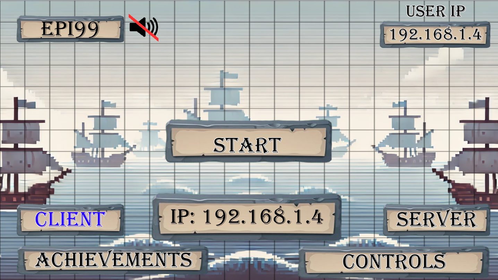
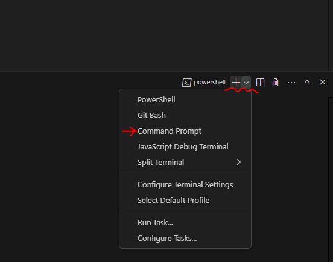
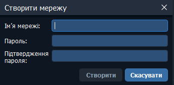
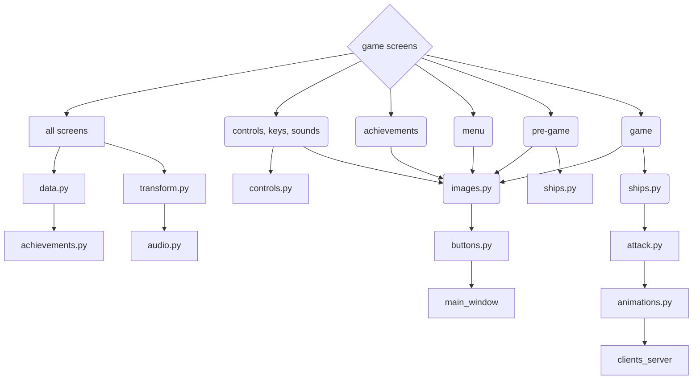

# **Online game - Sea Battle**

## Назва проекту: Онлайн гра морський бій / name project: Online game sea battles

### опис:
* Ця гра дозволяє грати у морський бій удвох на різних комп'ютерах.
#### description:
* This game allows two players to play the sea battles on different computers

### Структура readme:
### Organization readme:
---
- [Участники](#участники)

- [Mодулі](#модулі)

- [Iнструкція для запуску](#інструкція-для-запуску)

- [Структура проекту](#структура-проекту)

- [Повний опис файлів](#повний-опис-файлів)

---
- [Members](#members)
 
- [Modules](#modules)
  
- [Instructions for launch](#instructions-for-launch)
  
- [Project structure](#project-structure)

- [Full description of files](#full-description-of-files)

## Участники:
### Members:
* [Ілля Епік / Illya Epik](https://github.com/IllyaEpik/online_game.git)
* [Денис Бондар / Denys Bondar](https://github.com/DenysBondar1/online-game.git)
* [Субач Максим / Subach Maksim](https://github.com/MaxS2010/Online_sea_battle.git)
* [Лебідь Ілля / Ilya Lebid](https://github.com/SaberWQ/Ship-Fight)
* [Бобошко Ксюша/ Ksyusha Boboshko](https://github.com/Boboshko-Ksenia/Sea-Battle)

#### модулі:
##### modules:
+ pygame; модуль який дозволяє реалізувати саму гру / a module that enables game development.
+ pillow; модуль для роботи pygame / a module for working pygame
+ random; вбудований модуль, який потрібен для генерації випадкових чисел / a built-in which used for generating random numbers.
+ os; вбудований модуль для пошуку абсолютного шляху / a built-in module for finding absolute paths
+ threading; вбудований модуль, який обробляє потоки для одночасних завдань / handles threads for concurrent tasks.
+ socket; вбудований модуль, який дозволяє реалізувати онлайн підключення / a built-in module for enabling online connections.

## Інструкція для запуску:
1. Для початку потрібно встановити:
* [Python останньої версії](https://www.python.org/downloads/)
* [Застосунок для підключення по сеті](https://www.radmin-vpn.com/)

1. Зайти на Git Hub
2. У репозиторії проекту натиснути зелену кнопку "Code"
    
3. Обрати "Скопіювати посилання"

* Для Windows
5. Відкрити термінал 
6. Прописати команду для копіювання проекту з гіт хабу:
   - `git clone <посилання>`
7. Требя перейти до Comand Promt:
   * У відкритому терміналі натиснути на стрілочку біля плюсика(Дивитись нв скині)
   * Обрати Comand Promt
    
8. Після цього треба створити віртуальне оточення(У Command Prompt(cmd)):
    - `python -m venv venv`
9. Активувати віртуальне оточення(У Command Prompt(cmd)):
   - `cd venv/Scripts`
    - `.\activate.bat`
10.  Вести команду для завантаження необхідних модулів:
    - `pip install -r requirements.txt`
11.  Активувати гру за допомогою команди:
    - `python main.py`

* Для macOS
5. Відкрити термінал(Такуж послідовність дій можно виконати у терміналі Bash)
6. 
7. Прописати команду для копіювання проекту з гіт хабу:
    - `git clone <посилання>`
8. Після цього треба створити віртуальне оточення:
   - `python3 -m venv venv`
9. Активувати віртуальне оточення:
   - `source venv/bin/script`
10. Активувати віртуальне оточення для Bash на Windows:
   - `source venv/bin/script`
11.  Вести команду для завантаження необхідних модулів:
    - `pip3 install -r requirements.txt`
12.  Активувати гру за допомогою команди:
    - `python3 main.py`

### Для того щоб пограти:
* У режимі Lan:
1. У грі сервер(один з гравців) повідомляє інший свій IP та обирає роль сервера
2. Запускає обов'язково другий етап(обов'язково перший!)
3. Другий гравець вводить IP-сервер
4. Вдалої гри!

* По сеті:
1. Запускаємо застосунок Radmin VPN:
2. Натискаємо на кнопку:

3. Після цього один з гравців натискає:

4. Він має задати нобхідні данні і надати їх другому гравцю:

5. Другий має натиснути:

6. Та ввести дані, які були передані першим гравцем
7. Сервер(один з гравців) використовує інший свій IP з Radmin VPN та обирає роль сервера
8. Другий гравець вводити І.П
9. Вдалої гри!

### Instructions for launch
1. First, you need to install:  
* [The latest version of Python](https://www.python.org/downloads/)

* [Application for connecting over the network](https://www.radmin-vpn.com/)

1. Go to GitHub.  
2. In the project repository, click the green "Code" button.  
    
3. Select "Copy url to clipboard" 

* For Windows
5. Open the terminal
6. Enter the command to clone the project from GitHub:
    - `git clone <url>`
7. Switch to Command Prompt:
   * In the open terminal, click on the arrow next to the plus sign (See screenshot)
   * Select Command Prompt

8. Create a virtual environment (in Command Prompt (cmd)):
    - `python -m venv venv`
9. Activate the virtual environment (in Command Prompt (cmd)):
    - `cd venv/Scripts`
    - `.\activate.bat`
10. Enter the command to install the required modules:
    - `pip install -r requirements.txt`
11. Run the game using the command:
    - `python main.py`

* For macOS
5. Open the terminal (The same sequence of steps can be performed in the Bash terminal)
6. Enter the command to clone the project from GitHub:
    - `git clone <url>`
7. Create a virtual environment:
    - `python3 -m venv venv`
8. Activate the virtual environment:
    - `source venv/bin/script`
9. Activate the virtual environment for Bash on Windows:
    - `source venv/Scripts/script`
10. Enter the command to install the required modules:
    - `pip3 install -r requirements.txt`
11. Run the game using the command:
    - `python3 main.py`

### In order to play:
* In Lan mode:
1. In the game, the server (one of the players) tells the other his IP and chooses the role of the server
2. Launches the second stage (the first one!)
3. The second player enters the server IP
4. Have a good game!

* By network:
1. Launch the Radmin VPN application:
2. Click on the button:

3. After that, one of the players clicks:

4. He must enter the required data and provide it to the second player:

5. The second player must click:

6. And enter the data that was transferred by the first player
7. The server (one of the players) uses its other IP from Radmin VPN and chooses the server role
8. The second player enters the IP
9. Have a good game!

## Структура проекту:
### Project structure:
* Перше вікно: головне меню/First window: main menu
* Друге вікно: екран з налаштуваннями(Гарячі клавіші й музика) / Second window: Settings screen(Hot keys and music)
* Третє вікно: екран з досягненнями / Third window: achievement window
* Четверте вікно: етап розташування кораблів/ Fourth window: ship placement stage
* П'яте вікно: етап битви/ Fifth window: battle stage
* Шосте вікно: екран магазину / Sixth window: shop window
* Сьоме вікно: результат гри (програш чи перемога) / Seventh window: game result (lose or victory)

### Повний опис файлів:
#### Full description of files:

#### Online_game/modules/main_window.py: створення головну екрану гри:
Модуль `main_window.py` відповідає за створення та управління головним вікном гри, використовуючи бібліотеку Pygame. Він містить клас `Screen`, який ініціалізує вікно, встановлює його розміри, заголовок, іконку, а також обробляє події, такі як закриття вікна, натискання миші та клавіш.

## Функціональність

*   **Ініціалізація вікна:** Клас `Screen` ініціалізує вікно Pygame з розмірами, що становлять 75% від ширини та висоти екрана користувача. Вікно також отримує заголовок "online game" та іконку з файлу `images/icon.png`. Підтримується зміна розміру вікна (`pygame.RESIZABLE`).
*   **Обробка подій:** Модуль обробляє наступні події:
    *   `pygame.QUIT`: Закриття вікна. При цьому встановлюється прапорець `m_data.end` в `True` та відбувається спроба відключення клієнта (`m_client.client.close()`).
    *   `pygame.MOUSEBUTTONDOWN`: Натискання кнопки миші. Обробка натискань залежить від поточного стану гри (`m_data.progression`).
    *   `pygame.KEYDOWN`: Натискання клавіші. Використовується для введення тексту в меню, зміни керування та виконання дій в грі (наприклад, поворот корабля, атака).
    *   `pygame.KEYUP`: Відпускання клавіші. Використовується для відміни деяких дій в грі (наприклад, припинення вогню).
*   **Відображення елементів:** Модуль відповідає за відображення на екрані різних елементів гри, таких як спрайти, кнопки, текст, ефекти (вибухи, протиповітряна оборона), кораблі, ракети, а також елементи інтерфейсу (наприклад, інформація про чергу гравця, магазин). Позиціонування та масштабування елементів враховує поточні розміри вікна.
*   **Музичне керування:** Модуль дозволяє змінювати та зупиняти музичні треки за допомогою елементів керування, що відображаються на екрані.
*   **Досягнення:** Модуль відображає інформацію про досягнення гравця.
*   **Керування грою:** Залежно від стану гри (`m_data.progression`), модуль виконує різні дії, такі як:
    *   Розстановка кораблів перед початком гри (`pre-game`).
    *   Атака під час гри (`game`).
    *   Взаємодія з елементами меню (`menu`).
    *   Налаштування звуку (`sounds`).
    *   Налаштування клавіш керування (`keys`).
#### Online_game/modules/main_window.py: create the main game screen

* **Window initialization:** The `Screen` class initializes a Pygame window with dimensions that are 75% of the width and height of the user's screen. The window also gets the title "online game" and an icon from the `images/icon.png` file. Window resizing is supported (`pygame.RESIZABLE`).
* **Event handling:** The module handles the following events:
* `pygame.QUIT`: Closing the window. This sets the `m_data.end` flag to `True` and attempts to disconnect the client (`m_client.client.close()`).
* `pygame.MOUSEBUTTONDOWN`: Pressing a mouse button. The processing of presses depends on the current state of the game (`m_data.progression`).
* `pygame.KEYDOWN`: Pressing a key. Used to enter text in menus, change controls, and perform in-game actions (e.g., turn the ship, attack).
* `pygame.KEYUP`: Releasing a key. Used to cancel some actions in the game (e.g. ceasefire).
* **Display elements:** The module is responsible for displaying various game elements on the screen, such as sprites, buttons, text, effects (explosions, air defense), ships, missiles, as well as interface elements (e.g. information about the player's turn, store). Positioning and scaling of elements takes into account the current window size.
* **Music control:** The module allows you to change and stop music tracks using the controls displayed on the screen.
* **Achievements:** The module displays information about the player's achievements.
* **Game control:** Depending on the game state (`m_data.progression`), the module performs various actions, such as:
* Placing ships before the game starts (`pre-game`).
* Attacking during the game (`game`).
* Interacting with menu elements (`menu`).
* Configuring sound (`sounds`).
* Configuring control keys (`keys`).

#### Online_game/modules/attack.py: створення механіки атаки кораблів
## Функціональність

*   **Атака по клітинці (`attack_for_cell`):** Ця функція обробляє атаку на конкретну клітинку ворожого поля. Вона перевіряє, чи є влучання в корабель, створює анімації вибуху або промаху, оновлює стан ворожого поля (`m_data.enemy_field`), нараховує монети за влучання та додає досягнення. Також обробляється використання "вогненної ракети", яка завдає додаткової шкоди.
*   **Таймер радара (`timer_for_radar`):** Ця функція реалізує таймер для радара. Поки таймер активний (`m_data.time_for_radar > 0`), він відраховує секунди. Після закінчення часу, якщо не хід гравця (`not m_data.turn`), відправляється повідомлення "pass:" на сервер.
*   **Основна функція атаки (`attack`):** Ця функція обробляє різні типи атак (звичайна, ракета 3x3, лінійна ракета, самонавідна ракета, протиповітряна оборона). Вона перевіряє хід гравця (`m_data.turn`), підключення до сервера (`m_data.connected`), наявність запущених ракет (`not m_data.list_rockets`), обробляє витрату монет на зброю, викликає відповідні функції для кожного типу атаки та відправляє дані на сервер. Також обробляється ефект "Енергетик", який дає гравцю додатковий хід.

    *   **Атака самонавідною ракетою:** Вибирає випадковий корабель противника та випадкову клітинку на ньому для атаки.
    *   **Атака протиповітряною обороною:** Створює ефект протиповітряної оборони на своєму полі, який захищає від атак самонавідними ракетами в радіусі 5х5 клітинок.
    *   **Атака ракетою 3x3:** Атакує область 3x3 клітинки на ворожому полі.
    *   **Атака лінійною ракетою:** Атакує лінію клітинок на ворожому полі.
    *   **Атака радаром:** Показує область 5х5 клітинок на полі противника, виявляючи наявність кораблів.

*   **Функція вогню (`fire`):** Ця функція відповідає за розповсюдження вогню на власному полі гравця (`m_data.my_field`) після атаки "вогненною ракетою". Вона позначає клітинки, охоплені вогнем, та створює відповідні анімації.
*   **Перевірка перемоги/поразки (`win_lose`):** Ця функція перевіряє, чи всі кораблі противника знищені. Якщо так, встановлює стан гри на "win", нараховує досягнення та зберігає статистику. Також перевіряються умови для отримання інших досягнень, таких як "Total Domination", "Smells Like Victory", "Need More Gold!" і "Big Spender".
*   **Відправка даних на сервер:** Після кожної атаки або використання ефекту, модуль формує текстове повідомлення та відправляє його на сервер за допомогою `m_client.send()`. Повідомлення містить інформацію про тип атаки, координати цілі та результат атаки (влучання, промах).

## Використані змінні та структури даних

*   `list_miss`: Список клітинок без кораблів ("05").
*   `list_explosion`: Список клітинок з кораблями ("1234").
*   `attack_list`: Список допустимих для атаки клітинок ("012345").
*   `m_data.enemy_field`: Двовимірний список, що представляє поле противника.
*   `m_data.my_field`: Двовимірний список, що представляє поле гравця.
*   `m_data.enemy_ships`: Список об'єктів кораблів противника.
*   `m_data.my_buffs`: Список активних бафів гравця.
*   `m_data.buffs`: Список бафів на полі.
*   `m_data.list_explosions`: Список анімацій вибухів.
*   `m_data.list_rockets`: Список запущених ракет.
*   `m_data.attack`: Тип поточної атаки.
*   `m_data.turn`: Прапорець, що вказує, чи зараз хід гравця.
*   `m_data.connected`: Прапорець, що вказує, чи підключений гравець до сервера.
*   `m_data.coins`: Кількість монет гравця.
*   `m_data.cost_data`: Словник з вартістю різних типів зброї та бафів.
*   `m_data.list_Bought`: Словник, що зберігає інформацію про куплену зброю та бафи.
*   `m_data.time_for_radar`: час для радара.
*   `m_data.rect_for_radar`: поле для радара.
*   `m_data.list_for_radar`: список для радара.
*   `multiplier_x`, `multiplier_y`: Множники для масштабування елементів інтерфейсу.
*   `need_to_send`: Список повідомлень для відправки на сервер.

## Залежності

*   `pygame`
*   `random`
*   `time`
*   `threading`
*   `os`
*   Модулі проекту: `modules.data`, `modules.images`, `modules.buttons`, `modules.clients_server`, `modules.audio`, `modules.achievements`, `modules.transform`, `modules.animations`.

#### Online_game/modules/attack.py: creation of ship attack mechanics
## Функціональність

*   **Атака по клітинці (`attack_for_cell`):** Ця функція обробляє атаку на конкретну клітинку ворожого поля. Вона перевіряє, чи є влучання в корабель, створює анімації вибуху або промаху, оновлює стан ворожого поля (`m_data.enemy_field`), нараховує монети за влучання та додає досягнення. Також обробляється використання "вогненної ракети", яка завдає додаткової шкоди.
*   **Таймер радара (`timer_for_radar`):** Ця функція реалізує таймер для радара. Поки таймер активний (`m_data.time_for_radar > 0`), він відраховує секунди. Після закінчення часу, якщо не хід гравця (`not m_data.turn`), відправляється повідомлення "pass:" на сервер.
*   **Основна функція атаки (`attack`):** Ця функція обробляє різні типи атак (звичайна, ракета 3x3, лінійна ракета, самонавідна ракета, протиповітряна оборона). Вона перевіряє хід гравця (`m_data.turn`), підключення до сервера (`m_data.connected`), наявність запущених ракет (`not m_data.list_rockets`), обробляє витрату монет на зброю, викликає відповідні функції для кожного типу атаки та відправляє дані на сервер. Також обробляється ефект "Енергетик", який дає гравцю додатковий хід.

    *   **Атака самонавідною ракетою:** Вибирає випадковий корабель противника та випадкову клітинку на ньому для атаки.
    *   **Атака протиповітряною обороною:** Створює ефект протиповітряної оборони на своєму полі, який захищає від атак самонавідними ракетами в радіусі 5х5 клітинок.
    *   **Атака ракетою 3x3:** Атакує область 3x3 клітинки на ворожому полі.
    *   **Атака лінійною ракетою:** Атакує лінію клітинок на ворожому полі.
    *   **Атака радаром:** Показує область 5х5 клітинок на полі противника, виявляючи наявність кораблів.

*   **Функція вогню (`fire`):** Ця функція відповідає за розповсюдження вогню на власному полі гравця (`m_data.my_field`) після атаки "вогненною ракетою". Вона позначає клітинки, охоплені вогнем, та створює відповідні анімації.
*   **Перевірка перемоги/поразки (`win_lose`):** Ця функція перевіряє, чи всі кораблі противника знищені. Якщо так, встановлює стан гри на "win", нараховує досягнення та зберігає статистику. Також перевіряються умови для отримання інших досягнень, таких як "Total Domination", "Smells Like Victory", "Need More Gold!" і "Big Spender".
*   **Відправка даних на сервер:** Після кожної атаки або використання ефекту, модуль формує текстове повідомлення та відправляє його на сервер за допомогою `m_client.send()`. Повідомлення містить інформацію про тип атаки, координати цілі та результат атаки (влучання, промах).

## Використані змінні та структури даних

*   `list_miss`: Список клітинок без кораблів ("05").
*   `list_explosion`: Список клітинок з кораблями ("1234").
*   `attack_list`: Список допустимих для атаки клітинок ("012345").
*   `m_data.enemy_field`: Двовимірний список, що представляє поле противника.
*   `m_data.my_field`: Двовимірний список, що представляє поле гравця.
*   `m_data.enemy_ships`: Список об'єктів кораблів противника.
*   `m_data.my_buffs`: Список активних бафів гравця.
*   `m_data.buffs`: Список бафів на полі.
*   `m_data.list_explosions`: Список анімацій вибухів.
*   `m_data.list_rockets`: Список запущених ракет.
*   `m_data.attack`: Тип поточної атаки.
*   `m_data.turn`: Прапорець, що вказує, чи зараз хід гравця.
*   `m_data.connected`: Прапорець, що вказує, чи підключений гравець до сервера.
*   `m_data.coins`: Кількість монет гравця.
*   `m_data.cost_data`: Словник з вартістю різних типів зброї та бафів.
*   `m_data.list_Bought`: Словник, що зберігає інформацію про куплену зброю та бафи.
*   `m_data.time_for_radar`: час для радара.
*   `m_data.rect_for_radar`: поле для радара.
*   `m_data.list_for_radar`: список для радара.
*   `multiplier_x`, `multiplier_y`: Множники для масштабування елементів інтерфейсу.
*   `need_to_send`: Список повідомлень для відправки на сервер.

## Залежності

*   `pygame`
*   `random`
*   `time`
*   `threading`
*   `os`
*   Модулі проекту: `modules.data`, `modules.images`, `modules.buttons`, `modules.clients_server`, `modules.audio`, `modules.achievements`, `modules.transform`, `modules.animations`.

#### Online_game/modules/buttons.py: створення необхідних кнопок для застосунку
Цей файл містить класи та функції для створення інтерактивних елементів інтерфейсу користувача (UI) в грі "Морський бій", таких як кнопки, поля вводу та елементи для автоматичної розстановки кораблів.

## Класи

### `Button(Image)`

Клас `Button` успадковується від класу `Image` (код якого тут не надано, але він, ймовірно, відповідає за відображення зображень) та додає функціональність для обробки натискань миші та відображення тексту на кнопці.

*   **Конструктор `__init__`:**
    *   `fun`: Функція або дія, що виконується при натисканні кнопки. Може бути рядком, що містить команду (наприклад, `"c_s:client"`, `"change:game"`, `"weapons/weapon_type/weapon_name"`), або просто рядком, що ідентифікує дію.
    *   `width`, `height`, `x`, `y`: Розміри та позиція кнопки.
    *   `name`: Назва зображення кнопки (якщо є).
    *   `progression`: Екран, на якому відображається кнопка.
    *   `text`: Текст, що відображається на кнопці.
    *   `size`: Розмір шрифту тексту.
    *   `color`: Колір тексту.
    * `rotate`: кут повороту.

*   **Методи:**
    *   `activate(event)`: Перевіряє, чи курсор миші знаходиться над кнопкою.
    *   `button_start(event)`: Обробляє натискання кнопки та виконує відповідну дію на основі значення `self.function`. Обробляє режими клієнта/сервера, вибір корабля, керування музикою, перезапуск гри, покупки в магазині, відкриття/закриття екранів магазину, досягнень, налаштувань, запуск гри та вивід опису зброї/досягнення.
    *   `blit(screen, x, y, width, height, multiplier_x, multiplier_y)`: Відображає кнопку на екрані, враховуючи масштабування та центрування тексту.

### `Input(Image)`

Клас `Input` також успадковується від `Image` та створює поля вводу тексту.

*   **Конструктор `__init__`:**
    *   `width`, `height`, `x`, `y`: Розміри та позиція поля вводу.
    *   `name`: Назва зображення поля вводу (якщо є).
    *   `progression`: Екран, на якому відображається поле вводу.
    *   `color`: Колір тексту.
    *   `text`: Початковий текст у полі вводу.
    *   `list`: Рядок, що містить дозволені символи для вводу (наприклад, `"0123456789."` для IP-адреси або `"any"` для будь-яких символів).

*   **Методи:**
    *   `blit(screen, x, y, width, height, multiplier_x, multiplier_y)`: Відображає поле вводу на екрані та обробляє масштабування тексту.
    *   `activate(event)`: Перевіряє, чи курсор миші знаходиться в межах поля вводу, та встановлює прапорець `self.enter`, що дозволяє/забороняє введення тексту.
    *   `edit(event)`: Обробляє введення тексту з клавіатури, видалення символів та перевірку на дозволені символи.

### `Auto(Image)`

Клас `Auto` відповідає за автоматичну випадкову розстановку кораблів на ігровому полі.

*   **Конструктор `__init__`:**
    *   `width`, `height`, `x`, `y`: Розміри та позиція елемента.
    *   `name`: Назва зображення (якщо є).
    *   `progression`: Екран, на якому відображається елемент.

*   **Методи:**
    *   `blit(screen, x, y, width, height, multiplier_x, multiplier_y)`: Відображає елемент на екрані.
    *   `randomship(cor)`: Випадково розставляє кораблі на полі `m_data.my_field`, враховуючи їх розміри та обмеження. Використовує клас `Ship` (код якого не надано).

## Ініціалізація об'єктів UI

У файлі створюється велика кількість об'єктів класів `Button`, `Input` та `Auto` для різних екранів гри. Кожному об'єкту задаються параметри, такі як розмір, позиція, текст та функція, що виконується при натисканні. Створені об'єкти додаються до списків `m_data.list_blits` та `m_data.list_achievements_view`, які використовуються для відображення елементів на відповідних екранах.

## Залежності

Файл `buttons.py` залежить від наступних модулів:

*   `pygame`: Для роботи з графікою та подіями.
*   `socket`: Для отримання IP-адреси.
*   `getpass`: Для отримання імені користувача.
*   `random`: Для випадкової розстановки кораблів.
*   `modules.data`: Містить глобальні дані гри, такі як списки для відображення елементів, дані про кораблі, поле гри, налаштування та інше.
*   `modules.images`: Відповідає за відображення зображень.
*   `modules.buttons`: (Скоріш за все, циклічна залежність, можливо, варто переглянути структуру).
*   `modules.clients_server`: Для обробки мережевих операцій.
*   `modules.audio`: Для роботи зі звуком.
*   `modules.achievements`: Для обробки досягнень.
*   `modules.transform`: Для анімацій переходу між екранами.
*   `modules.animations`: Для інших анімацій.

## Використання

Цей файл є частиною гри "Морський бій" та не призначений для безпосереднього запуску. Він імпортується та використовується іншими модулями гри для створення та керування елементами інтерфейсу.

## Зауваження

*   Використання великої кількості глобальних змінних з `m_data` може ускладнити підтримку коду. Рекомендується використовувати класи та об'єкти для кращої організації.
*   Код містить деякі повторення, які можна оптимізувати за допомогою функцій або циклів.

#### Online_game/modules/buttons.py: сreation of necessary buttons for the application
This file contains classes and functions for creating interactive user interface (UI) elements in the game "Sea Battle", such as buttons, input fields, and elements for automatic ship placement.

## Classes

### `Button(Image)`

The `Button` class inherits from the `Image` class (the code for which is not provided here, but it is probably responsible for displaying images) and adds functionality for handling mouse clicks and displaying text on the button.

* **Constructor `__init__`:**
* `fun`: The function or action to be performed when the button is clicked. This can be a string containing a command (for example, `"c_s:client"`, `"change:game"`, `"weapons/weapon_type/weapon_name"`), or simply a string identifying the action.
* `width`, `height`, `x`, `y`: The dimensions and position of the button.
* `name`: The name of the button image (if any).
* `progression`: The screen on which the button is displayed.
* `text`: The text displayed on the button.
* `size`: The font size of the text.
* `color`: The color of the text.
* `rotate`: The rotation angle.

* **Methods:**
* `activate(event)`: Checks if the mouse cursor is over the button.
* `button_start(event)`: Handles a button press and performs the appropriate action based on the value of `self.function`. Handles client/server modes, ship selection, music control, game restart, shop purchases, opening/closing shop screens, achievements, settings, starting the game, and displaying weapon/achievement descriptions.
* `blit(screen, x, y, width, height, multiplier_x, multiplier_y)`: Displays the button on the screen, taking into account scaling and text centering.

### `Input(Image)`

The `Input` class also inherits from `Image` and creates text input fields.

* **Constructor `__init__`:**
* `width`, `height`, `x`, `y`: Dimensions and position of the input field.
* `name`: Name of the input field image (if any).
* `progression`: The screen on which the input field is displayed.
* `color`: The color of the text.
* `text`: The initial text in the input field.
* `list`: A string containing the characters allowed for input (e.g. `"0123456789."` for an IP address or `"any"` for any characters).

* **Methods:**
* `blit(screen, x, y, width, height, multiplier_x, multiplier_y)`: Displays the input field on the screen and handles text scaling.
* `activate(event)`: Checks if the mouse cursor is within the input field, and sets the `self.enter` flag, which allows/disallows text entry.
* `edit(event)`: Handles keyboard input, deleting characters, and checking for allowed characters.

### `Auto(Image)`

The `Auto` class is responsible for automatically randomizing ships on the playing field.

* **Constructor `__init__`:**
* `width`, `height`, `x`, `y`: Dimensions and position of the element.
* `name`: Name of the image (if any).
* `progression`: The screen on which the element is displayed.

* **Methods:**
* `blit(screen, x, y, width, height, multiplier_x, multiplier_y)`: Displays the element on the screen.
* `randomship(cor)`: Randomly places ships on the field `m_data.my_field`, given their sizes and constraints. Uses the `Ship` class (code not provided).

## Initializing UI objects

The file creates a large number of `Button`, `Input`, and `Auto` objects for various game screens. Each object is given parameters such as size, position, text, and the function to be performed when clicked. The created objects are added to the `m_data.list_blits` and `m_data.list_achievements_view` lists, which are used to display items on the corresponding screens.

## Dependencies

The `buttons.py` file depends on the following modules:

* `pygame`: For working with graphics and events.
* `socket`: For getting an IP address.
* `getpass`: For getting a username.
* `random`: For random ship placement.
* `modules.data`: Contains global game data, such as lists for displaying items, ship data, game board, settings, etc.
* `modules.images`: Responsible for displaying images.
* `modules.buttons`: (Most likely a cyclic dependency, maybe you should review the structure).
* `modules.clients_server`: For handling network operations.
* `modules.audio`: For working with sound.
* `modules.achievements`: For handling achievements.
* `modules.transform`: For animations of transitions between screens.
* `modules.animations`: For other animations.

## Usage

This file is part of the game "Sea Battle" and is not intended to be run directly. It is imported and used by other game modules to create and manage interface elements.

## Notes

* Using a large number of global variables with `m_data` can make the code difficult to maintain. It is recommended to use classes and objects for better organization.
* The code contains some repetition that can be optimized with functions or loops.
* 
#### Online_game/modules/ships.py: створення механік кораблів, грального поля

Цей файл відповідає за створення, розміщення, обертання та перевірку кораблів на ігровому полі в грі "Морський бій". Він містить клас `Ship` та допоміжні функції для керування станом поля.

## Клас `Ship(m_images.Image)`

Клас `Ship` успадковується від класу `Image` (з модуля `modules.images`) та представляє корабель на ігровому полі.

### Конструктор `__init__(self, x, y, name='1', row=0, cell=0, field_cor=[59, 115], rotate=0, add=True)`

*   `x`, `y`: Початкові координати корабля.
*   `name`: Назва корабля, де перший символ вказує на кількість клітинок (наприклад, "1", "2", "3", "4").
*   `row`, `cell`: Початкові координати корабля на ігровому полі (рядок та стовпець).
*   `field_cor`: Координати верхнього лівого кута ігрового поля.
*   `rotate`: Кут повороту корабля (0, 90, 180, 270).
*   `add`: Прапорець, що вказує, чи потрібно додавати корабель до списку `m_data.all_ships`.

Конструктор ініціалізує розміри корабля, викликає конструктор батьківського класу, встановлює координати на полі, додає корабель до списку `m_data.all_ships` (якщо `add` True), заповнює відповідні клітинки поля `m_data.my_field` значенням, що відповідає розміру корабля, та ініціалізує інші параметри корабля, такі як `select`, `row`, `cell`, `jump_cor`, `field_cor`, `field`, `rect` та `celled`.

### Методи

*   `check_enemy(self)`: Перевіряє, чи потрапив ворожий постріл у корабель. Оновлює поле `m_data.enemy_field` та додає інформацію про вибух до `m_attack.need_to_send` для відправки на сервер. Також викликає функцію `check` для позначення сусідніх клітинок як "промах".
*   `activate(self, event, multiplier_x=1, multiplier_y=1)`: Активує корабель при натисканні на нього мишею. Змінює стан `select` та назву корабля для візуального відображення виділення. Якщо корабель вже розміщено на полі, викликає метод `place` для переміщення корабля.
*   `rotate_ship(self)`: Обертає корабель на 90 градусів. Очищає старе положення корабля на полі, перевіряє можливість обертання без зіткнень з іншими кораблями або краями поля та оновлює положення корабля на полі `m_data.my_field` та його `rect`.
*   `place(self, pos, multiplier_x=1, multiplier_y=1)`: Розміщує або переміщує корабель на нову позицію на ігровому полі. Перевіряє, чи можливо розмістити корабель в заданій позиції, та оновлює координати корабля, його `rect` та поле `m_data.my_field`.

## Функції

*   `check(field, row, cell, values=[0, 5])`: Перевіряє задану клітинку на полі та встановлює значення `values[1]`, якщо значення клітинки дорівнює `values[0]`. Використовується для позначення сусідніх клітинок навколо корабля як "зайнятих" (значення 5) або для відображення промаху (значення 7 та створення зображення "miss").
*   `fill_field(field)`: Заповнює поле навколо розміщених кораблів значенням 5, щоб запобігти розміщенню кораблів впритул.
*   `clear_field(field)`: Очищує поле від значень 5 (позначає сусідні клітинки навколо кораблів).

## Ініціалізація кораблів

В кінці файлу відбувається ініціалізація кораблів різних розмірів та їх розміщення на полі. Створюються 10 кораблів: 4 однопалубні, 3 двопалубні, 2 трипалубні та 1 чотирипалубний.

## Залежності

*   `modules.images`: Для роботи з зображеннями.
*   `modules.data`: Містить глобальні дані гри, такі як поле гравця, список кораблів, список вибухів та інше.
*   `modules.clients_server`: Для мережевої взаємодії.
*   `modules.attack`: Для обробки атак.
*   `modules.achievements`: Для обробки досягнень.
*   `pygame`: Для роботи з графікою та подіями.
*   `random`: Для генерації випадкових чисел.

## Використання

Цей файл є частиною гри "Морський бій" та не призначений для безпосереднього запуску. Він імпортується та використовується іншими модулями гри для керування кораблями.

#### Online_game/modules/ships.py: development of mechanics for ships and the game field
This file is responsible for creating, placing, rotating, and checking ships on the playing field in the game "Sea Battle". It contains the `Ship` class and auxiliary functions for managing the state of the field.

## Class `Ship(m_images.Image)`

The `Ship` class inherits from the `Image` class (from the `modules.images` module) and represents a ship on the playing field.

### Constructor `__init__(self, x, y, name='1', row=0, cell=0, field_cor=[59, 115], rotate=0, add=True)`

* `x`, `y`: Initial coordinates of the ship.
* `name`: Name of the ship, where the first character indicates the number of cells (for example, "1", "2", "3", "4").
* `row`, `cell`: Initial coordinates of the ship on the playing field (row and column).
* `field_cor`: The coordinates of the upper left corner of the playing field.
* `rotate`: The angle of rotation of the ship (0, 90, 180, 270).
* `add`: A flag indicating whether to add the ship to the `m_data.all_ships` list.

The constructor initializes the ship's dimensions, calls the parent class's constructor, sets the coordinates on the field, adds the ship to the `m_data.all_ships` list (if `add` is True), fills the corresponding cells of the `m_data.my_field` field with a value corresponding to the ship's size, and initializes other ship parameters such as `select`, `row`, `cell`, `jump_cor`, `field_cor`, `field`, `rect`, and `celled`.

### Methods

* `check_enemy(self)`: Checks whether an enemy shot hit the ship. Updates the `m_data.enemy_field` field and adds the explosion information to `m_attack.need_to_send` to send to the server. Also calls the `check` function to mark the adjacent cells as "missed".
* `activate(self, event, multiplier_x=1, multiplier_y=1)`: Activates the ship when the mouse clicks on it. Changes the `select` state and the ship's name to visually display the selection. If the ship is already placed on the field, calls the `place` method to move the ship.
* `rotate_ship(self)`: Rotates the ship 90 degrees. Clears the old position of the ship on the field, checks if it can rotate without colliding with other ships or the edges of the field, and updates the ship's position on the `m_data.my_field` field and its `rect`.
* `place(self, pos, multiplier_x=1, multiplier_y=1)`: Places or moves a ship to a new position on the board. Checks if it is possible to place the ship at the given position, and updates the ship's coordinates, its `rect`, and the `m_data.my_field` field.

## Functions

* `check(field, row, cell, values=[0, 5])`: Checks the given cell on the board and sets the value `values[1]` if the cell's value is `values[0]`. Used to mark neighboring cells around the ship as "occupied" (value 5) or to display a miss (value 7 and create a "miss" image).
* `fill_field(field)`: Fills the field around placed ships with a value of 5 to prevent ships from being placed close together.
* `clear_field(field)`: Clears the field of values ​​5 (marks neighboring cells around the ships).

## Initializing ships

At the end of the file, ships of different sizes are initialized and placed on the field. 10 ships are created: 4 single-deck, 3 double-deck, 2 triple-deck and 1 quadruple-deck.

## Dependencies

* `modules.images`: For working with images.
* `modules.data`: Contains global game data, such as the player's field, ship list, explosion list, etc.
* `modules.clients_server`: For network interaction.
* `modules.attack`: For handling attacks.
* `modules.achievements`: For handling achievements.
* `pygame`: For working with graphics and events.
* `random`: For generating random numbers.

## Usage

This file is part of the game "Sea Battle" and is not intended to be run directly. It is imported and used by other game modules to control ships.

#### Online_game/modules/images.py: файл для роботи з зображеннями

Цей файл містить клас `Image`, який відповідає за завантаження, зміну розміру, поворот та відображення зображень у грі "Морський бій".

## Клас `Image()`

Клас `Image` забезпечує базову функціональність для роботи з графічними елементами.

### Конструктор `__init__(self, width, height, x, y, name='', progression="menu", rotate=0, edit=True)`

*   `width`: Ширина зображення.
*   `height`: Висота зображення.
*   `x`: Координата X лівого верхнього кута зображення.
*   `y`: Координата Y лівого верхнього кута зображення.
*   `name`: Назва файлу зображення (без розширення `.png`). Файл повинен знаходитись у папці `images` на рівень вище від поточного файлу.
*   `progression`: Назва екрану, до якого належить зображення. Використовується для організації відображення елементів на різних екранах гри.
*   `rotate`: Кут повороту зображення в градусах (0, 90, 180, 270 і т.д.).
*   `edit`: Прапорець, що вказує, чи потрібно змінювати розмір зображення. Якщо `False`, розмір зображення залишається оригінальним.

Конструктор ініціалізує атрибути об'єкта `Image`, завантажує зображення за допомогою методу `update_image()` та додає об'єкт до списку `m_data.list_blits[self.progression]`, який, ймовірно, використовується для зберігання списку елементів, що відображаються на кожному екрані.

### Методи

*   `update_image(self)`: Завантажує зображення з файлу, змінює його розмір (якщо `self.edit_image == True`) та повертає його. Обробляє помилки завантаження файлу. Використовує `os.path.abspath` для формування абсолютного шляху до файлу зображення, що робить код більш переносимим.
*   `blit(self, screen, x, y, width, height, multiplier_x, multiplier_y)`: Відображає зображення на заданому екрані (`screen`) за координатами `x`, `y` з заданими розмірами `width`, `height`. Враховує поворот зображення та масштабування. Цей метод оптимізовано для запобігання зайвому перевантаженню зображень: зображення перевантажується лише тоді, коли змінюється його назва, розмір або кут повороту.

## Створення об'єктів `Image`

В кінці файлу створюються екземпляри класу `Image` для різних елементів інтерфейсу гри, таких як:

*   `background`: Фон головного меню.
*   `background_shop`: Фон магазину.
*   `background_achievements`: Фон екрану досягнень.
*   `background_keys`: Фон екрану налаштувань клавіш.
*   `background_sounds`: Фон екрану налаштувань звуку.
*   `playing_field`: Фон екрану підготовки до гри.
*   `play_field`: Фон ігрового поля під час гри.
*   `lose`: Фон екрану програшу.
*   `win`: Фон екрану перемоги.
*   `air_defence`: Зображення протиповітряної оборони.
*   `target`: Зображення мішені.

Для кожного об'єкта задаються відповідні параметри, такі як розмір, позиція, назва файлу зображення та екран, на якому він відображається.

## Залежності

*   `pygame`: Для роботи з графікою.
*   `os`: Для роботи з файловою системою.
*   `modules.data`: Для доступу до глобальних даних гри, зокрема списку елементів для відображення (`m_data.list_blits`).
*   `modules.main_window`: Для доступу до об'єкта головного вікна гри.

## Використання

Цей файл є частиною гри "Морський бій" та не призначений для безпосереднього запуску. Він імпортується та використовується іншими модулями гри для відображення графічних елементів.

## Пояснення для інших

Цей модуль відповідає за відображення всіх картинок в грі. Він має клас `Image`, який приймає розміри, координати, назву файлу картинки, екран, на якому вона має відображатись, та кут повороту.

Коли створюється новий об'єкт `Image`, він завантажує відповідну картинку з папки `images`, змінює її розмір, якщо потрібно, та додає до списку елементів, які потрібно відобразити на відповідному екрані.

Метод `blit` відповідає за безпосереднє відображення картинки на екрані. Він оптимізований таким чином, щоб картинка перевантажувалась лише тоді, коли це необхідно (наприклад, при зміні розміру або повороту).

Таким чином, цей модуль забезпечує зручний та ефективний спосіб керування та відображення графічних елементів у грі.

#### Online_game/modules/images.py: file for working with images
This file contains the `Image` class, which is responsible for loading, resizing, rotating, and displaying images in the game "Sea Battle".

## class `Image()` 

The `Image` class provides basic functionality for working with graphic elements.

### Constructor `__init__(self, width, height, x, y, name='', progression="menu", rotate=0, edit=True)`

* `width`: Width of the image.
* `height`: Height of the image.
* `x`: X coordinate of the upper left corner of the image.
* `y`: Y coordinate of the upper left corner of the image.
* `name`: Name of the image file (without `.png` extension). The file must be located in the `images` folder one level above the current file.
* `progression`: Name of the screen to which the image belongs. Used to organize the display of elements on different screens of the game.
* `rotate`: The angle to rotate the image in degrees (0, 90, 180, 270, etc.).
* `edit`: A flag indicating whether to resize the image. If `False`, the image size remains the original size.

The constructor initializes the attributes of the `Image` object, loads the image using the `update_image()` method, and adds the object to the `m_data.list_blits[self.progression]` list, which is probably used to store the list of items displayed on each screen.

### Methods

* `update_image(self)`: Loads an image from a file, resizes it (if `self.edit_image == True`), and returns it. Handles file upload errors. Uses `os.path.abspath` to form an absolute path to the image file, making the code more portable.
* `blit(self, screen, x, y, width, height, multiplier_x, multiplier_y)`: Displays an image on the given screen (`screen`) at the coordinates `x`, `y` with the given dimensions `width`, `height`. Takes into account image rotation and scaling. This method is optimized to prevent unnecessary image overloading: the image is reloaded only when its name, size, or rotation angle changes.

## Creating `Image` objects

At the end of the file, instances of the `Image` class are created for various elements of the game interface, such as:

* `background`: The background of the main menu.
* `background_shop`: The background of the shop.
* `background_achievements`: The background of the achievements screen.
* `background_keys`: The background of the key settings screen.
* `background_sounds`: The background of the sound settings screen.
* `playing_field`: The background of the game preparation screen.
* `play_field`: The background of the playing field during the game.
* `lose`: Background for the losing screen.
* `win`: Background for the winning screen.
* `air_defence`: Air defense image.
* `target`: Target image.

For each object, the appropriate parameters are set, such as size, position, image file name and the screen on which it is displayed.

## Dependencies

* `pygame`: For working with graphics.
* `os`: For working with the file system.
* `modules.data`: For accessing global game data, in particular the list of items to display (`m_data.list_blits`).
* `modules.main_window`: For accessing the main game window object.

## Usage

This file is part of the game "Sea Battle" and is not intended to be run directly. It is imported and used by other game modules to display graphic elements.

## Explanation for others

This module is responsible for displaying all images in the game. It has an `Image` class that takes the dimensions, coordinates, file name of the image, the screen it should be displayed on, and the rotation angle.

When a new `Image` object is created, it loads the appropriate image from the `images` folder, resizes it if necessary, and adds it to the list of items to be displayed on the appropriate screen.

The `blit` method is responsible for directly displaying the image on the screen. It is optimized so that the image is reloaded only when necessary (for example, when resizing or rotating).

Thus, this module provides a convenient and efficient way to manage and display graphical elements in the game.
#### Online_game/modules/audio.py: файл для роботи зі звуком
# audio.py: Керування аудіо в грі "Морський бій"

Цей файл містить клас `Audio`, який відповідає за відтворення звуків та музики в грі "Морський бій".

## Клас `Audio()`

Клас `Audio` інкапсулює функціональність для роботи з аудіофайлами.

### Конструктор `__init__(self, name, loops=-1, volume=0.5, max_time="any")`

*   `name`: Назва аудіофайлу (без розширення `.mp3`). Файл повинен знаходитись у папці `audio` на рівень вище від поточного файлу.
*   `loops`: Кількість повторень відтворення аудіо. `-1` означає нескінченне повторення (для музики). `0` означає відтворення один раз (для звукових ефектів).
*   `volume`: Гучність відтворення (від 0.0 до 1.0).
*   `max_time`: Максимальна тривалість відтворення аудіо (не використовується в даному коді).

Конструктор створює об'єкт `pygame.mixer.Sound` для заданого аудіофайлу, встановлює гучність та зберігає параметри в атрибутах об'єкта `Audio`.

### Методи

*   `volume(self, volume)`: Встановлює гучність відтворення аудіо. Якщо аудіо є саундтреком (містить `"Soundtracks"` в назві), гучність регулюється з урахуванням глобальних змінних `main_volume` та `soundtrack`.
*   `play(self, volume=None)`: Відтворює аудіо. Якщо передано аргумент `volume`, встановлює відповідну гучність. Інакше, використовує гучність, задану в конструкторі, або регулює її з урахуванням глобальних змінних для саундтреків.
*   `stop(self)`: Зупиняє відтворення аудіо.

## Ініціалізація аудіо

В файлі також відбувається ініціалізація різних аудіоефектів та музики:

*   Ініціалізується мікшер Pygame (`pygame.mixer.init()`).
*   Зчитується та встановлюється глобальна гучність `main_volume` з файлу `volume.txt`. Якщо файл відсутній або містить некоректні дані, створюється новий файл зі значенням гучності за замовчуванням (0.5).
*   Створюються об'єкти `Audio` для різних звукових ефектів:
    *   `achievement`: Звук отримання досягнення.
    *   `radar`: Звук радара.
    *   `track`: Саундтрек (вибирається на основі значення, збереженого у файлі `music.txt`).
    *   `buying`: Звук покупки.
    *   `explosion`: Звук вибуху.
*   Якщо в налаштуваннях гри звук увімкнено (`m_data.read_data["sound"] != "False"`), починається відтворення саундтреку.

## Глобальні змінні

*   `main_volume`: Глобальна гучність для всіх звуків.
*   `soundtrack`: Гучність для саундтреків (використовується разом з `main_volume`).
* `list_audio`: Список для збереження аудіо (не використовується).

## Залежності

*   `pygame`: Для роботи з аудіо.
*   `os`: Для роботи з файловою системою.
*   `modules.data`: Для доступу до глобальних даних гри, таких як шлях до файлів та налаштування звуку.

## Використання

Цей файл є частиною гри "Морський бій" та не призначений для безпосереднього запуску. Він імпортується та використовується іншими модулями гри для відтворення звуків та музики.

## Пояснення для інших

Цей модуль відповідає за відтворення звуків та музики в грі. Він використовує бібліотеку Pygame для цього.

Клас `Audio` дозволяє створювати об'єкти, які представляють окремі звукові файли. При створенні об'єкта задається назва файлу, кількість повторень відтворення та гучність.

Метод `play` відтворює звук, а метод `stop` зупиняє його.

В файлі також задаються різні звукові ефекти та музика для гри, такі як звук вибуху, звук отримання досягнення та фонова музика. Гучність звуків можна налаштувати.

Таким чином, цей модуль забезпечує простий спосіб додавання та керування звуковими ефектами та музикою в грі.

#### Online_game/modules/audio.py: file for working with sound
# audio.py: Audio control in the game "Sea Battle"

This file contains the `Audio` class, which is responsible for playing sounds and music in the game "Sea Battle".

## `Audio()` class

The `Audio` class encapsulates the functionality for working with audio files.

### Constructor `__init__(self, name, loops=-1, volume=0.5, max_time="any")`

* `name`: The name of the audio file (without the `.mp3` extension). The file must be located in the `audio` folder one level above the current file.
* `loops`: The number of times the audio will be played. `-1` means infinite looping (for music). `0` means playing once (for sound effects).
* `volume`: The volume of the playback (from 0.0 to 1.0).
* `max_time`: The maximum duration of audio playback (not used in this code).

The constructor creates a `pygame.mixer.Sound` object for the given audio file, sets the volume, and stores the parameters in the `Audio` object's attributes.

### Methods

* `volume(self, volume)`: Sets the volume of the audio playback. If the audio is a soundtrack (containing `"Soundtracks"` in the name), the volume is adjusted based on the `main_volume` and `soundtrack` global variables.
* `play(self, volume=None)`: Plays the audio. If the `volume` argument is passed, sets the appropriate volume. Otherwise, uses the volume specified in the constructor or adjusts it based on the global variables for soundtracks.
* `stop(self)`: Stops the audio playback.

## Audio initialization

The file also initializes various audio effects and music:

* Initializes the Pygame mixer (`pygame.mixer.init()`).
* Reads and sets the global volume `main_volume` from the file `volume.txt`. If the file is missing or contains invalid data, a new file is created with the default volume value (0.5).
* Creates `Audio` objects for various sound effects:
* `achievement`: Achievement sound.
* `radar`: Radar sound.
* `track`: Sound track (selected based on the value stored in the `music.txt` file).
* `buying`: Buying sound.
* `explosion`: Explosion sound.
* If sound is enabled in the game settings (`m_data.read_data["sound"] != "False"`), the soundtrack starts playing.

## Global variables

* `main_volume`: Global volume for all sounds.
* `soundtrack`: Volume for soundtracks (used in conjunction with `main_volume`).
* `list_audio`: List to save audio (not used).

## Dependencies

* `pygame`: For working with audio.

* `os`: For working with the file system.

* `modules.data`: For accessing global game data, such as file paths and sound settings.

## Usage

This file is part of the game "Sea Battle" and is not intended to be run directly. It is imported and used by other game modules to play sounds and music.

## Explanation for others

This module is responsible for playing sounds and music in the game. It uses the Pygame library for this.

The `Audio` class allows you to create objects that represent individual sound files. When creating an object, you specify the file name, the number of times it will be played, and the volume.

The `play` method plays the sound, and the `stop` method stops it.

The file also specifies various sound effects and music for the game, such as the explosion sound, the achievement sound, and the background music. The volume of the sounds can be adjusted.

Thus, this module provides an easy way to add and control sound effects and music in the game.

#### Online_game/modules/data.py: файл у якому зберігається змінні
Цей файл містить різні дані та налаштування, що використовуються в грі "Морський бій". Він також забезпечує функції для читання та збереження цих даних.

## Словники з даними

Файл містить кілька словників для зберігання різних типів даних:

*   `read_data`: Містить загальні налаштування гри, такі як звуки, перемоги, поразки тощо.
*   `cost_data`: Містить ціни на різні види зброї та покращення.
*   `weapon_data`: Містить описи зброї та покращень.
*   `achievements_data`: Містить інформацію про досягнення в грі, включаючи назву, опис, прогрес та рівень.
*   `list_blits`: Містить порожні списки для зберігання графічних елементів різних екранів гри (меню, налаштування, гра тощо).
*   `cells`: Містить координати розташування кораблів на полі для стандартного розміщення.

## Інші змінні

Файл також містить інші змінні для відстеження стану гри, такі як:

*   `select_weapon`: Вибрана зброя.
*   `attack`: Чи атакує гравець зараз.
*   `time_for_radar`: Час дії радара.
*   `rect_for_radar`: Прямокутник для візуалізації радара.
*   `coins`: Кількість ігрових монет у гравця.
*   `list_achievements`: Список отриманих досягнень.
*   `list_animations`: Список анімацій.
*   `list_for_radar`: Список клітинок, виявлених радаром.
*   `buffs`: Активні покращення.
*   `list_Bought`: Чи придбав гравець певний вид зброї/покращення.
*   `list_rockets`: Список ракет на полі.
*   `my_buffs`: Активні покращення гравця.
*   `progression`: Поточний екран гри.
*   `fire_attack`: Чи використовується вогняна атака.
*   `ip`: IP-адреса опонента.
*   `enemy_data`: Дані опонента.
*   `all_ships`: Список усіх кораблів на полі (гравець і опонент).
*   `enemy_ships`: Список кораблів опонента.
*   `list_explosions`: Список клітинок з вибухами.
*   `end`: Чи закінчилась гра.
*   `connected`: Чи підключено до гри.
*   `enemy_nickname`: Нікнейм опонента.
*   `my_field`: Ігрове поле гравця.
*   `enemy_field`: Ігрове поле опонента.
*   `turn`: Чия черга зараз (гравця чи опонента).
*   `client_server`: Чи є гравець клієнтом або сервером.
*   `revenge`: Чи гра реванш.

## Функції

*   `reading_data(dict, filename)`: Ця функція читає дані з файлу та зберігає їх у словнику. Вона також створює файл із заздалегідь визначеними значеннями, якщо він не існує.

## Висновок

Цей файл є центральним місцем зберігання даних гри "Морський бій". Він забезпечує структурований спосіб зберігання та доступу до різних налаштувань, описів та стану гри.
#### Online_game/modules/data.py: file for storing variables
This file contains various data and settings used in the game "Sea Battle". It also provides functions to read and save this data.

## Data Dictionaries

The file contains several dictionaries to store different types of data:

* `read_data`: Contains general game settings such as sounds, wins, losses, etc.
* `cost_data`: Contains prices for various weapons and upgrades.
* `weapon_data`: Contains descriptions of weapons and upgrades.
* `achievements_data`: Contains information about achievements in the game, including name, description, progress, and level.
* `list_blits`: Contains empty lists to store graphical elements of various game screens (menu, settings, game, etc.).
* `cells`: Contains coordinates of ships on the field for standard placement.

## Other variables

The file also contains other variables to track game state, such as:

* `select_weapon`: Selected weapon.
* `attack`: Whether the player is currently attacking.
* `time_for_radar`: Radar duration.
* `rect_for_radar`: Radar visualization rectangle.
* `coins`: Number of game coins the player has.
* `list_achievements`: List of achievements.
* `list_animations`: List of animations.
* `list_for_radar`: List of cells detected by the radar.
* `buffs`: Active upgrades.
* `list_Bought`: Whether the player has purchased a certain type of weapon/upgrade.
* `list_rockets`: List of rockets on the field.
* `my_buffs`: Active upgrades of the player.
* `progression`: Current game screen.
* `fire_attack`: Whether a fire attack is used.
* `ip`: Opponent's IP address.
* `enemy_data`: Opponent's data.
* `all_ships`: List of all ships on the field (player and opponent).
* `enemy_ships`: List of opponent ships.
* `list_explosions`: List of cells with explosions.
* `end`: Whether the game is over.
* `connected`: Whether connected to the game.
* `enemy_nickname`: Opponent's nickname.
* `my_field`: Player's playing field.
* `enemy_field`: Opponent's playing field.
* `turn`: Whose turn is it now (player or opponent).
* `client_server`: Whether the player is a client or a server.
* `revenge`: Whether the game is a revenge game.

## Functions

* `reading_data(dict, filename)`: This function reads data from a file and stores it in a dictionary. It also creates a file with predefined values ​​if it does not exist.

## Conclusion

This file is the central data storage location for the Sea Battle game. It provides a structured way to store and access various settings, descriptions, and game state.

#### Online_game/modules/clients_server.py: файл який відповідає за роботу клієнту та серверу для гри по мережі
Цей файл відповідає за встановлення та підтримку з'єднання між клієнтом та сервером у грі "Морський бій". Він містить функції для відправки та отримання даних, а також обробки отриманих даних.

## Імпорти

Файл імпортує необхідні модулі:

*   `modules.data`: Для доступу до глобальних даних гри.
*   `modules.ships`: Для роботи з класом корабля.
*   `modules.images`: Для роботи з класом зображень.
*   `modules.buttons`: Для роботи з кнопками та введенням нікнейму.
*   `modules.transform`: Для трансформацій (наприклад, зміна кольору).
*   `modules.achievements`: Для обробки досягнень.
*   `modules.audio`: Для відтворення звуків.
*   `socket`: Для роботи з сокетами (мережа).
*   `random`: Для генерації випадкових чисел.
*   `os`: Для роботи з операційною системою.
*   `modules.animations`: Для роботи з анімаціями.

## Функція `send(data: bytes)`

Ця функція відправляє закодовані дані на сервер. Вона додає символи ";" на початку та в кінці даних для розділення повідомлень.

## Змінні

*   `hostname`: Ім'я хоста комп'ютера.
*   `ip`: IP-адреса комп'ютера.
*   `client_server`: Сокет клієнта.
*   `count`: Лічильник (використовується в функції `activate`).

## Функція `activate()`

Ця функція встановлює з'єднання між клієнтом та сервером та обробляє обмін даними між ними.

### Логіка роботи:

1.  **Ініціалізація:**
    *   Функція оголошує глобальні змінні `client` та `count`.
    *   Формує повідомлення `ships`, що містить інформацію про розташування кораблів гравця.
2.  **Підключення:**
    *   Якщо гравець є сервером (`m_data.client_server == "server"`):
        *   Сокет прив'язується до IP-адреси та порту.
        *   Сервер починає прослуховування підключень.
        *   Визначається випадковим чином, чий хід першим.
        *   Сервер приймає підключення клієнта.
        *   Встановлюється прапорець `m_data.connected = True`.
    *   Якщо гравець є клієнтом (`m_data.client_server == "client"`):
        *   Клієнт підключається до сервера за заданою IP-адресою та портом.
        *   Встановлюється прапорець `m_data.connected = True`.
3.  **Обмін даними:**
    *   Цикл `while not m_data.end` триває до закінчення гри.
    *   Клієнт отримує дані від сервера (`client.recv(1024).decode()`).
    *   Отримані дані розділяються символом ";".
    *   Кожне повідомлення обробляється окремо.
4.  **Обробка даних:**
    *   **"field_nickname"**: Отримує нікнейм опонента та інформацію про розташування його кораблів. Створює об'єкти `m_ships.Ship` для кораблів опонента та оновлює поле `m_data.enemy_field`.
    *   **"buff"**: Додає інформацію про використані бафи опонентом до списку `m_data.buffs`.
    *   **"remove_buff"**: Видаляє інформацію про використані бафи опонентом зі списку `m_data.buffs`.
    *   **"Anti_fire"**: Перевіряє наявність палаючих клітинок на полі опонента та змінює їх стан.
    *   **"attack"**: Обробляє атаку опонента. Створює об'єкти `m_images.Image` або `m_animations.Animation` для відображення результату атаки (промах, влучання, вогонь). Оновлює поле гравця `m_data.my_field` та відтворює звук вибуху.
    *   **"pass"**: Передає хід гравцю.
    *   **"fire"**: Обробляє розповсюдження вогню на полі опонента.
    *   **"explosion"**: Обробляє інформацію про вибух.
    *   **"lose"**: Обробляє програш гравця. Змінює стан гри, оновлює статистику поразок та додає досягнення.
5.  **Обробка помилок:**
    *   В коді присутні блоки `try-except` для обробки можливих помилок під час отримання та обробки даних.

## Залежності

*   `modules.data`, `modules.ships`, `modules.images`, `modules.buttons`, `modules.transform`, `modules.achievements`, `modules.audio`, `modules.animations`: Власні модулі гри.
*   `socket`: Для роботи з мережею.
*   `random`: Для генерації випадкових чисел.
*   `os`: Для роботи з операційною системою.

## Пояснення для інших

Цей модуль відповідає за спілкування між гравцями в онлайн-режимі. Він встановлює з'єднання між комп'ютерами та передає інформацію про розташування кораблів, атаки та інші події в грі.

Функція `activate` виконує основну роботу: вона встановлює з'єднання, отримує дані від іншого гравця та обробляє їх. Наприклад, якщо інший гравець атакував, цей модуль отримує координати атаки та відображає вибух на екрані.

Таким чином, цей модуль дозволяє гравцям грати один з одним по мережі.

#### Online_game/modules/clients_server.py: file responsible for the client and server functionality in a networked game
This file is responsible for establishing and maintaining a connection between the client and the server in the game "Sea Battle". It contains functions for sending and receiving data, as well as processing the received data.

## Imports

The file imports the necessary modules:

* `modules.data`: For accessing the global game data.
* `modules.ships`: For working with the ship class.
* `modules.images`: For working with the image class.
* `modules.buttons`: For working with buttons and entering a nickname.
* `modules.transform`: For transformations (for example, changing the color).
* `modules.achievements`: For processing achievements.
* `modules.audio`: For playing sounds.
* `socket`: For working with sockets (network).
* `random`: For generating random numbers.
* `os`: For working with the operating system.
* `modules.animations`: For working with animations.

## `send(data: bytes)` function

This function sends encoded data to the server. It adds ";" characters at the beginning and end of the data to separate the messages.

## Variables

* `hostname`: The hostname of the computer.
* `ip`: The IP address of the computer.
* `client_server`: The client socket.
* `count`: A counter (used in the `activate` function).

## `activate()` function

This function establishes a connection between the client and the server and handles the data exchange between them.

### Logic of operation:

1. **Initialization:**
* The function declares the global variables `client` and `count`.
* Generates a `ships` message containing information about the location of the player's ships.
2. **Connection:**
* If the player is the server (`m_data.client_server == "server"`):
* The socket is bound to the IP address and port.
* The server starts listening for connections.
* It is determined randomly whose turn it is first.
* The server accepts the client connection.
* The `m_data.connected = True` flag is set.
* If the player is the client (`m_data.client_server == "client"`):
* The client connects to the server at the specified IP address and port.
* The `m_data.connected = True` flag is set.
3. **Data exchange:**
* The `while not m_data.end` loop continues until the game ends.
* The client receives data from the server (`client.recv(1024).decode()`).
* The received data is separated by the `;` character.
* Each message is processed separately.
4. **Data processing:**
* **"field_nickname"**: Gets the opponent's nickname and information about the location of his ships. Creates `m_ships.Ship` objects for the opponent's ships and updates the `m_data.enemy_field` field.
* **"buff"**: Adds information about the opponent's used buffs to the `m_data.buffs` list.
* **"remove_buff"**: Removes information about the opponent's used buffs from the `m_data.buffs` list.
* **"Anti_fire"**: Checks for burning cells on the opponent's field and changes their state.
* **"attack"**: Processes the opponent's attack. Creates `m_images.Image` or `m_animations.Animation` objects to display the result of the attack (miss, hit, fire). Updates the player's field `m_data.my_field` and plays the explosion sound.
* **"pass"**: Passes the move to the player.
* **"fire"**: Handles the spread of fire on the opponent's field.
* **"explosion"**: Handles information about the explosion.
* **"lose"**: Handles the player's loss. Changes the game state, updates the defeat statistics and adds achievements.
5. **Error handling:**
* The code contains `try-except` blocks to handle possible errors when receiving and processing data.

## Dependencies

* `modules.data`, `modules.ships`, `modules.images`, `modules.buttons`, `modules.transform`, `modules.achievements`, `modules.audio`, `modules.animations`: Own game modules.
* `socket`: For working with the network.
* `random`: For generating random numbers.
* `os`: For working with the operating system.

## Explanation for others

This module is responsible for communication between players in online mode. It establishes a connection between computers and transmits information about the location of ships, attacks and other events in the game.

The `activate` function does the main work: it establishes a connection, receives data from another player and processes it. For example, if another player attacked, this module receives the coordinates of the attack and displays the explosion on the screen.

Thus, this module allows players to play with each other over the network.

#### Online_game/modules/transform.py: файл у якому реалізовані анімації переходів
Цей файл відповідає за візуальні ефекти переходу між екранами в грі "Морський бій". Він містить функції для трансформації екрану та анімації переходу у формі прямокутника.

## Імпорти

Файл імпортує необхідні модулі:

*   `random`: Для генерації випадкових чисел (для кольору переходу).
*   `pygame`: Для роботи з графікою.
*   `modules.buttons`: Для використання функції `stroke` (малювання прямокутника).
*   `modules.data`: Для доступу до даних гри, таких як поточний екран (`m_data.progression`).
*   `modules.audio`: для роботи зі звуком.
*   `modules.achievements`: для роботи з досягненнями.

## Глобальні змінні

*   `type_transform`: Тип трансформації (наразі підтримується лише `0` для прямокутної трансформації, `None` - відсутність трансформації).
*   `width`: Ширина екрану (1280).
*   `height`: Висота екрану (832).
*   `color`: Колір переходу.
*   `size`: Розмір прямокутника під час анімації переходу.
*   `progression`: Екран, на який відбувається перехід.
*   `count_types`: Кількість типів переходів (використовується, але значення завжди 0).
*   `end`: Кінець переходу (використовується, але значення завжди 0).

## Функції

*   `transform(screen, multiplier_x, multiplier_y)`: Ця функція відповідає за запуск процесу трансформації екрану.
    *   Якщо `type_transform == None`, функція ініціалізує перехід:
        *   Записує поточний екран в `progression`.
        *   Генерує випадковий колір для переходу.
        *   Оновлює дисплей (`pygame.display.flip()`).
    *   Якщо `type_transform == 0`, викликає функцію `transform_rect` для виконання прямокутної трансформації.
*   `transform_rect(screen, multiplier_x, multiplier_y)`: Ця функція виконує анімацію прямокутного переходу.
    *   Збільшує розмір прямокутника (`size += 25`).
    *   Створює об'єкт `pygame.Rect` для прямокутника переходу, враховуючи масштабування (`multiplier_x`, `multiplier_y`).
    *   Малює прямокутник на екрані за допомогою функції `m_buttons.stroke`, використовуючи заданий колір та товщину лінії (10).
    *   Оновлює частину дисплея, що займає прямокутник (`pygame.display.update(rect)`).
    *   Якщо розмір прямокутника перевищує висоту екрану (`size > 832`), завершує анімацію:
        *   Встановлює `type_transform = None`.
        *   Скидає розмір прямокутника (`size = 0`).

## Пояснення для інших

Цей модуль відповідає за красиві переходи між різними частинами гри, наприклад, між головним меню та ігровим полем.

Функція `transform` вирішує, який тип переходу використовувати. Зараз є тільки один тип - розширення прямокутника від центру екрану.

Функція `transform_rect` малює цей прямокутник, що постійно збільшується, створюючи ефект анімації. Коли прямокутник стає достатньо великим, щоб закрити весь екран, анімація закінчується.

Використання `pygame.display.update(rect)` дозволяє оновлювати лише ту частину екрану, де відбувається анімація, що покращує продуктивність.

Таким чином, цей модуль додає візуальний ефект переходу між екранами, роблячи гру більш привабливою.

## Зауваження

*   Наразі реалізовано лише один тип переходу (розширення прямокутника). Можна додати інші типи переходів, змінюючи значення `type_transform` та створюючи відповідні функції.
*   Використання глобальних змінних може ускладнити підтримку коду в майбутньому. Рекомендується використовувати класи для інкапсуляції стану та поведінки переходу.
*   Коефіцієнт `1.53846153846` використовується для збереження пропорцій прямокутника при масштабуванні. Варто перевірити його доцільність та, можливо, зробити його більш зрозумілим (наприклад, обчислити на основі співвідношення сторін екрану).

Цей розширений опис надає більш повне розуміння функціональності модуля, включаючи пояснення для нетехнічних користувачів та зауваження щодо покращення коду.
#### Online_game/modules/transform.py:  file for transition animations
This file is responsible for the visual effects of the transition between screens in the game "Sea Battle". It contains functions for transforming the screen and animating the transition in the shape of a rectangle.

## Imports

The file imports the necessary modules:

* `random`: To generate random numbers (for the transition color).
* `pygame`: To work with graphics.
* `modules.buttons`: To use the `stroke` function (drawing a rectangle).
* `modules.data`: To access game data, such as the current screen (`m_data.progression`).
* `modules.audio`: To work with sound.
* `modules.achievements`: To work with achievements.

## Global variables

* `type_transform`: The type of transformation (currently only `0` for rectangular transformation is supported, `None` - no transformation).
* `width`: The width of the screen (1280).
* `height`: Height of the screen (832).
* `color`: Color of the transition.
* `size`: Size of the rectangle during the transition animation.
* `progression`: The screen to which the transition occurs.
* `count_types`: Number of transition types (used, but always 0).
* `end`: End of the transition (used, but always 0).

## Functions

* `transform(screen, multiplier_x, multiplier_y)`: This function is responsible for starting the screen transformation process.
* If `type_transform == None`, the function initializes the transition:
* Writes the current screen to `progression`.
* Generates a random color for the transition.
* Updates the display (`pygame.display.flip()`).
* If `type_transform == 0`, calls the `transform_rect` function to perform a rectangular transformation.
* `transform_rect(screen, multiplier_x, multiplier_y)`: This function performs a rectangular transition animation.
* Increases the size of the rectangle (`size += 25`).
* Creates a `pygame.Rect` object for the transition rectangle, taking into account the scaling (`multiplier_x`, `multiplier_y`).
* Draws a rectangle on the screen using the `m_buttons.stroke` function, using the given color and line thickness (10).
* Updates the portion of the display occupied by the rectangle (`pygame.display.update(rect)`).
* If the rectangle size exceeds the screen height (`size > 832`), terminates the animation:
* Sets `type_transform = None`.
* Resets the rectangle size (`size = 0`).

## Explanation for others

This module is responsible for beautiful transitions between different parts of the game, for example, between the main menu and the playing field.

The `transform` function decides which type of transition to use. Currently, there is only one type, which is the expansion of a rectangle from the center of the screen.

The `transform_rect` function draws this rectangle, which is constantly growing, creating an animation effect. When the rectangle becomes large enough to cover the entire screen, the animation ends.

Using `pygame.display.update(rect)` allows you to update only the part of the screen where the animation is taking place, which improves performance.

Thus, this module adds a visual effect to the transition between screens, making the game more attractive.

## Remarks

* Currently, only one type of transition is implemented (the expansion of a rectangle). Other types of transitions can be added by changing the value of `type_transform` and creating the appropriate functions.
* Using global variables can make the code more difficult to maintain in the future. It is recommended to use classes to encapsulate the state and behavior of the transition.
* The factor `1.53846153846` is used to preserve the proportions of the rectangle when scaling. It is worth checking its feasibility and perhaps making it more understandable (e.g. calculating based on the aspect ratio of the screen).

This extended description provides a more complete understanding of the module's functionality, including explanations for non-technical users and comments on code improvements.

#### Online_game/modules/achievements.py: файл для реалізауції механіки досягнень
Версия 2.0 Flash Experimental. Может работать не так, как задумано.
Markdown

# achievements.py: Досягнення в грі

Цей файл відповідає за систему досягнень у грі "Морський бій". Він містить клас `achievement`, який дозволяє перевіряти, додавати та відображати досягнення на екрані.

## Імпорти

Файл імпортує наступні модулі:

*   `pygame`: Для роботи з графікою та текстом.
*   `os`: Для роботи з файловою системою (завантаження зображень).
*   `time`: Для реалізації таймера відображення досягнення.
*   `threading`: Для створення окремого потоку для таймера.
*   `modules.data`: Для доступу до даних гри, зокрема словника `m_data.achievements_data` та списку `m_data.list_achievements`.
*   `modules.audio`: для відтворення звуку отримання досягнення.

## Глобальні змінні

*   `width`: Ширина прямокутника досягнення (400).
*   `height`: Висота прямокутника досягнення (120).
*   `y`: Початкова Y-координата для відображення досягнень (0).
*   `x`: Початкова X-координата для відображення досягнень (1280, тобто за межами екрану).

## Клас `achievement`

Цей клас представляє досягнення в грі.

### Метод `__init__(self, name)`

Конструктор класу, який ініціалізує досягнення.

1.  **Перевірка наявності:** Перевіряє, чи вже отримано досягнення з заданим ім'ям (`name`) у словнику `m_data.achievements_data`.
2.  **Додавання досягнення:** Якщо досягнення ще не отримано:
    *   Перевіряє чи всі інші досягнення виконані, якщо так, то видає досягнення "Into the Sunset...".
    *   Встановлює значення `has` для досягнення `name` на "True" у словнику `m_data.achievements_data`.
    *   Створює об'єкт досягнення та додає його до списку `m_data.list_achievements`.
    *   Розділяє назву досягнення на слова для відображення на кількох рядках, якщо назва занадто довга.
    *   Відтворює звук отримання досягнення (`m_audio.achievement.play()`).
    *   Ініціалізує таймер відображення досягнення (`self.time`, `self.activate_timer`, `self.deactivate_timer`).
    *   Записує значення 'True' у файл досягнення.

### Метод `move(self)`

Відповідає за анімацію появи та зникнення досягнення на екрані.

1.  **Анімація появи:** Якщо таймер ще не активовано (`not self.activate_timer`) та прямокутник ще не повністю з'явився на екрані (`self.rect.x < 1280-395`), запускає таймер в окремому потоці (`threading.Thread`).
2.  **Анімація зникнення:** Якщо таймер деактивовано (`self.deactivate_timer`) та прямокутник повністю зник з екрану (`self.rect.x > 1280`), видаляє досягнення зі списку `m_data.list_achievements`.
3.  **Рух:** Якщо таймер не деактивовано, переміщує прямокутник вліво (`self.rect.x -= 15`). Якщо таймер деактивовано, переміщує прямокутник вправо (`self.rect.x += 15`).

### Метод `blit(self, screen: pygame.Surface, multiplier_x, multiplier_y)`

Відображає досягнення на екрані.

1.  **Масштабування:** Створює новий прямокутник `rect` з урахуванням масштабування (`multiplier_x`, `multiplier_y`).
2.  **Завантаження та масштабування зображення:** Завантажує зображення досягнення з файлу та масштабує його. Встановлює прозорий колір для зображення.
3.  **Відображення:** Малює прямокутник-фон та зображення досягнення на екрані.
4.  **Відображення тексту:** Відображає назву досягнення на екрані, розбиваючи її на кілька рядків, якщо необхідно, та враховуючи масштабування.

### Метод `timer(self)`

Реалізує таймер для відображення досягнення.

1.  **Цикл таймера:** Цикл `while self.time != 0` відлічує заданий час (`self.time`).
2.  **Затримка:** Використовує `time.sleep(1)` для затримки на 1 секунду.
3.  **Деактивація таймера:** Після закінчення часу встановлює `self.deactivate_timer = True` та `self.activate_timer = False`.

## Пояснення для інших

Цей модуль відповідає за показ повідомлень про отримані досягнення під час гри. Коли гравець виконує певну умову (наприклад, топить корабель противника), створюється об'єкт класу `achievement`, який з'являється на екрані, показує назву досягнення та його зображення, а потім зникає.

#### Online_game/modules/achievements.py: file for achievement mechanics
Version 2.0 Flash Experimental. May not work as intended.
Markdown

# achievements.py: Achievements in the game

This file is responsible for the achievement system in the game "Sea Battle". It contains the `achievement` class, which allows you to check, add and display achievements on the screen.

## Imports

The file imports the following modules:

* `pygame`: For working with graphics and text.
* `os`: For working with the file system (loading images).
* `time`: For implementing the achievement display timer.
* `threading`: For creating a separate thread for the timer.
* `modules.data`: For accessing game data, including the `m_data.achievements_data` dictionary and the `m_data.list_achievements` list.
* `modules.audio`: For playing the achievement receiving sound.

## Global variables

* `width`: Width of the achievement rectangle (400).
* `height`: Height of the achievement rectangle (120).
* `y`: Starting Y coordinate for displaying achievements (0).
* `x`: Starting X coordinate for displaying achievements (1280, i.e. off-screen).

## `achievement` class

This class represents achievements in the game.

### `__init__(self, name)` method

A class constructor that initializes the achievement.

1. **Check for existence:** Checks if an achievement with the given name (`name`) has already been obtained in the `m_data.achievements_data` dictionary.
2. **Add achievement:** If the achievement has not yet been obtained:
* Checks if all other achievements have been completed, if so, returns the achievement "Into the Sunset...".
* Sets the `has` value for the achievement `name` to "True" in the `m_data.achievements_data` dictionary.
* Creates an achievement object and adds it to the `m_data.list_achievements` list.
* Splits the achievement name into words to display on multiple lines if the name is too long.
* Plays the achievement sound (`m_audio.achievement.play()`).
* Initializes the achievement display timer (`self.time`, `self.activate_timer`, `self.deactivate_timer`).
* Writes the value 'True' to the achievement file.

### `move(self)` method

Responsible for the animation of the achievement appearing and disappearing from the screen.

1. **Appearance animation:** If the timer is not yet activated (`not self.activate_timer`) and the rectangle has not yet completely appeared on the screen (`self.rect.x < 1280-395`), starts the timer in a separate thread (`threading.Thread`).
2. **Disappearance animation:** If the timer is deactivated (`self.deactivate_timer`) and the rectangle has completely disappeared from the screen (`self.rect.x > 1280`), removes the achievement from the `m_data.list_achievements` list.
3. **Movement:** If the timer is not deactivated, moves the rectangle to the left (`self.rect.x -= 15`). If the timer is deactivated, moves the rectangle to the right (`self.rect.x += 15`).

### Method `blit(self, screen: pygame.Surface, multiplier_x, multiplier_y)`

Displays the achievement on the screen.

1. **Scale:** Creates a new rectangle `rect` with the scaling factor (`multiplier_x`, `multiplier_y`).
2. **Load and scale image:** Loads the achievement image from a file and scales it. Sets the transparent color for the image.
3. **Display:** Draws a background rectangle and an image of the achievement on the screen.
4. **Display text:** Displays the achievement name on the screen, breaking it into multiple lines if necessary, and taking into account scaling.

### `timer(self)` method

Implements a timer to display the achievement.

1. **Timer loop:** The `while self.time != 0` loop counts down the specified time (`self.time`).
2. **Delay:** Uses `time.sleep(1)` to delay for 1 second.
3. **Deactivate timer:** After the time has elapsed, sets `self.deactivate_timer = True` and `self.activate_timer = False`.

## Explanation for others

This module is responsible for displaying notifications about achievements received during the game. When the player fulfills a certain condition (for example, sinks an enemy ship), an object of the `achievement` class is created, which appears on the screen, shows the name of the achievement and its image, and then disappears.

## Висновок 
### Conclusion:

Цей проєкт, "Онлайн гра Морський бій", є результатом колективної роботи команди розробників, яка поставила за мету створення повноцінної мережевої гри на Python з використанням бібліотеки Pygame. Мета проєкту була досягнута, і кінцевий продукт представляє собою функціональну та цікаву гру, яка дозволяє двом гравцям змагатися один з одним через інтернет або локальну мережу  / This project, "Online Sea Battle Game", is the result of the collaborative effort of a team of developers who set out to create a fully functional online game using Python and the Pygame library. The project's goal was successfully achieved, and the final product is a functional and engaging game that allows two players to compete against each other over the internet or a local network.

### Основні характеристики проєкту  / Key Project Features:

#### Ігровий процес  /  Gameplay: 
Гра відтворює класичну механіку морського бою. Кожен гравець має власне ігрове поле, на якому розміщує свої кораблі. Після розміщення кораблів, гравці по черзі атакують поля противника, намагаючись потопити його кораблі. Атака вважається успішною, якщо потрапляє в корабель, і невдалою, якщо потрапляє у воду. У випадку влучання гравець має право на ще одну атаку. Перемагає той гравець, який першим потопить всі кораблі противника /   The game replicates the classic mechanics of sea battle. Each player has their own game board on which they place their ships. After placing the ships, players take turns attacking the opponent's board, trying to sink their ships. A successful attack is one that hits a ship, and an unsuccessful attack is one that hits the water. A successful hit grants the player another attack. The player who sinks all of the opponent's ships first wins.

#### Мережева гра  /  Network Interaction: 
Однією з ключових особливостей проєкту є можливість грати онлайн з іншим користувачем. Підключення може здійснюватися як через локальну мережу, так і через сервіс Radmin VPN. Гравець може виступати в ролі сервера або клієнта, в залежності від налаштувань, що забезпечує гнучкість та зручність для різних сценаріїв гри  /  One of the key features of the project is the ability to play online with another user. Connections can be made either over a local network or through the Radmin VPN service. A player can act as a server or a client, depending on the settings, which provides flexibility and convenience for various game scenarios.

#### Інтуїтивний інтерфейс  / Intuitive Interface: 
Інтерфейс гри створено з використанням бібліотеки Pygame, що забезпечує інтерактивність та зручність використання. Включає в себе візуалізацію ігрових полів, кнопок для взаємодії, текстових полів для вводу IP-адреси та нікнейму. Для відображення вибухів, атак та переходів між етапами гри використовуються анімації, що робить геймплей більш динамічним та привабливим.  /  The game interface is created using the Pygame library, ensuring interactivity and ease of use. It includes a visualization of the game boards, buttons for interaction, text fields for entering IP addresses and nicknames. Animations are used to display explosions, attacks, and transitions between game stages, making the gameplay more dynamic and engaging

### Різноманітні можливості  / Diverse Features:

#### Магазин  /  Shop: 
Додано ігровий магазин, де гравці можуть витрачати зароблені під час гри монети на придбання різноманітної зброї та посилень. Зброя включає ракети різних типів, такі як ракети, що самонаводяться, ракети 3х3, лінійні та вогняні. Посилення містять радар, протиповітряну оборону, енергетик, та протипожежний захист. Це додає елемент стратегії та різноманітності геймплею  /   An in-game shop has been added, where players can spend coins earned during the game to purchase various types of weapons and power-ups. Weapons include different types of missiles, such as homing missiles, 3x3 missiles, line missiles, and fire missiles. Power-ups include radar, air defense, an energy boost, and fire protection. This adds an element of strategy and variety to the gameplay.  

#### Система досягнень  / The game includes an achievement system that unlocks when : 
У грі вбудована система досягнень, яка відкривається при виконанні певних ігрових завдань. Досягнення стимулюють гравців до нових спроб, відкривають нові стратегії та заохочують до дослідження всіх можливостей гри.  /  The game includes an achievement system that unlocks when certain in-game tasks are completed. Achievements motivate players to try new things, discover new strategies, and encourage them to explore all the game's possibilities.

#### Налаштування  / Settings: 
Для зручності гравців надано можливість персоналізувати гру, налаштовуючи гарячі клавіші для швидкого керування, а також змінюючи музичний супровід, що дозволяє створити індивідуальну атмосферу під час гри  / For player convenience, the game provides the ability to customize controls by configuring hotkeys, as well as changing the music, allowing for a personalized gaming atmosphere.

#### Випадкове розташування  /  Random Ship Placement:: 
На етапі розстановки кораблів гравці мають змогу скористатися кнопкою "auto", яка випадковим чином розмістить всі кораблі.  /  At the ship placement stage, players have the option to use the "auto" button, which will randomly place all ships on the board.

#### Повороти кораблів  / Ship Rotation:
На етапі розстановки кораблів гравці мають змогу скористатися кнопкою "rotate", для повороту корабля на 90 градусів.  /  At the ship placement stage, players have the option to use the "rotate" button to rotate the selected ship by 90 degrees.

### Технічні аспекти  / Technical Aspects:

#### Структура проєкту  /  Project Structure: 
Код проєкту організовано у модульну структуру, що спрощує розуміння, підтримку та розширення кодової бази. Кожен  відпов файли ідає за певну частину функціональності гри, що робить код більш читабельним і зручним для розробки.  /  The project's code is organized into a modular structure, which makes the code easier to understand, maintain, and extend. Each module is responsible for a specific part of the game's functionality, making the code more readable and convenient for development

#### Бібліотеки Python  /  Python Libraries: 
Проект використовує широкий спектр бібліотек Python, включаючи: pygame для графіки, pillow для роботи із зображеннями, random для генерації випадкових чисел, os для взаємодії з файловою системою, threading для багатопоточності та socket для мережевої взаємодії.  /  The project utilizes a wide range of Python libraries, including: pygame for graphics, pillow for image processing, random for generating random numbers, os for interacting with the file system, threading for multi-threading, and socket for network communication.

#### Мережева взаємодія  /  Network Interaction: 
Завдяки модулю socket гравці можуть обмінюватися даними в режимі реального часу, що створює можливість повноцінної онлайн-гри.  /   The socket module allows players to communicate with each other in real-time, enabling full online gameplay.

#### Збереження даних /  Data Persistence: 
Прогрес гравців, налаштування гри та досягнення зберігаються у текстових файлах.  /  Player progress, game settings, and achievements are stored in text files, allowing players to save their progress and avoid reconfiguring the game each time they launch it.

### Перспективи розвитку  / Future Development:

### Графічні покращення  / Graphical Enhancements: 
Можна додати більш виразну графіку, урізноманітнити візуальний стиль гри та деталізувати анімації, що зробить геймплей ще більш захоплюючим  / More detailed and higher-quality graphics, as well as animated explosions and other in-game events, could be added to make the gameplay even more captivating..

#### Розширення ігрових режимів / Graphical Enhancements: 
Можна розробити нові ігрові режими, які будуть відрізнятися кількістю кораблів, умовами перемоги або наявністю додаткових можливостей. /  More detailed and higher-quality graphics, as well as animated explosions and other in-game events, could be added to make the gameplay even more captivating.

#### Інтелектуальні боти /  Expanded Game Modes: 
Можливість гри проти штучного інтелекту зробить гру доступнішою в офлайновому режимі. /  Developing different game modes, such as variations with different numbers of ships, different winning conditions, or additional features, could significantly increase replayability and interest in the game.

#### Оптимізація коду / Intelligent Bots: 
Постійна оптимізація коду, зокрема мережевої частини, підвищить стабільність з'єднання, зменшить затримки та покращить загальну продуктивність. / The ability to play against artificial intelligence would make the game more accessible in offline mode.

#### Інтерфейс / User Interface: 
Постійне поліпшення інтерфейсу зробить гру більш зручною для різних користувачів. / Continuous improvements to the user interface would make the game more user-friendly for a wider range of players.

### Заключення / Conclusion:

#### "Онлайн гра Морський бій" є успішним проєктом, який поєднує в собі класичну ігрову механіку з можливостями сучасних технологій. Завдяки використанню бібліотеки Pygame, гра має якісний інтерфейс, а використання threading та socket дозволяє гравцям насолоджуватися повноцінним онлайн-геймплеєм. Загалом, цей проєкт є чудовим прикладом того, як команда розробників може створити повноцінну мережеву гру, використовуючи Python та його різноманітні бібліотеки, і є вагомим досягненням, що підтверджує здатність команди створювати повноцінні ігрові додатки. / "Online Sea Battle Game" is a successful project that combines classic gameplay mechanics with the capabilities of modern technologies. Thanks to the use of the Pygame library, the game has a high-quality interface, and the use of threading and socket allows players to enjoy full online gameplay. Overall, this project is a great example of how a team of developers can create a complete online game using Python and its various libraries, and it is a significant achievement that confirms the team's ability to create complete gaming applications