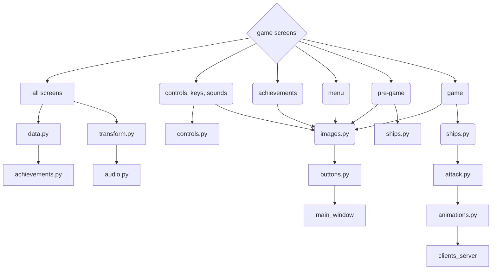

# **Online game - Sea Battle**

## Назва проекту: Онлайн гра морський бій / name project: Online game sea battles

### опис:
* Ця гра дозволяє грати у морський бій удвох на різних комп'ютерах.
#### description:
* This game allows two players to play the sea battles on different computers


### Структура readme:
### Organization readme:
---
- [Участники](#участники)

- [Mодулі](#модулі)

- [Iнструкція для запуску](#інструкція-для-запуску)

- [Структура проекту](#структура-проекту)

- [Повний опис файлів](#повний-опис-файлів)

---
- [Members](#members)
 
- [Modules](#modules)
  
- [Instructions for launch](#instructions-for-launch)
  
- [Project structure](#project-structure)

- [Full description of files](#full-description-of-files)


## Участники:
### Members:
* [Ілля Епік / Illya Epik](https://github.com/IllyaEpik/online_game.git)
* [Денис Бондар / Denys Bondar](https://github.com/DenysBondar1/online-game.git)
* [Субач Максим / Subach Maksim](https://github.com/MaxS2010/Online_sea_battle.git)
* [Лебідь Ілля / Ilya Lebid](https://github.com/SaberWQ/Ship-Fight)
* [Бобошко Ксюша/ Ksyusha Boboshko](https://github.com/Boboshko-Ksenia/Sea-Battle)

#### модулі:
##### modules:
+ pygame; модуль який дозволяє реалізувати саму гру / a module that enables game development.
+ pillow; модуль для роботи pygame / a module for working pygame
+ random; вбудований модуль, який потрібен для генерації випадкових чисел / a built-in which used for generating random numbers.
+ os; вбудований модуль для пошуку абсолютного шляху / a built-in module for finding absolute paths
+ threading; вбудований модуль, який обробляє потоки для одночасних завдань / handles threads for concurrent tasks.
+ socket; вбудований модуль, який дозволяє реалізувати онлайн підключення / a built-in module for enabling online connections.

## Інструкція для запуску:
1. Для початку потрібно встановити:
* [Python останньої версії](https://www.python.org/downloads/)
* [Застосунок для підключення по сеті](https://www.radmin-vpn.com/)


1. Зайти на Git Hub
2. У репозиторії проекту натиснути зелену кнопку "Code"
    
3. Обрати "Скопіювати посилання"

* Для Windows
5. Відкрити термінал 
6. Прописати команду для копіювання проекту з гіт хабу:
   - `git clone <посилання>`
7. Требя перейти до Comand Promt:
   * У відкритому терміналі натиснути на стрілочку біля плюсика(Дивитись нв скині)
   * Обрати Comand Promt
    
8. Після цього треба створити віртуальне оточення(У Command Prompt(cmd)):
    - `python -m venv venv`
9. Активувати віртуальне оточення(У Command Prompt(cmd)):
   - `cd venv/Scripts`
    - `.\activate.bat`
10.  Вести команду для завантаження необхідних модулів:
    - `pip install -r requirements.txt`
11.  Активувати гру за допомогою команди:
    - `python main.py`

* Для macOS
5. Відкрити термінал(Такуж послідовність дій можно виконати у терміналі Bash)
6. Прописати команду для копіювання проекту з гіт хабу:
    - `git clone <посилання>`
7. Після цього треба створити віртуальне оточення:
   - `python3 -m venv venv`
8. Активувати віртуальне оточення:
   - `source venv/bin/script`
9. Активувати віртуальне оточення для Bash на Windows:
   - `source venv/Scripts/script`
10.  Вести команду для завантаження необхідних модулів:
    - `pip3 install -r requirements.txt`
11.  Активувати гру за допомогою команди:
    - `python3 main.py`

### Для того щоб пограти:
* У режимі Lan:
1. У грі сервер(один з гравців) повідомляє інший свій IP та обирає роль сервера
2. Запускає обов'язково другий етап(обов'язково перший!)
3. Другий гравець вводить IP-сервер
4. Вдалої гри!

* По сеті:
1. Запускаємо застосунок Radmin VPN:
2. Натискаємо на кнопку:

3. Після цього один з гравців натискає:

4. Він має задати нобхідні данні і надати їх другому гравцю:

5. Другий має натиснути:

6. Та ввести дані, які були передані першим гравцем
7. Сервер(один з гравців) використовує інший свій IP з Radmin VPN та обирає роль сервера
8. Другий гравець вводити І.П
9. Вдалої гри!


### Instructions for launch
1. First, you need to install:  
* [The latest version of Python](https://www.python.org/downloads/)

* [Application for connecting over the network](https://www.radmin-vpn.com/)


1. Go to GitHub.  
2. In the project repository, click the green "Code" button.  
    
3. Select "Copy url to clipboard" 

* For Windows
5. Open the terminal
6. Enter the command to clone the project from GitHub:
    - `git clone <url>`
7. Switch to Command Prompt:
   * In the open terminal, click on the arrow next to the plus sign (See screenshot)
   * Select Command Prompt

8. Create a virtual environment (in Command Prompt (cmd)):
    - `python -m venv venv`
9. Activate the virtual environment (in Command Prompt (cmd)):
    - `cd venv/Scripts`
    - `.\activate.bat`
10. Enter the command to install the required modules:
    - `pip install -r requirements.txt`
11. Run the game using the command:
    - `python main.py`

* For macOS
5. Open the terminal (The same sequence of steps can be performed in the Bash terminal)
6. Enter the command to clone the project from GitHub:
    - `git clone <url>`
7. Create a virtual environment:
    - `python3 -m venv venv`
8. Activate the virtual environment:
    - `source venv/bin/script`
9. Activate the virtual environment for Bash on Windows:
    - `source venv/Scripts/script`
10. Enter the command to install the required modules:
    - `pip3 install -r requirements.txt`
11. Run the game using the command:
    - `python3 main.py`

### In order to play:
* In Lan mode:
1. In the game, the server (one of the players) tells the other his IP and chooses the role of the server
2. Launches the second stage (the first one!)
3. The second player enters the server IP
4. Have a good game!

* By network:
1. Launch the Radmin VPN application:
2. Click on the button:

3. After that, one of the players clicks:

4. He must enter the required data and provide it to the second player:

5. The second player must click:

6. And enter the data that was transferred by the first player
7. The server (one of the players) uses its other IP from Radmin VPN and chooses the server role
8. The second player enters the IP
9. Have a good game!

## Структура проекту:
### Project structure:
* Перше вікно: головне меню/First window: main menu
* Друге вікно: екран з налаштуваннями(Гарячі клавіші й музика) / Second window: Settings screen(Hot keys and music)
* Третє вікно: екран з досягненнями / Third window: achievement window
* Четверте вікно: етап розташування кораблів/ Fourth window: ship placement stage
* П'яте вікно: етап битви/ Fifth window: battle stage
* Шосте вікно: екран магазину / Sixth window: shop window
* Сьоме вікно: результат гри (програш чи перемога) / Seventh window: game result (lose or victory)



### Повний опис файлів:
#### Full description of files:

#### Online_game/modules/main_window.py: створення головну екрану гри / create a main screen of game

```python
'''
    >>> Створює головне вікно - класс Screen
'''
# імпортуємо модуль pygame
import pygame, threading, os,random
# ініціалізуємо pygame
pygame.init()
# імпортуємо наші модулі 
import modules.data as m_data
import modules.controls as m_controls
import modules.buttons as m_buttons
import modules.images as m_images
import modules.clients_server as m_client
import modules.ships as m_ships
import modules.attack as m_attack
import modules.transform as m_transform
import modules.audio as m_audio
import modules.achievements as m_achievements
import modules.animations as m_animations
threading.Thread(target=m_animations.play_animation,daemon=True).start()
# клас для налаштування головного вікна
class Screen():
    '''
        >>> Налаштовує головне вікно
    '''
    # ініціалізуємо screen
    def __init__(self):
        size = pygame.display.Info()
        # створюємо таймер
        self.clock = pygame.time.Clock()
        # вказуємо ширину
        self.WIDTH= size.current_w * 0.75
        # вказуємо висоту
        self.HEIGHT = size.current_h * 0.75
        # створюємо екран
        self.screen = pygame.display.set_mode((self.WIDTH, self.HEIGHT),pygame.RESIZABLE)
        self.counter = 0

        # задаємо назву нашому екрану
        pygame.display.set_caption('online game')
        # завантажуємо іконку гравця
        icon = pygame.image.load(os.path.abspath(__file__ + "/../../images/icon.png"))
        pygame.display.set_icon(icon)
    # функція запуску
    def run(self):
        '''
            >>> Запускає гру
        '''
        # запускаємо гру
        game = True
        # до кількості додаємо 1
        self.counter += 1
        # налаштування розміра дісплея
        size = pygame.display.Info()
        # поки гра триває
        while game:
            size1 = self.screen.get_size()
            WIDTH = size1[0]
            HEIGHT= size1[1]
            multiplier_x = (WIDTH / 100) / (1280 / 100)
            multiplier_y = (HEIGHT / 100) / (832 / 100)
            # цикл всіх подій
            for event in pygame.event.get():
                # якщо вікно гри зачинено то 
                if event.type == pygame.QUIT:
                    # гра закінчується
                    game = False
                    # гра закінчилася
                    m_data.end=True
                    try:
                        # відключаємо клієнта
                        m_client.client.close()
                    except:
                        pass 
                # коли кнопка миші натиснута
                if event.type == pygame.MOUSEBUTTONDOWN:
                    # перехід
                    if m_transform.type_transform == None:
                        # цикл для спрайту в списку ефектів
                        for sprite in m_data.list_blits[m_data.progression]:
                            # print(sprite.name)
                            try:
                                # if sprite.fun != '':
                                # кнопка старт
                                sprite.button_start(event)
                            except:
                                pass
                        # перевірка виграшу і програшу
                        if m_data.progression in "winlose":
                            # m_buttons.revenge.button_start(event)
                            # перевірка натискання поза кнопкою старт
                            if m_buttons.out.button_start(event):
                                # гра не починається
                                game = False
                                # гра не почалася
                                m_data.end=True
                                try:
                                    # відключаємо клієнта
                                    m_client.client.close()
                                except:
                                    pass 
                        # перевірка музики
                        if m_data.progression == 'sounds':
                            # натискання мишки
                            m_controls.fun(pygame.mouse.get_pos(),multiplier_x,multiplier_y)
                            print(event.pos)
                            # перевірка x
                            if event.pos[0]< 800*multiplier_x:
                                yes = 0
                                # цикл для контролю в списку музики
                                for control in m_controls.list_music:
                                    # print(control[0].rect.collidepoint(event.pos),control[0].rect.x,control[0].rect.y,control[0].rect.width,control[0].rect.height,control[2])
                                    # перевірка обводки контроля
                                    if control[0].rect.collidepoint(event.pos):
                                        control[1] = 1
                                        control[0].COLOR = (50,50,255)
                                        control[0].second_color = (0,0,0)
                                        # зміна треку
                                        m_controls.music_edit('soundtracks')
                                        # трек змінен
                                        yes = 1
                                    else:
                                        control[1] = 0
                                        control[0].COLOR = (0,0,0)
                                        control[0].second_color = (255,255,255)
                                # якщо трек не змінен
                                if not yes:
                                    # музика не змінюється
                                    m_controls.music_edit(None)
                            else:
                                # цикл для контролю в списку музики
                                for control in m_controls.list_music:
                                    # перевірка контролю
                                    if control[1]:
                                        # цикл для ключів в списку музики
                                        for key in m_controls.list_musics:
                                            control = key
                                            # перевірка обводки контролю
                                            if control[0].rect.collidepoint(event.pos):
                                                control[1] = 1
                                                control[0].COLOR = (50,50,255)
                                                control[0].second_color = (0,0,0)
                                                # трек зупиняється
                                                m_audio.track.stop()
                                                # зміна треку
                                                m_audio.track = m_audio.Audio('soundtracks/'+key[0].TEXT)
                                                # трек грається
                                                m_audio.track.play()
                                                # безпечно відкриваємо файл з музикою
                                                with open(m_data.path+m_data.type+'music.txt', "w") as file:
                                                    # записуємо текст до ключа
                                                    file.write(key[0].TEXT)
                                            else:
                                                control[1] = 0
                                                control[0].COLOR = (0,0,0)
                                                control[0].second_color = (255,255,255)
                                        # зупинка
                                        break
                        # перевірка ключів
                        if m_data.progression == 'keys':
                            print(event.pos)
                            # перевірка x
                            if event.pos[0]< 800*multiplier_x:
                                yes = 0
                                # цикл для контролю в списку контролю
                                for control in m_controls.list_controls:
                                    # print(control[0].rect.collidepoint(event.pos),control[0].rect.x,control[0].rect.y,control[0].rect.width,control[0].rect.height,control[2])
                                    # перевірка обводки контролю
                                    if control[0].rect.collidepoint(event.pos):
                                        control[1] = 1
                                        control[0].COLOR = (50,50,255)
                                        control[0].second_color = (0,0,0)
                                        m_controls.text_edit(control[2])
                                        yes = 1
                                    else:
                                        control[1] = 0
                                        control[0].COLOR = (0,0,0)
                                        control[0].second_color = (255,255,255)
                                if not yes:
                                    # текст змінюється на None
                                    m_controls.text_edit(None)
                                
                            else:
                                # цикл для контролю в списку контролю
                                for control in m_controls.list_controls:
                                    # перевірка контролю
                                    if control[1]:
                                        # цикл для ключа в списку ключів
                                        for key in m_controls.list_keys:
                                            control = key
                                            # перевірка обводки контроля
                                            if control[0].rect.collidepoint(event.pos):
                                                control[1] = 1
                                                control[0].COLOR = (50,50,255)
                                                control[0].second_color = (0,0,0)
                                            else:
                                                control[1] = 0
                                                control[0].COLOR = (0,0,0)
                                                control[0].second_color = (255,255,255)
                                        # зупинка
                                        break
                        # якщо прогресс дорівнює меню то
                        if m_data.progression == "menu":
                            # вибір місця написання
                            m_buttons.input.activate(event) 
                            m_buttons.nickname.activate(event)
                        # прогресс дорівнює досягненням то
                        elif m_data.progression == 'achievements':
                            # m_buttons.achievements_.button_start(event)
                            for achievement in m_data.list_achievements_view:
                                m_data.list_achievements_view[achievement].button_start(event)
                        # якщо прогресс дорівнює пре-грі то    
                        if m_data.progression == "pre-game":
                            # автоматична розтановка кораблів
                            m_buttons.auto.randomship(event.pos)
                            # цикл всіх кораблів
                            for ship in m_data.all_ships:
                                # виділення кораблів
                                ship.activate(event, multiplier_x, multiplier_y)
                        # якщо прогресс дорівнює грі то
                        if m_data.progression == "game":
                            # якщо підключено
                            if m_data.connected:
                                # кнопка магазину і старту
                                m_buttons.shop.button_start(event)
                            # вибір місця атаки
                            m_attack.attack(event.pos,multiplier_x,multiplier_y)
                            # m_buttons.shop.button_start(event)
                        # при находженні в магазині
                        elif m_data.progression == 'shop':
                            # цикл для зброї в списку зброї
                            for weapon in m_buttons.list_weapons:
                                weapon.button_start(event=event)
                    # якщо будь-яка клавіша натиснута то
                    else:
                        m_transform.type_transform = None
                        m_transform.size = 0
                # якщо кнопка вгору натиснута
                if event.type == pygame.KEYUP:
                    print(event.key, m_controls.controls['fire attack'])
                    if m_data.progression == 'game' and str(event.key) in m_controls.controls['fire attack']:
                        m_data.fire_attack = False
                        print('NNNNNNNNNNNNNNNNNNNNNNNNNNNNNNOOOOOOOOOOOOOOOOOOOOOOOOOOOOOOOOOOOOOO')
                # якщо кнопка вниз натиснута
                if event.type == pygame.KEYDOWN:
                    print(m_controls.controls['rotate ship'],type(m_controls.controls['rotate ship']))
                    # якщо знаходимося в меню
                    if m_data.progression == "menu":
                        # додає символи в event
                        m_buttons.input.edit(event)
                        #редагуємо нікнейм
                        m_buttons.nickname.edit(event)
                        for object in [m_buttons.nickname]:
                            size = object.FONT.size(object.TEXT)
                            # if object.width < size[0] - 10:
                            width = -(object.start_width - size[0] - 10)
                            object.width = width + object.start_width
                            if object.width < object.start_width:
                                object.width = object.start_width
                            object.update_image()
                            # кнопка з музикою
                            m_buttons.music.rect = pygame.Rect(m_buttons.music.x, m_buttons.music.y,m_buttons.music.width,m_buttons.music.height)
                            m_buttons.music.x = m_buttons.nickname.width + 50
                    # при знаходженні в ключах
                    elif m_data.progression == 'keys':
                        # print('yes')
                        # цикл для контролю в списку контролю
                        for control in m_controls.list_controls:
                            if control[1]:
                                # print('yes2')
                                # цикл для ключів в списку ключів
                                for key in m_controls.list_keys:
                                    if key[1]:
                                        # print('yes3')
                                        m_controls.controls[control[2]][key[2]] = event.key
                                        # print('yes4',event.key)
                                        m_controls.text_edit(control[2])
                                        l_controls = ''
                                        controls = m_controls.controls
                                        for control in controls:
                                            l_controls += f'{controls[control][0]},{controls[control][1]},{controls[control][2]},{controls[control][3]}\n'
                                        with open(m_data.path+m_data.type+'controls'+'.txt', "w") as file:
                                            file.write(l_controls)
                    # при знаходженні в pre-game і ключа в контролі
                    elif m_data.progression == 'pre-game' and str(event.key) in m_controls.controls['rotate ship']:
                        # цикл для корабля в усіх кораблів
                        for ship in m_data.all_ships:
                            # якщо корабль виділен
                            if ship.select:
                                # поворот корабля   
                                ship.rotate_ship()
                    # при знаходженні в грі
                    elif m_data.progression == 'game':
                        # rect = pygame.Rect((725+55.7*cell) * multiplier_x, 
                        #             (115+55.7*row) * multiplier_y,
                        #             55.7 * multiplier_x,
                        #             55.7 * multiplier_y)
                        # перевірка вогняної атаки
                        if str(event.key) in m_controls.controls['fire attack']:
                            m_data.fire_attack = True
                            print('hhhhhhhhhhhhhhhhhhhhhhhhhhhhhhhhos')
                        # перевірка рандомної атаки
                        if str(event.key) in m_controls.controls['random attack']:
                            yes = 0
                            # цикл для кораблів на ворожому полі
                            for row in m_data.enemy_field:
                                for cell in row:
                                    # перевірка кораблів в клітинках
                                    if str(cell) in '012345':
                                        yes = True
                                        # зупинка
                                        break
                            if yes:
                                # поки True
                                while True:
                                    # рандомна розстановка в рядах
                                    row = random.randint(0,9)
                                    # рандомна розстановка в клітинках
                                    cell = random.randint(0,9)
                                    if str(m_data.enemy_field[row][cell]) in '012345':
                                        print(row,cell,m_data.enemy_field[row][cell])
                                        m_attack.attack([(726+55.7*cell)*multiplier_x,(115+55.7*row)*multiplier_y],multiplier_x,multiplier_y)
                                        break

            # if m_data.progression == 'game':
            #     m_data.fire_attack = False
            #     for key in pygame.key.get_pressed():
                    
            #         if key in m_controls.controls['fire attack']:
            #             m_data.fire_attack = True
            # запис монет
            m_buttons.coins.TEXT = f"{m_data.coins}"
            # запис монет
            m_buttons.coins_.TEXT = f"{m_data.coins}"

            # цикл відображення всього що є в списку
            for sprite in m_data.list_blits[m_data.progression]:
                # відображення елементу
                sprite.blit(self.screen,
                                 sprite.x*multiplier_x,
                                 sprite.y*multiplier_y,
                                 sprite.width*multiplier_x,
                                 sprite.height*multiplier_y,
                                 multiplier_x,multiplier_y)
            # перевірка музики
            if m_data.progression == 'sounds':
                # цикл для ключів в списку музики
                for key in m_controls.list_musics:
                    sprite = key[0]
                    sprite.blit(self.screen,
                                 sprite.x*multiplier_x,
                                 sprite.y*multiplier_y,
                                 sprite.width*multiplier_x,
                                 sprite.height*multiplier_y,
                                 multiplier_x,multiplier_y)
            # перевірка ключів
            if m_data.progression == 'keys':
                # цикл для ключів в списку ключів
                for key in m_controls.list_keys:
                    sprite = key[0]
                    sprite.blit(self.screen,
                                 sprite.x*multiplier_x,
                                 sprite.y*multiplier_y,
                                 sprite.width*multiplier_x,
                                 sprite.height*multiplier_y,
                                 multiplier_x,multiplier_y)
            # зупинка звуку
            if m_audio.track.stoped:
                # якщо знаходимося в меню
                if m_data.progression == "menu":
                    # малюємо лінії 
                    pygame.draw.line(self.screen,(255,50,50),
                                    (m_buttons.music.x*multiplier_x,m_buttons.music.y*multiplier_y,),
                                    (m_buttons.music.x*multiplier_x + m_buttons.music.width*multiplier_x,m_buttons.music.y*multiplier_y + m_buttons.music.height*multiplier_y),10)
                elif 'game' in m_data.progression :
                    pygame.draw.line(self.screen,(255,50,50),
                                    (m_buttons.music2.x*multiplier_x,m_buttons.music2.y*multiplier_y,),
                                    (m_buttons.music2.x*multiplier_x + m_buttons.music2.width*multiplier_x,m_buttons.music2.y*multiplier_y + m_buttons.music2.height*multiplier_y),10)
            # якщо знаходимось не в списку досягнень то
            if m_data.list_achievements != []:
                # список досягнень
                achievement = m_data.list_achievements[0]
                # рух досягнень
                achievement.move()
                achievement.blit(self.screen,multiplier_x,multiplier_y)
            # якщо знаходимося в pre-game
            if m_data.progression in "pre-game":
                # цикл для відображення всіх кораблів
                for ship in m_data.all_ships:
                    if ship.jump_cor[2]:
                        ship.x += ship.jump_cor[0]
                        ship.y -= ship.jump_cor[1]
                        if not ship.jump_cor[3]:
                            ship.jump_cor[0] /= 1.1
                            ship.jump_cor[1] -= 2.5
                        elif ship.y == 120:
                            ship.jump_cor[3] = False
                            ship.jump_cor[-2] = False
                            # нове досягнення
                            m_achievements.achievement('the bug')
                    # перевірка кораблів на екрані
                    if ship.y > self.screen.get_size()[1]+1000:
                        ship.y = -100
                        ship.jump_cor[0] =0
                        ship.jump_cor[1] = -20
                        ship.jump_cor[3] = True
                        ship.x = 805
                        ship.name = '4ticket'
                        ship.update_image()
                        # ship.name = '4'
                    # саме відображення кораблів
                    ship.blit(self.screen,ship.x*multiplier_x,ship.y*multiplier_y,ship.width*multiplier_x,ship.height*multiplier_y,multiplier_x,multiplier_y)
            # якщо знаходимося в грі то
            if m_data.progression == "game":
                # цикл для ракет в списку ракет
                for rocket in m_data.list_rockets:
                    try:
                        # перевіряємо вид ракети
                        if rocket[0].name != 'weapons/line_rocket':
                            x = (725+55.7*rocket[2]) * multiplier_x
                            sprite = rocket[0]
                            sprite.blit(self.screen,
                                        sprite.x*multiplier_x,
                                        sprite.y*multiplier_y,
                                        sprite.width*multiplier_x,
                                        sprite.height*multiplier_y,
                                        multiplier_x,multiplier_y)
                            if rocket[0].x*multiplier_x + rocket[0].width*multiplier_x > x:
                                rocket[3]()
                                m_data.list_rockets.remove(rocket)
                        else:
                            sprite = rocket[0]
                            sprite.blit(self.screen,
                                        sprite.x*multiplier_x,
                                        sprite.y*multiplier_y,
                                        sprite.width*multiplier_x,
                                        sprite.height*multiplier_y,
                                        multiplier_x,multiplier_y)
                            for count in range(10):
                                x = (725+55.7*count) * multiplier_x
                                if rocket[0].x*multiplier_x + rocket[0].width*multiplier_x > x:
                                    last = 0
                                    if str(m_data.enemy_field[rocket[1]][count]) in '1234' or count == 9:
                                        last = 1
                                    rocket[2](rocket[1],count,last)
                                    if last:
                                        m_data.list_rockets.remove(rocket)
                                        m_data.attack = None
                                        break
                    except Exception as error:
                        pass
                # кількість 0
                count = 0
                # список для видалень
                list_to_delete = []
                # цикл для ефектів в ефектах
                for buff in m_data.my_buffs:
                    # перевірка ефекту протиповітряної оборони
                    if buff[0] == 'Air_Defence':
                        if str(m_data.my_field[buff[1]][buff[2]]) in '05':
                            m_images.air_defence.blit(self.screen,
                                                    (59+buff[2]*55.7)*multiplier_x,
                                                    (115+buff[1]*55.7)*multiplier_y,m_images.air_defence.width*multiplier_x,m_images.air_defence.height*multiplier_y,multiplier_x,multiplier_y
                                                    )
                        else:
                            list_to_delete.append(count)
                    # до кількості додаємо 1
                    count +=1
                # цикл для видалення з списку видалення
                for delete in list_to_delete:
                    del m_data.my_buffs[delete]
                # цикл для спрайту в списку вибуху
                for sprite in m_data.list_explosions:
                    sprite = sprite[0]
                    # відображення спрайту на екрані
                    sprite.blit(self.screen,
                                sprite.x*multiplier_x,
                                sprite.y*multiplier_y,
                                sprite.width*multiplier_x,
                                sprite.height*multiplier_y,
                                multiplier_x,multiplier_y)
                # перевірка часу для радара
                if m_data.time_for_radar:
                    # цикл для спрайту в списку для радара
                    for sprite in m_data.list_for_radar:
                        # малюємо круги
                        pygame.draw.circle(self.screen,(50,255,50),((sprite.x+sprite.width/2)*multiplier_x,(sprite.y+sprite.height/2)*multiplier_y),10,25)
                # якщо підключення відбулося
                if m_data.connected:
                    # якщо черга змінилась
                    if m_data.turn:
                        # зміна кольору
                        m_buttons.opponent_turn.COLOR = (0, 0, 255)
                        # m_buttons.your_turn.COLOR = ()
                    else:
                        # зміна кольору
                        m_buttons.opponent_turn.COLOR = (255, 0, 0)
                        # m_buttons.your_turn.COLOR = (140, 140, 140)
                    # if m_data.turn:
                    #     m_buttons.opponent_turn.COLOR = (140, 140, 140)
                    #     m_buttons.your_turn.COLOR = (0, 0, 255)
                    # else:
                    #     m_buttons.opponent_turn.COLOR = (255, 0, 0)
                    #     m_buttons.your_turn.COLOR = (140, 140, 140)
                    # кнопка магазину
                    sprite = m_buttons.shop
                    # виводимо кнопку на екран
                    m_buttons.shop.blit(self.screen,sprite.x*multiplier_x,sprite.y*multiplier_y,sprite.width*multiplier_x,sprite.height*multiplier_y,multiplier_x,multiplier_y)
                    # sprite = m_buttons.your_turn
                    # m_buttons.your_turn.blit(self.screen,sprite.x*multiplier_x,sprite.y*multiplier_y,sprite.width*multiplier_x,sprite.height*multiplier_y,multiplier_x,multiplier_y)
                    # кнопка черги опонента
                    sprite = m_buttons.opponent_turn
                    # виводимо кнопку на екран
                    m_buttons.opponent_turn.blit(self.screen,sprite.x*multiplier_x,sprite.y*multiplier_y,sprite.width*multiplier_x,sprite.height*multiplier_y,multiplier_x,multiplier_y)
                else:
                    # кнопка очікування
                    wait = m_buttons.wait
                    # виводимо кнопку на екран
                    wait.blit(self.screen,wait.x*multiplier_x,wait.y*multiplier_y,wait.width*multiplier_x,wait.height*multiplier_y,multiplier_x,multiplier_y)
            #  перевірка досягнень
            elif m_data.progression == 'achievements':
                square = pygame.Surface((m_buttons.description_.rect.width,m_buttons.description_.rect.height))
                square.fill((0,0,0))
                square.set_alpha(100)
                self.screen.blit(square,m_buttons.description_.rect)
                m_buttons.stroke(self.screen,m_buttons.description_.rect,(0,0,0),5)
                sprite = m_buttons.description_
                m_buttons.description_.blit(self.screen,
                                 sprite.x*multiplier_x,
                                 sprite.y*multiplier_y,
                                 sprite.width*multiplier_x,
                                 sprite.height*multiplier_y,
                                 multiplier_x,multiplier_y)
                x,y =50,50
                for achievement_code in m_data.achievements_data:
                    achievement = m_data.achievements_data[achievement_code]
                    # перевірка наявності досягнень
                    if achievement['has'] == 'True':
                        m_data.list_achievements_view[achievement_code].blit(self.screen,
                                 x*multiplier_x,
                                 y*multiplier_y,
                                 150*multiplier_x,
                                 150*multiplier_y,
                                 multiplier_x,multiplier_y)
                        x += 200
                        if x == 850:
                            x = 50
                            y += 200
            # якщо знаходимося в грі то 
            if m_data.progression == 'game':
                # прибираємо видимість мишки
                pygame.mouse.set_visible(False)
                # задаємо мишці координати появи
                x,y = pygame.mouse.get_pos()
                t= m_images.target
                # відображаємо картинку цілі на екран
                m_images.target.blit(self.screen,
                                     x-50*multiplier_x,
                                     y-50*multiplier_y,
                                     100*multiplier_x,
                                     100*multiplier_y,
                                     multiplier_x,multiplier_y)
            else:
                # задаємо видимість мишки
                pygame.mouse.set_visible(True)
            # якщо знаходимося в звуках то
            if m_data.progression == 'sounds':
                # малюємо контрол 
                m_controls.draw(self.screen,multiplier_x,multiplier_y)
            # оновлення екрану 
            m_transform.transform(self,multiplier_x,multiplier_y)
            # фпс
            self.clock.tick(60)
# створення екземпляру классу
screen = Screen()

```


#### Description:
  - **Відповідає за вибух кораблів**

#### Online_game/modules/attack.py: створення механіки атаки кораблів / creation of ship attack mechanics
```python
'''
    >>> Відповідає за атаку кораблей
    >>> Перевіряє чи відбулась атака
    >>> Відповідає за роботу зброї
'''
# імпортуємо необхідні модулі
import pygame,random, time, threading,os
import modules.data as m_data
import modules.images as m_images
import modules.clients_server as m_client
import modules.audio as m_audio
import modules.achievements as m_achievements
import modules.transform as m_transform
import modules.animations as m_animations
# список клітинок без кораблів
list_miss = "05"
# список клітинок з кораблями
list_explosion = "1234"
attack_list = '012345'
# функція для атаки кораблів в клітинках
def attack_for_cell(row,cell):
    '''
        >>> Відповідає за вибух кораблів
    '''
    # змінна з назвою
    name = None
    # наслідування класа Image для картинки і задання параметрів для неї
    image = m_images.Image(
            progression = "Noke",
            name = "",
            x = 725+55.7*cell,
            y = 115+55.7*row ,
            width= 55.7,
            height=55.7,
    )
    # для вибуху кораблів на ворожому полі
    yes = False
    if m_data.attack == 'fire_rocket' or m_data.fire_attack and m_data.attack == None and m_data.coins > 1:
        # назва змінюється на вогонь
        m_data.coins -= m_data.cost_data['fire_rocket']
        yes = True
    if str(m_data.enemy_field[row][cell]) in list_explosion:
        # вибухи кораблів на ворожому полі
        m_data.enemy_field[row][cell] = 6
        # наслідування класа Animation для анімації і задання параметрів для неї
        image = m_animations.Animation(progression = "Noke",
            x = 725+55.7*cell,
            y = 115+55.7*row ,
            width= 55.7,
            name = 'explosion',
            height=55.7)
        # назва змінюється на виьух
        name = "explosion"
        # для атаки з використанням вогненної ракети
        print(m_data.fire_attack, m_data.attack)
        if m_data.attack == 'fire_rocket' or m_data.fire_attack and m_data.attack == None and yes:
            # назва змінюється на вогонь
            # m_data.coins -= m_data.cost_data['fire_rocket']
            name = 'fire'
            # назва картинки змінюється на вогонь
            image.name = 'fire'
            # вибух корабля на ворожому полі
            m_data.enemy_field[row][cell] = 8
            # атака
            m_data.attack = None
        # додає монети за атаку
        m_data.coins += 10
        # оновлює картинки
        image.update_image()
        # додає параметри до списку з вибухами
        m_data.list_explosions.append([image, row, cell])
        # додає досягнення гравцю
        m_achievements.achievement('It’s a Hit!')
        # список для вибухів
        explosions = []
        # цикл для ворожих кораблів
        for ship in m_data.enemy_ships:
            # перевіряє ворожий корабль
            ship.check_enemy()
            # список з клітинками кораблів
            cells = []
            # цикл для додавання всіх клітинок корабля до cells
            for count in range(int(ship.name)):
                # якщо корабель стоїть горизонтально то
                if ship.rotate %180 == 0 and m_data.enemy_field[ship.row][ship.cell+count] != int(ship.name[0]):
                    # додається клітика
                    cells.append([ship.row, ship.cell+count])
                # інакше якщо корабель стоїть вертикалюно то
                elif ship.rotate %180 != 0 and m_data.enemy_field[ship.row+count][ship.cell] != int(ship.name[0]):
                    # додається клітинка
                    cells.append([ship.row+count, ship.cell])
            # назва корабля повинна дорівнювати довжині клітинок
            if int(ship.name) == len(cells):
                # для вибухів в списку вибухів
                for explosion in m_data.list_explosions:
                    # цикл для клітинок
                    for celll in cells:
                        # якщо вибухи дорівнюють клітинкам то
                        if explosion[1] == celll[0] and explosion[2] == celll[1]:
                            # до вибухів додається 0
                            explosions.append(explosion[0])
        # цикл минулих для вибухів
        for ex in explosions:
            try:
                # до списку додається значення 'game' і прибирається минулиц вибух
                m_data.list_blits['game'].remove(ex)
            except:
                pass
    # інакше промах на воожому полі
    elif str(m_data.enemy_field[row][cell]) in list_miss:
        # нове досягнення
        m_achievements.achievement('Missed Shot')
        # для атаки вогненної ракети
        if m_data.attack == 'fire_rocket':
            # атака
            m_data.attack = None
        # промах на ворожому полі
        m_data.enemy_field[row][cell] = 7
        # зміна назви на промах
        name = "miss"
        # зміна назви картинки на промах
        image.name = 'miss'
        # оновлення картинки
        image.update_image()
        # зміна ходу
        m_data.turn = False
        # додає параметри до списку з вибухами
        m_data.list_explosions.append([image, row, cell])
    # повертає назву
    return name
# функція для часу радара
def timer_for_radar():
    '''
        >>> Відповідає за час роботи(таймер) радару
    '''
    # поки радар працює
    while m_data.time_for_radar:
        # від часу віднімається 1 секунда
        m_data.time_for_radar -= 1
        # пауза на 1 секунду
        time.sleep(1)
    # якщо не має ходу
    if not m_data.turn:
        # відправляє пропуск в m_client
        m_client.send("pass:")
# список для відправки всього необхідного
need_to_send = []
# метод з атакою
def attack(pos: tuple,multiplier_x,multiplier_y):
    '''
        >>> Відповідає за атаку кораблів зі зброєю
    '''
    # створення глобальних змінних
    global list_miss, list_explosion
    # blits = True
    # текст для відправки
    text_for_send = ''
    # зміна ходу і підключення
    if m_data.turn and m_data.connected and not m_data.list_rockets:
        # цикл для атаки самонаводящою ракетою
        if m_data.attack == 'homing_rocket':
            m_data.coins -= m_data.cost_data[m_data.attack]
            # функція з вогнем
            fire()
            # список кораблів
            list_ships = []
            # для кораблів на ворожому полі
            for ship in m_data.enemy_ships:
                # якщо не кораблі в всіх кораблях то
                if not ship in m_data.all_ships:
                    # до списку кораблів додається корабель
                    list_ships.append(ship)
            # головний корабель, його поворот і довжина списку кораблів
            main_ship = list_ships[random.randint(0,len(list_ships)-1)]
            # головна клітинка і віднімання 1 значення від корабля
            main_cell = random.randint(0,int(main_ship.name)-1)
            # головний ряд
            main_row = main_ship.row
            # поворот кораблів
            rotate_ship = main_ship.rotate
            # перевірка розвороту корабля
            if rotate_ship % 180 == 0:
                # головна клітинка додається до головного корабля
                main_cell += main_ship.cell
                # name = attack_for_cell(main_ship.row,main_cell + main_ship.cell)
                # m_client.send(f"attack:{ main_ship.row},{main_cell + main_ship.cell},{name}".encode())
            else:
                # головна клітинка додається до головного корабля
                main_row += main_cell
                # нове досягнення
                # головна клітинка дорівнює головному кораблю
                main_cell = main_ship.cell
            # наявнісь ефектів
            for buff in m_data.buffs:
                # якщо ефект протиповітряної оборони
                if buff[0] == 'Air_Defence':
                    # список клітинок
                    list_cells = []
                    # ефект в ряду
                    buff_row = int(buff[1])
                    # ефект в клітинці
                    buff_cell = int(buff[2])
                    # для ракети в ряд
                    for row_air in range(5):
                        # для ракети по клітинкам
                        for cell_air in range(5):
                            # до ефекту в ряд додається ракета в ряд
                            row = buff_row + row_air-2
                            # до ефекту по клітинкам додається ракета по клітинкам
                            cell = buff_cell + cell_air-2
                            # перевірка значення в ряду і клітинці
                            if -1 < row < 10 and -1 < cell < 10:
                                # до списку клітинок додаються параметри: ряд і клітинка
                                list_cells.append([row,cell])
                    # для клітинок в повітрі в списку клітинок 
                    for cell_for_air in list_cells:
                        # якщо клітинки мають однакові значення
                        if main_row == cell_for_air[0] and main_cell == cell_for_air[1]:
                            # в ряду ефект в ряд
                            main_row = buff_row
                            # в клітинці ефект в клітинку
                            m_achievements.achievement('Closed Skies')
                            main_cell = buff_cell
                            # видалення ефекту
                            m_data.buffs.remove(buff)
            # if can_attack:
            def atta(main_row,main_cell):
                '''
                    >>> Відповідає за хід після атаки
                '''
                # функція атаки для клітинок
                name = attack_for_cell(main_row,main_cell)
                # текст для відправки: атака
                text_for_send = f"attack:{main_row},{main_cell},{name};"
                # if name: 
                # атака
                m_data.attack = None
                # зміна ходу
                m_data.turn = False
                # для ефекту в ефектах
                for buff in m_data.buffs:
                    # якщо ефект енергетик
                    if buff[0] == 'Energetic':
                        # зміна ходу
                        m_data.turn = True
                # якщо не має ходу
                if not m_data.turn:
                    # текст для відправки: пропуск
                    text_for_send+= 'pass:'
                win_lose(text_for_send) 
                # звук вибуху
                m_audio.explosion.play()
            # додає картинку до списку ракет
            m_data.list_rockets.append((m_images.Image(55.7*2,55.7*0.5,-120,115+55.7*main_row,f'weapons/homing_rocket','Noke',0),main_row,main_cell,lambda:atta(main_row,main_cell),0))
            try:
                # запускає анімації
                threading.Thread(target=lambda:m_animations.move(m_data.list_rockets[-1][0])).start()
            except:
                pass
            ## 59, 115
            # звук вибуху
        # атака протиповітряної оборони
        elif m_data.attack == 'Air_Defence':
            m_data.coins -= m_data.cost_data[m_data.attack]
            # функція вогню
            fire()
            # цикл для ряду
            for row in range(10):
                # цикл для клітинки
                for cell in range(10):
                    # створюємо хіт-бокс
                    rect = pygame.Rect((59+55.7*cell) * multiplier_x, 
                                    (115+55.7*row) * multiplier_y,
                                    55.7 * multiplier_x,
                                    55.7 * multiplier_y)
                    # перевірка на колізію
                    if rect.collidepoint(pos) and str(m_data.my_field[row][cell]) in '05':
                        # до моїх ефектів додається протиповітряна оборона
                        m_data.my_buffs.append(['Air_Defence',row,cell])
                        # текст для відправки: ефект протиповітряної оборони
                        text_for_send+=f'buff:Air_Defence,{row},{cell};'
                        # атака
                        m_data.attack = None
                        # зміна ходу
                        m_data.turn = False
                        # цикл для ефекту в ефектах
                        for buff in m_data.buffs:
                            # якщо ефект енергетик
                            if buff[0] == 'Energetic':
                                # зміна ходу
                                m_data.turn = True
                        # якщо не має ходу
                        if not m_data.turn:
                            # текст для відправки: пропуск
                            text_for_send+='pass:;'
        else:
            # цикл для ряду
            for row in range(10):
                # цикл для клітинки
                for cell in range(10):
                    # наслідуємо клас Rect і створюємо хіт-бокс
                    rect = pygame.Rect((725+55.7*cell) * multiplier_x, 
                                    (115+55.7*row) * multiplier_y,
                                    55.7 * multiplier_x,
                                    55.7 * multiplier_y)
                    # перевірка на колізію
                    # малюємо обводку
                    if rect.collidepoint(pos) and str(m_data.enemy_field[row][cell]) in attack_list:
                        # якщо атака ракетою 3x3
                        if m_data.attack == 'rocket_3x3':
                            m_data.coins -= m_data.cost_data[m_data.attack]
                            # текст: атака
                            def atta(row,cell):
                                '''
                                    >>> Відповідає за атаку ракетою 3x3
                                '''
                                text = 'attack:'
                                # цикл для ракети 3х3
                                for row_3x3 in range(3):
                                    # цикл для ракети 3х3
                                    for cell_3x3 in range(3):
                                        # перевірка ракети в клітинках 3х3
                                        if -1 < row+row_3x3-1 < 10 and -1 < cell+cell_3x3-1 < 10:
                                            # атака для клітинок
                                            name = attack_for_cell(row+row_3x3-1,cell+cell_3x3-1)
                                            # текст для ракети 3х3 в ряду і клітинці
                                            text += f'{row+row_3x3-1},{cell+cell_3x3-1},{name},1 '
                                # до тексту додаємо символ ";"
                                # атака
                                m_data.attack = None
                                # функція вогню
                                fire()
                                m_audio.explosion.play(1)
                                win_lose(text + ';')
                            # змінна для тимчасового збереження рядка   
                            ok,ok1 = row,cell 
                            m_data.list_rockets.append((m_images.Image(55.7*2,55.7*0.5,-120,115+55.7*row,f'weapons/rocket_3x3','Noke',0),ok,ok1,lambda:atta(ok,ok1),0))
                            try:
                                # запускаємо анімації
                                threading.Thread(target=lambda:m_animations.move(m_data.list_rockets[-1][0])).start()
                            except:
                                pass
                        # атака дінійною ракетою  
                        elif m_data.attack == 'line_rocket':
                            m_data.coins -= m_data.cost_data[m_data.attack]
                            fire()
                            # функція для атаки
                            def atta(row,cell,last = 0):
                                '''
                                    >>> Відповідає за атаку в клітинках
                                '''
                                # функція вогню
                                # даємо назву - атака для клітинок
                                name = attack_for_cell(row,cell)
                                # змінна текст
                                text = ''
                                # якщо назва - атака для клітинок
                                if name: 
                                    # виграш або програш 
                                    # win_lose(f"attack:{row},{cell},{name}")
                                    if last:
                                        win_lose(m_data.list_rockets[-1][-1]+f"{row},{cell},{name}")
                                        # звук вибуху
                                        m_audio.explosion.play() 
                                    else:
                                        # m_data.list_rockets[-1][-1]+=f"{row},{cell},{name} "
                                        win_lose(f"attack:{row},{cell},{name},0")
                                
                            # змінна для тимчасового збереження рядка   
                            ok = row
                            # до списку ракет додаємо параметри
                            m_data.list_rockets.append((m_images.Image(55.7*2,55.7*0.5,-120,115+55.7*row,f'weapons/line_rocket','Noke',0),ok,atta,'pass;attack:'))
                            try:
                                # запуск списку ракет, їх анімація
                                threading.Thread(target=lambda:m_animations.move(m_data.list_rockets[-1][0])).start()
                            except:
                                pass
                                # elif str(m_data.enemy_field[row][cell]) in '05':
                        # атака радаром
                        elif m_data.attack == 'radar':
                            m_data.coins -= m_data.cost_data[m_data.attack]
                            # функція вогню
                            fire()
                            # нове досягнення
                            m_achievements.achievement('used radar')
                            # змінюємо ширину
                            width = 55.7 * multiplier_x
                            # змінюємо висоту
                            height = 55.7 * multiplier_y
                            # змінюємо розташування по x
                            x = (725+55.7*cell) * multiplier_x
                            # змінюємо розташування по y
                            y = (115+55.7*row) * multiplier_y
                            # задаємо початок клітинок
                            start_cell = cell
                            # задаємо початок рядів
                            start_row = row
                            # задаємо кінець клітинок
                            end_cell = cell
                            # задаємо кінець рядів
                            end_row = row
                            # перевіряємо розташування рядів
                            if row > 1:
                                # змінюємо параметри ширини, x і початку ряду
                                width += 55.7 * multiplier_x *2
                                x -= 55.7 * multiplier_x *2
                                start_row -= 2
                            # перевіряємо розташування рядів
                            elif row == 1:
                                # змінюємо параметри ширини, x і початку ряду
                                width += 55.7 * multiplier_x
                                x -= 55.7 * multiplier_x
                                start_row -= 1
                            # перевіряємо розташування рядів
                            if row < 8:
                                # змінюємо параметри ширини і кінця ряду
                                width += 55.7 * multiplier_x*2
                                end_row += 2
                            # перевіряємо розташування рядів
                            elif row == 8:
                                # змінюємо параметри ширини і кінця ряду
                                width += 55.7 * multiplier_x
                                end_row += 1
                            # перевіряємо розташування клітинок
                            if cell < 8:
                                # змінюємо параметри висоти і кінця клітинок
                                height += 55.7 * multiplier_y*2
                                end_cell += 2
                            # перевіряємо розташування клітинок
                            elif cell == 8:
                                # змінюємо параметри висоти і кінця клітинок
                                height += 55.7 * multiplier_y
                                end_cell += 1
                            # перевіряємо розташування клітинок
                            if cell > 1:
                                # змінюємо параметри висоти, y і початку клітинок
                                start_cell -=2
                                height += 55.7 * multiplier_y*2
                                y -= 55.7 * multiplier_y * 2 
                            # перевіряємо розташування клітинок
                            elif cell == 1:
                                # змінюємо параметри висоти, y і початку клітинок
                                start_cell -=1
                                height += 55.7 * multiplier_y
                                y -= 55.7 * multiplier_y
                            # поле для радару
                            m_data.rect_for_radar = pygame.Rect(x,y,width,height)
                            # список для радару
                            m_data.list_for_radar = []
                            # звук радару
                            m_audio.radar.play()
                            # цикл для ряду
                            for row2 in range(10):
                                # цикл для клітинки
                                for cell2 in range(10):
                                    # перевірка першого і останнього ряда
                                    if row2 >= start_row and row2 <= end_row:
                                        # перевірка першої клітинки і останньої
                                        if cell2 >= start_cell and cell2 <= end_cell:
                                            # перевірка розташування кораблів на ворожому полі
                                            if str(m_data.enemy_field[row2][cell2]) in '1234':
                                                # додаємо до списку з радаром:
                                                m_data.list_for_radar.append(
                                                    # наслідуємо клас Image і задаємо параметри
                                                    m_images.Image(55.7,
                                                                55.7,
                                                                725+55.7*cell2,
                                                                115+55.7*row2,
                                                                'explosion',
                                                                progression='Noke')
                                                                )
                            # ставимо час для роботи радару 5 секунд
                            m_data.time_for_radar = 5
                            # запускаємо час дії радару
                            threading.Thread(target= timer_for_radar,daemon = True).start()
                            # атакуємо
                            m_data.attack = None
                            # змінюємо ход
                            m_data.turn = False
                            # для ефекту в ефектах
                            for buff in m_data.buffs:
                                # якщо ефект - енергетик
                                if buff[0] == 'Energetic':
                                    # дозволяємо ходити
                                    m_data.turn = True
                        
                        else:
                            # функція для атаки
                            def atta(row,cell):
                                '''
                                    >>> Відповідає за атаку по клітинкам
                                '''
                                # функція вогню
                                fire()
                                # даємо назву - атака для клітинок
                                name = attack_for_cell(row,cell)
                                # змінна текст
                                text = ''
                                # якщо назва - атака для клітинок
                                if name: 
                                    # виграш або програш                                  
                                    win_lose(f"attack:{row},{cell},{name}")
                                    # звук вибуху
                                    m_audio.explosion.play()
                            # змінна для тимчасового збереження рядка   
                            ok,ok1 = row,cell
                            # створення назви для звичайної ракети
                            name_for_rocket = 'standart_rocket'
                            # якщо атака вогняною ракетою, то
                            if m_data.attack == 'fire_rocket':
                                # назва ракети змінюється на вогняну ракету
                                name_for_rocket = 'fire_rocket'
                            # до списку ракет додаємо параметри
                            m_data.list_rockets.append((m_images.Image(55.7*2,55.7*0.5,-120,115+55.7*row,f'weapons/{name_for_rocket}','Noke',0),ok,ok1,lambda:atta(ok,ok1),0))
                            try:
                                # запуск списку ракет, їх анімація
                                threading.Thread(target=lambda:m_animations.move(m_data.list_rockets[-1][0])).start()
                            except:
                                pass

        # if text != 'fire:':
        #     text_for_send+= ';'+text
        
        # функція для перемоги і програшу
        win_lose(text_for_send)
# функція для вогню
def fire():
    '''
        >>> Відповідає за горіння кораблів
    '''
    # робимо змінну необхідної для відправки глобальною
    global need_to_send
    # текст для вогню
    text = 'fire:'
    # цикл для перевірки рядів
    for row in range(10):
            # перевіряємо ряди на полі
            if 8 in m_data.my_field[row]:
                # цикл для перевірки клітинок
                for cell in range(10):
                    #  перевіряємо кількість ряди на полі
                    if m_data.my_field[row][cell] == 8:
                        # цикл для вогню в ряд
                        for row_fire in range(3):
                            # цикл для вогню в клітинках
                            for cell_fire in range(3):
                                # перевіряємо ряди і вогонь в рядах
                                if -1 < (row_fire + row-1) < 10:
                                    # перевіряємо клітинки і вогонь в клітинках 
                                    if -1 < (cell_fire + cell-1) < 10:
                                        # перевіряємо вибухи на полі в списку вибухів
                                        if str(m_data.my_field[row+row_fire-1][cell+cell_fire-1]) in list_explosion:
                                            # 9 рядів і клітинок на полі
                                            m_data.my_field[row+row_fire-1][cell+cell_fire-1] = 9
    # цикл для рядів
    for row in range(10):
        # якщо на полі є 9 рядів
        if 9 in m_data.my_field[row]:
            # цикл для клітинок
            for cell in range(10):
                # якщо на полі 9 рядів і клітинок
                if m_data.my_field[row][cell] == 9:
                    # до тексту записується ряд і клітинка
                    text += f'{row},{cell} '
                    # 8 рядів і клітинок на полі
                    m_data.my_field[row][cell] = 8
                    # наслідування класу Animation для картинки анімацій і задаємо параметри
                    image = m_animations.Animation(
                            progression = "Noke",
                            name = 'fire',
                            x = 59+55.7*cell,
                            y = 115+55.7*row,
                            # 5 9 4
                            width= 55.7,
                            height=55.7
                        )
                    # до списку вибухів додаємо картинку, ряд і клітинку
                    m_data.list_explosions.append([image,row,cell])
    # якщо текст не дорвнює вогню
    if text != 'fire:':
        # додаємо символ ';' до змінної необхідного для відправки
        need_to_send.append(';' + text)
    # return text
# функція для виграшу та поразки
def win_lose(text_for_send):
    '''
        >>> Відповідає за виграш та програш
    '''
    # робимо змінну необхідної для відправки глобальною
    global need_to_send
    # змінна да_ні
    yes_no = True
    # цикл для корабля в ворожих кораблях
    for ship in m_data.enemy_ships:
        # якщо немає вибуху корабля
        if not ship.explosion:
        # elif :
            # змінна да_ні змінюється на False
            yes_no = False
    # перевірка да_ні і ворожих кораблів
    if yes_no and m_data.enemy_ships:
        # зміна кольору
        m_transform.color = (25,255,25)
        # зміна типу переходу
        m_transform.type_transform = 0
        # перехід на вікно перемоги
        m_data.progression = "win"
        # нове досягнення
        m_achievements.achievement('Like a Clap of Hands')
        # змінна може
        can= True
        # цикл для рядів на полі
        for row in m_data.my_field:
            # цикл для клітинок в ряду
            for cell in row:
                # перевірка клітинок
                if cell == 6 or cell == 8:
                    # не може
                    can = False
                    # зупинка
                    break 
        # умова для досягнення
        if can:
            # нове досягнення
            m_achievements.achievement('Total Domination')
        # додається перемога
        m_data.read_data['wins']+= 1
        # записується в дату
        m_data.reading_data(m_data.read_data,'date.txt')
        # якщо більше ніж 2 перемоги, то
        if m_data.read_data['wins'] > 2:
            # нове досягнення
            m_achievements.achievement('Smells Like Victory')
            # перевіряє кількість перемог
            if m_data.read_data['wins'] > 49:
                # нове досягнення
                m_achievements.achievement('True Cossack')
        # перевірка наявних монет 
        if m_data.coins == 200:
            # нове досягнення
            m_achievements.achievement('Need More Gold!')
        # перевіряє кількість монет
        elif m_data.coins == 190:
            # нове досягнення
            m_achievements.achievement("Big Spender")
        # до тексту для відправки додається програш
        text_for_send += ";lose:?????"
    # перевірка тексту для відправки
    if text_for_send:
        # змінна додати
        add = ''
        # якщо хід не змінюється
        if not m_data.turn:
            # пропуск ходу
            add = ';pass:'
        # перевірка необхідного для відправки
        if need_to_send:
            # до тексту додаємо символ ';'
            text_for_send +=';' + ";".join(need_to_send)
            # список для необхідного для відправки
            need_to_send = []
        # відправляємо все в клієнта
        m_client.send(text_for_send + add)
```

#### Description:
- **Відповідає за атаку кораблей**
- **Перевіряє чи відбулась атака**
- **Відповідає за роботу зброї**

#### Online_game/modules/buttons.py: створення необхідних кнопок для застосунку / сreation of necessary buttons for the application
```python
'''
    >>> Відповідяє за створення всіх кнопок - клас Button
    >>> Відповідає за функції при натисканні кнопок - метод button_start 
'''
# імпорт чужих модулів для роботи
import pygame , socket, os
import threading, random
import getpass
# імпорт наших модулів
import modules.audio as m_audio
from modules.images import Image
import modules.transform as m_transform
import modules.data as m_data
import modules.clients_server as m_client 
import modules.achievements as m_achievements
import modules.attack as m_attack
# import modules.server as m_server
from modules.ships import Ship,fill_field
# функція для малювання обведення
def stroke(screen,rect:pygame.Rect,color = (0,0,0),width = 5,multiplier_x = 1,multiplier_y = 1):
    '''
        >>> Малює обведення
    '''
    # малюємо лінії обводки
    pygame.draw.line(screen,color,
                     (int(rect.x*multiplier_x),int(rect.y*multiplier_y)),
                     (int((rect.x+rect.width)*multiplier_x),int(rect.y*multiplier_y)),int(width*multiplier_x))
    pygame.draw.line(screen,color,
                     (int((rect.x+rect.width)*multiplier_x),int(rect.y*multiplier_y)),
                     (int((rect.x+rect.width)*multiplier_x),int((rect.y+rect.height)*multiplier_y)),int(width*multiplier_x))
    pygame.draw.line(screen,color,
                     (int((rect.x+rect.width)*multiplier_x),int(rect.y+rect.height)*multiplier_y),
                     (int(rect.x*multiplier_x),int((rect.y+rect.height)*multiplier_y)),int(width*multiplier_x))
    pygame.draw.line(screen,color,
                     (int((rect.x)*multiplier_x),int((rect.y+rect.height)*multiplier_y)),
                     (int(rect.x*multiplier_x),int(rect.y*multiplier_y)),int(width*multiplier_x))

# класс з кнопками
class Button(Image):
    '''
        >>> Додає параметри до класу зображень
    '''
    # метод з створенням параметрів
    def __init__(self, fun = None, width = 100, height = 100, x= 0, y= 0, name = "", progression = "menu", text: str ="", size = 65, color = (0, 0, 0),rotate = 0):
        # задаємо параметри в класс зображень
        Image.__init__(self, width=width, height=height, x=x, y=y, name=name, progression=progression,rotate=rotate)
        # переносимо параметри в змінні
        self.center_text = True
        self.WIDTH_BUT = width
        self.second_color = (255,255,255)
        self.HEIGHT_BUT = height
        self.X = x
        self.Y = y
        self.function = fun
        self.TEXT = text  
        self.render = None
        self.last_text = None
        self.activate = 0
        # створюємо параметри
        self.COLOR = color
        self.FONT = pygame.font.SysFont("algerian", size)
        self.rect = pygame.Rect(x,y,width,height)
        self.size = size 
        self.start_size = size
        self.current_size = self.size
        self.select = False
    def activate(self, event):
        '''
            >>> Відповідає за виділення
        '''
        # умова для обводки
        if self.rect.collidepoint(event.pos):
            # обираємо
            self.select = True
        else:
            # не обираємо
            self.select = False
    # метод з кнопкою старт
    def button_start(self, event):
        '''
            >>> Створює кнопку старт
            >>> Перевіряє чи кнопка натиснута
        '''
        # перевіряємо подію
        if type(event) == pygame.event.Event:
            # ставимо позицію
            pos = event.pos
        else:
            # ставимо позицію
            pos = event
        # якщо кнопка натиснута
        if self.rect.collidepoint(pos):
            if type(self.function) == type("123") and self.function.split(":")[0] == "c_s":
                m_data.client_server = self.function.split(":")[1]
                server.COLOR = (0,0,0)
                client.COLOR = (0,0,0)
                self.COLOR =(40,2,255)
            # якщо функція корабль то
            elif self.function == "ship":
                # цикл для всіх кораблів
                for ship in m_data.all_ships:
                    # якщо корабль виділен
                    if ship.select:
                        # поворот корабля   
                       ship.rotate_ship()
                        # виділення корабля
                       ship.select  = False
            # перевіряє музику
            elif self.function == "music":
                # перевіряє чи зупинена музика
                if m_audio.track.stoped:
                    music3.name = 'pause'
                    # запускаємо музику
                    m_audio.track.play()
                    # self.name = "music"
                else:
                    music3.name = 'play'
                    # зупиняємо музику
                    m_audio.track.stop()
                music3.update_image()
                    # self.name = "music_off"
                # self.update_image()
            # перевіряємо чи відбувся виграш_програш
            elif self.function == "win_lose":
                # змінюємо помсту на True
                m_data.revenge = True
                # програє анімацію переходу
                m_transform.type_transform = random.randint(0,m_transform.count_types)
                # переміщуємося на екран pre-game
                m_data.progression = "pre-game"
                # задаємо розмір кораблю
                size_ship = "1"
                # список для ворожого корабля
                m_data.enemy_ships = []
                # список для всіх кораблів
                m_data.all_ships = []
                # Створення списку, у якому зберігаеться усе наше поле
                m_data.my_field = [
                    [0, 0, 0, 0, 0, 0, 0, 0, 0, 0],
                    [0, 0, 0, 0, 0, 0, 0, 0, 0, 0],
                    [0, 0, 0, 0, 0, 0, 0, 0, 0, 0],
                    [0, 0, 0, 0, 0, 0, 0, 0, 0, 0],
                    [0, 0, 0, 0, 0, 0, 0, 0, 0, 0],
                    [0, 0, 0, 0, 0, 0, 0, 0, 0, 0],
                    [0, 0, 0, 0, 0, 0, 0, 0, 0, 0],
                    [0, 0, 0, 0, 0, 0, 0, 0, 0, 0],
                    [0, 0, 0, 0, 0, 0, 0, 0, 0, 0],
                    [0, 0, 0, 0, 0, 0, 0, 0, 0, 0]
                ]

                # Створення списку, у якому зберігаеться усе поле ворога
                m_data.enemy_field = [
                    [0, 0, 0, 0, 0, 0, 0, 0, 0, 0],
                    [0, 0, 0, 0, 0, 0, 0, 0, 0, 0],
                    [0, 0, 0, 0, 0, 0, 0, 0, 0, 0],
                    [0, 0, 0, 0, 0, 0, 0, 0, 0, 0],
                    [0, 0, 0, 0, 0, 0, 0, 0, 0, 0],
                    [0, 0, 0, 0, 0, 0, 0, 0, 0, 0],
                    [0, 0, 0, 0, 0, 0, 0, 0, 0, 0],
                    [0, 0, 0, 0, 0, 0, 0, 0, 0, 0],
                    [0, 0, 0, 0, 0, 0, 0, 0, 0, 0],
                    [0, 0, 0, 0, 0, 0, 0, 0, 0, 0]
                ]
                # m_data.turn = 
                # list_count = []
                # m_data.list_blits["game"] = []
                # список для вибухів
                m_data.list_explosions = []
                # play_field = Image(width = 1280, height = 851, x = 0, y = 0, name = "play_field", progression = "game", edit = False)
                # for count in range(len(m_data.list_blits["game"])):
                #     if m_data.list_blits["game"][count].name in "miss, explosion":
                #         list_count += [count]
                # for count in range(len(list_count)):
                #     del m_data.list_blits["game"][list_count[-(count + 1)]]
                # цикл для рахунку
                for count in range(10):
                    # наслідуємо клас Ship 
                    ship = Ship(x=59, y=115, name=size_ship)
                    # виділяємо корабель
                    ship.select = True
                    # розташовуємо кораблі за x та y
                    ship.place((684, 220))
                    # прибираємо виділення корабля
                    ship.select = False
                    # превіряємо чи число дорівнює 3
                    if count == 3:
                        # розмір корабля змінюємо на 2
                        size_ship = "2"
                    # превіряємо чи число дорівнює 6
                    if count == 6:
                        # розмір корабля змінюємо на 3
                        size_ship = "3"
                    # превіряємо чи число дорівнює 8
                    if count == 8:
                        # розмір корабля змінюємо на 4
                        size_ship = "4"
            # робимо перевірку
            elif self.function == "check":
                # повертаємо True 
                return True
            # перевіряємо покупку
            elif self.function == "buy":
                print('hallo')
                try:
                    # якщо не атакуємо
                    
                        # перевіряємо чи достатньо монет для покупки
                        if m_data.cost_data[m_data.select_weapon] <= m_data.coins:
                            # віднімаємо суму покупки
                            
                            # додаємо досягнення
                            m_achievements.achievement('Arm yourself')
                            # звук покупки
                            m_audio.buying.play()
                            # перевіряємо чи обран енергетик
                            if 'Energetic' == m_data.select_weapon:
                                m_data.coins -= m_data.cost_data[m_data.select_weapon]
                                # додаємо енергетик в ефекти
                                m_data.buffs.append(['Energetic'])
                                # m_client.send('buff:Energetic')
                            # перевіряємо чи обран вогнегасник
                            elif "Anti_fire"== m_data.select_weapon:
                                m_data.coins -= m_data.cost_data[m_data.select_weapon]
                                # додаємо пропуск
                                add = ';pass'
                                # цикл для ефекту в ефектах
                                for buff in m_data.buffs:
                                    # перевіряємо чи енергетик в ефектах
                                    if buff[0] == 'Energetic':
                                        # змінна для додавання
                                        add = ''
                                # в клієнта відправляємо вогнегасник та додаємо add
                                m_client.send('Anti_fire:'+add)
                                # перевіряємо додане
                                if add:
                                    # забороняємо хід
                                    m_data.turn = False
                                # цикл для ряду
                                for row in range(10):
                                    # перевіряємо чи є чотирипалубний корабель на полі
                                    if 8 in m_data.my_field[row]:
                                        # цикл для клітинок
                                        for cell in range(10):
                                            # перевіряє чи корабель на полі є чотирипалубним
                                            if m_data.my_field[row][cell] == 8:
                                                # ставимо трипалубний корабель на поле
                                                m_data.my_field[row][cell] = 6
                                # цикл для вибуху в списку вибухів 
                                for explosion in m_data.list_explosions:
                                    # перевіряє чи горить корабель
                                    if explosion[0].name == 'fire' and explosion[0].x < 725:
                                        # до вибуху додає назву вибуху
                                        explosion[0].name = 'explosion'
                                        # оновлює картинку
                                        explosion[0].update_image()
                                # програє анімацію переходу
                                m_transform.type_transform = random.randint(0,m_transform.count_types)
                                # переміщює на вікно гри
                                m_data.progression = "game"
                                                        # m_attack.need_to_send.append('Anti_fire:')                           
                            else:
                                # обирає атаку
                                m_data.attack = m_data.select_weapon
                                # програє анімацію переходу
                                m_transform.type_transform = random.randint(0,m_transform.count_types)
                                # переміщює на вікно гри
                                m_data.progression = "game"
                except Exception as error:
                    print(error)
            # перевіряємо магазин
            elif self.function == 'shop':
                # програє анімацію переходу
                m_transform.type_transform = random.randint(0,m_transform.count_types)
                # перевіряє чи ми знаходимося в вікні магазину
                if m_data.progression == 'shop':
                    # переміщює на вікно гри
                    m_data.progression = "game"
                    # нічого не обираємо
                    m_data.select_weapon = None
                else:
                    # переходимо в магазин
                    m_data.progression = 'shop'
                    # додаємо досягнення
                    m_achievements.achievement("New Opportunities")
            elif self.function == 'controls':
                m_transform.type_transform = random.randint(0,m_transform.count_types)
                # перевіряємо досягнення
                if m_data.progression == 'controls':
                    # переходимо в меню
                    m_data.progression = "menu"
                else:
                    # переходимо в досягнення
                    m_data.progression = 'controls'
            # перевіряємо досягнення
            elif self.function == 'achievements':
                # програє анімацію переходу
                m_transform.type_transform = random.randint(0,m_transform.count_types)
                # перевіряємо досягнення
                if m_data.progression == 'achievements':
                    # переходимо в меню
                    m_data.progression = "menu"
                else:
                    # переходимо в досягнення
                    m_data.progression = 'achievements'

            elif self.function and self.function.split(":")[0] == 'change':
                # програє анімацію переходу
                m_transform.type_transform = random.randint(0,m_transform.count_types)
                # перевіряємо досягнення
                m_data.progression = self.function.split(":")[1]
            # переходимо в гру
            elif self.function == "play":
                # задаємо початкову кількість монет
                m_data.coins = 0
                # змінна да_ні дорівнює правді
                yes_no = True
                print(m_data.cells)
                # цикл для стандартних клітинок
                for row in m_data.cells:
                    # цикл для клітинок в ряду
                    for cell in m_data.cells[row]:
                        # якщо кораблі не розставлені
                        if cell[0]:
                            print(cell)
                            # змінна да_ні змінюється на неправду 
                            yes_no =  False
                # якщо всі кораблі розставлені
                if yes_no:
                    # цикл для корабля в усіх кораблях
                    for ship in m_data.all_ships:
                        # не обираємо корабель
                        ship.select = False
                        # оновлюємо картинку
                        ship.update_image()
                    # програє анімацію переходу
                    m_transform.type_transform = random.randint(0,m_transform.count_types)
                    # переходимо в гру
                    m_data.progression = "game"
                    # icon = pygame.image.load(os.path.abspath(__file__ + "/../../images/icon_peaceful.png"))
                    # pygame.display.set_icon(icon)
                    #перевіряємо помсту
                    if not m_data.revenge:
                        # if m_data.client_server == "client" or not m_data.client_server:
                        # активує клієнта одночасно з роботою кода
                        threading.Thread(target = m_client.activate,daemon=True).start()
                        # if m_data.client_server == "server" or not m_data.client_server:
                            # активує сервер
                            # threading.Thread(target = m_server.activate,daemon=True).start()
                    else:
                        print(m_data.all_ships)
                        # додаємо текст до нікнейму
                        ships = f"field_nickname:{nickname.TEXT}:"
                        # цикл для корабля в усіх кораблях
                        for ship in m_data.all_ships:
                            # до корабля додаємо назву, ряд, клітинку і поворот
                            ships += f"{ship.name},{ship.row},{ship.cell},{ship.rotate} "
                        # відправляємо закодовані данні в клієнта
                        m_client.send(ships.encode()) 
            # задаємо досягнення
            elif self.function and 'set_achievement' in self.function:
                # додаємо опис до досягнень
                description_.TEXT = (self.name.split('/')[1]+': '+m_data.achievements_data[self.function.split('/')[1]]['description']).split(' ') +['                ', '           ']
                # додаємо '/' до назви обраної зброї
                m_data.select_weapon = self.name.split('/')[1]
                # додаємо шрифт та розмір до опису
                size = description_.FONT.size(" ".join(description_.TEXT))
                # перевіряємо розмір тексту
                if size[0] < description_.rect.width:
                    # додаємо текст до опису
                    description_.TEXT = [" ".join(description_.TEXT)]
                # віднімаємо довжину опису
                elif len(description_.TEXT)-2:
                    # список для тексту 
                    list_text = []
                    # змінна для тексту
                    text = ''
                    # цикл для тексту в описі
                    for text_for in description_.TEXT:
                        # задає розмір і шрифт тексту
                        size = description_.FONT.size(text+text_for)
                        # превіряє розмір тексту
                        if size[0] < description_.rect.width:
                            # до тексту додаємо текст для
                            text += text_for + ' '
                        # превіряє розмір тексту
                        elif size[0] > description_.rect.width:
                            # до списку з текстом додаємо текст
                            list_text.append(text)
                            # до тексту для додаємо ' '
                            text = text_for + ' '
                        # перевіряємо чи текст опису дорівнює тексту для
                        elif description_.TEXT[-1] == text_for + ' ':
                            # до списку з текстом додаємо текст
                            list_text.append(text)
                    # перевіряємо текст в списку
                    if text_for in list_text[-1]:
                        pass
                    else:
                        # задає розмір і шрифт тексту
                        size = description_.FONT.size(text+text_for)
                        # превіряє розмір тексту
                        if size[0] < description_.rect.width:
                            # до тексту додаємо текст для
                            text += text_for
                        # превіряє розмір тексту
                        elif size[0] > description_.rect.width:
                            # до списку з текстом додаємо текст
                            list_text.append(text)
                            # до списку з текстом додаємо текст для
                            list_text.append(text_for)
                        # превіряє розмір тексту
                        elif description_.TEXT[-1] == text_for:
                            # до списку з текстом додаємо текст
                            list_text.append(text)
                    # опис повинен дорівнювати тексту в списку
                    description_.TEXT = list_text
            # ghtdshz'vj aeyrws. s p,hj. d aeyrwsz[]
            elif self.function and 'weapons' in self.function:
                # buff
                # розділяємо строки з описом за допомогою '/'
                description.TEXT = m_data.weapon_data[self.function.split('/')[1]][self.function.split('/')[2]].split(' ') +['                ', '           ']
                # розділяємо строки з обраною зброєю за допомогою '/'
                m_data.select_weapon = self.function.split('/')[2]
                # список для мультиплееру
                multiplers = [
                    # додаємо параметри
                    self.rect.width/self.width,
                    self.rect.height/self.height
                ]
                # перевіряємо мультиплеер
                if multiplers[0] > multiplers[1]:
                    # до опису додаємо шрифт та розмір
                    description.FONT = pygame.font.SysFont("algerian", int((40*multiplers[1])))
                else:
                    # до опису додаємо шрифт та розмір
                    description.FONT = pygame.font.SysFont("algerian", int((40*multiplers[0])))
                # додаємо текст опису до шрифту і розміру опису
                size = description.FONT.size(" ".join(description.TEXT))
                # перевіряємо розмір опису
                if size[0] < description.width*multiplers[0]:
                    # до опису додаємо " "
                    description.TEXT = [" ".join(description.TEXT)]
                # віднімаємо два символи від опису
                elif len(description.TEXT)-2:
                    # список для тексту
                    list_text = []
                    # змінна для тексту
                    text = ''
                    # цикл для тексту в описі
                    for text_for in description.TEXT:
                        # задаємо розмір і шрифт до тексту
                        size = description.FONT.size(text+text_for)
                        # перевіряємо розмір опису
                        if size[0] < description.width*multiplers[0]:
                            # до тексту додаємо текст для і ' '
                            text += text_for + ' '
                        # перевіряємо розмір опису
                        elif size[0] > description.width*multiplers[0]:
                            # до списку з текстом додаємо текст
                            list_text.append(text)
                            # до тексту для додаємо ' '
                            text = text_for + ' '
                        # перевіряємо розмір опису
                        elif description.TEXT[-1] == text_for + ' ':
                            # до списку з текстом додаємо текст
                            list_text.append(text)
                    # перевіряємо текст в списку з текстом
                    if text_for in list_text[-1]:
                        pass
                    else:
                        # додаємо шрифт і розмір до тексту
                        size = description.FONT.size(text+text_for)
                        # перевіряємо розмір опису
                        if size[0] < description.width*multiplers[0]:
                            # до тексту додаємо текст для
                            text += text_for
                        # перевіряємо розмір опису
                        elif size[0] > description.width*multiplers[0]:
                            # до списку з текстом додаємо текст
                            list_text.append(text)
                            # до списку з текстом додаємо текст для
                            list_text.append(text_for)
                        # перевіряємо розмір опису
                        elif description.TEXT[-1] == text_for:
                            # до списку з текстом додаємо текст
                            list_text.append(text)
                    # розділяємо строки з описом за допомогою '/'
                    description.TEXT = [self.function.split('/')[2]+': '] +  list_text
            # превіряємо чи ми в 'start_game'
            elif self.function == 'start_game':
                # превіряємо текст нікнейму
                if m_data.client_server and nickname.TEXT:
                    # записуємо ip 
                    ip = input.TEXT.split(": ")
                    # видаляємо ip
                    del ip[0]
                    # додаємо ": " до ip
                    ip = ": ".join(ip)
                    # записуємо ip
                    m_data.ip = ip
                    # перевіряємо ip
                    if m_data.ip == "":
                        # ip клієнта повинно дорівнювати ip
                        m_data.ip = m_client.ip
                    # безпечно відкриваємо data.txt
                    with open(m_data.path+m_data.type+'data.txt', "w") as file:
                        # записуємо нікнейм, ip, звук і клієнт_сервер
                        file.write(f"{nickname.TEXT}\n{m_data.ip}\n{not m_audio.track.stoped}\n{m_data.client_server}")
                    
                    # програє анімацію переходу
                    m_transform.type_transform = random.randint(0,m_transform.count_types)
                    # переходить в pre-game
                    m_data.progression = "pre-game"
    # метод відображення поверхні на головному окні
    def blit(self, screen,x,y,width,height,multiplier_x,multiplier_y):
        '''
            >>> Відображає картинку на екрані
        '''
        # якщо картинка задана 
        self.rect = pygame.Rect(x,y,width,height)
        # ім'я не повинно дорівнювати ""
        if self.name != "":
            # відображення картинки 
            Image.blit(self, screen,x,y,width,height,multiplier_x,multiplier_y)
        # перевіряєо шрифт і розмірмо мультиплеер та розмір
        if multiplier_x > multiplier_y and self.current_size !=int((self.size*multiplier_y)):
            # додаємо шрифт і розмір
            self.FONT = pygame.font.SysFont("algerian", int((self.size*multiplier_y)))
            # задаємо поточний розмір
            self.current_size= int((self.size*(multiplier_y/2)))
            # self.size = int((self.size*multiplier_y))
        # поточний розмір не дорівнює розміру мультиплеера
        elif self.current_size != int((self.size*multiplier_x)) and multiplier_x <= multiplier_y:
            # додаємо шрифт і розмір
            self.FONT = pygame.font.SysFont("algerian", int((self.size*(multiplier_x))))
            # поточний розмір дорівнює розміру мультиплеера
            self.current_size = int((self.size*multiplier_x))
        # перевіряємо тип тексту
        if type(self.TEXT) == type(""):
            # додаємо розмір і шрифт до тексту
            size = self.FONT.size(self.TEXT) 
            # задаємо y для тексту
            y = y + height/2-size[1]/2
            # задаємо центральний текст
            if self.center_text:
                # змінюємо x
                x = x + width/2-size[0]/2
            else:
                # додаємо 20 до x
                x += 20
            # if self.TEXT != self.last_text:
                # screen.blit(self.FONT.render(self.TEXT,True,self.COLOR), (x, y))
            # перевіряємо другий колір
            if self.second_color:
                # робимо анімацію удару
                render_stroke = self.FONT.render(self.TEXT,True,self.second_color)
                # цикл для ряду
                for row in range(3):
                    # цикл для клітинки
                    for cell in range(3):
                        # виводимо анімацію удару на екран
                        screen.blit(render_stroke, (x+row-1, y+cell-1))
            # додаємо параметри до удару
            render = self.FONT.render(self.TEXT,True,self.COLOR)
            # задаємо прозорість удару
            render.set_alpha(self.opasity)
            # відображуємо на екрані
            screen.blit(render, (x, y))
            # зберігаємо текст до прошлого тексту
            self.last_text = self.TEXT
            # else:
            #     screen.blit(self.render, (x, y))
            # screen.blit(self.FONT.render(self.TEXT,True,self.COLOR), (x, y))
        # превіряємо текст
        elif type(self.TEXT) == type([]):
            # кількість дорівнює 0 
            count = 0
            # while True:
            # цикл для перевірки тексту
            for text in self.TEXT:
                # перевіряємо мультиплеери
                if multiplier_x > multiplier_y:
                    # додаємо шрифт і розмір до тексту
                    self.FONT = pygame.font.SysFont("algerian", int((40*multiplier_y)))
                else:
                    # додаємо шрифт і розмір до тексту
                    self.FONT = pygame.font.SysFont("algerian", int((40*multiplier_x)))
                # додаємо до висоти тексту шрифт і розмір 
                height = self.FONT.size(text)[1]
                # додаємо шрифт і розмір до тексту
                size = self.FONT.size(text) 
                # задаємо y
                y = (self.rect.y+height*count) * multiplier_y+10
                # задаємо x 
                x = (self.rect.x)*multiplier_x+10
                # задаємо параметри до render
                render = self.FONT.render(text,True,self.COLOR)
                # задаємо прозорість 
                render.set_alpha(self.opasity)
                # відображуємо на екрані
                screen.blit(render, (self.rect.x+10, y))
                # до кількості додаємо 1
                count += 1
        # y = y + height/2-size[1]/2
        # # задаємо x для тексту 
        # x = x + width/2-size[0]/2
        # # відображення тексту на екрані
        # size = self.FONT.size(self.TEXT)

        # size[0] = multiplier_x * size[0]
        # size[1] = multiplier_y * size[1]
        # задаємо y для тексту

# button = Button()
# клас для додавання параметрів до картинки
class Input(Image):
    '''
        >>> Додає параметри до картинки
    '''
    # функція для ініціалізації картинки
    def __init__(self, width: int, height: int,x = 0,y = 0, name = "", progression = "menu", color = (0,0,0), text = "ip: ", list = "0123456789."):
        # задаємо параметри
        self.start_width = width 
        self.start_height = height 
        # ініціалізуємо картини
        Image.__init__(self, width=width, height=height, x=x, y=y, name=name, progression=progression)
        # задаємо параметри
        self.COLOR = color
        self.FONT = pygame.font.SysFont("algerian", 65)
        self.TEXT = text 
        self.RENDER_TEXT = None
        self.enter = False
        self.edit("ok")
        self.rect = pygame.Rect(x,y,width,height)
        self.list = list
        self.size = 65 
        self.current_size = self.size
    # функція для відображення картинки на екрані
    def blit(self, screen,x,y,width,height,multiplier_x,multiplier_y):
        '''
            >>> Відображає картинку на екрані
        '''
        # ім'я не дорівнює ""
        if self.name != "":
            # відображення картинки
            Image.blit(self, screen,x,y,width,height,multiplier_x,multiplier_y)
        # s = pygame.time.get_ticks()
        # задаємо параметри
        self.rect = pygame.Rect(x,y,width,height)
        # перевіряємо наявність чогось в списку
        if self.list == 'any':
            # задаємо x 
            self.x = 42
        # перевіряємо мультиплеер і поточний розмір
        if multiplier_x > multiplier_y and self.current_size !=int((self.size*multiplier_y)):
            # змінюємо шрифт і розмір
            self.FONT = pygame.font.SysFont("algerian", int((self.size*multiplier_y)))
            # змінюємо розмір для поточного розміру
            self.current_size= int((self.size*multiplier_y))
            # self.size = int((self.size*multiplier_y))
        # перевіряємо мультиплеер і поточний розмір
        elif self.current_size != int((self.size*multiplier_x)) and multiplier_x <= multiplier_y:
            # змінюємо шрифт і розмір
            self.FONT = pygame.font.SysFont("algerian", int((self.size*multiplier_x)))
            # змінюємо розмір для поточного розміру
            self.current_size = int((self.size*multiplier_x))
        # додаємо шрифт і розмір до тексту
        size = self.FONT.size(self.TEXT)
        # задаємо y для тексту
        y = y + height/2-size[1]/2
        # задаємо x для тексту
        x = x + width/2-size[0]/2
        # задаємо колір до удару
        render = self.FONT.render(self.TEXT,True,self.COLOR)
        # задаємо прозорість до удару
        render.set_alpha(self.opasity)
        # відображаємо на екрані
        screen.blit(render, (x, y))
        # анімація переходу
        self.rect = pygame.Rect(x,y,width,height)
    # метод для виділення поля ввода
    def activate(self, event):
        '''
            >>> Відповідає за виділення поля ввода
        '''
        # робимо обводку 
        if self.rect.collidepoint(event.pos):
            # дозволяємо вводити
            self.enter = True
        else:
            # забороняємо вводити
            self.enter = False
    # метод для редагування тексту
    def edit(self,event):
        '''
            >>> Редагує текст
        '''
        # перевіряє введений текст
        if self.enter:
            # записує назву
            key = pygame.key.name(event.key)
            # перевіряє ip
            if event.key == pygame.K_BACKSPACE and self.TEXT != "ip: ":
                # прибирає останній символ текста 
                self.TEXT = self.TEXT[:-1]
            # перевіряє ключі в списках
            elif key in self.list or self.list != "0123456789." and len(key) == 1:
                # до тексту додаємо текст
                self.TEXT += key
        # додаємо параметри до тексту удару
        self.RENDER_TEXT = self.FONT.render(self.TEXT, True, self.COLOR)
# клас для випадкової розстановки кораблів
class Auto(Image):
    '''
        >>> Випадково розставляє кораблі
    '''
    # функція для ініціалізації
    def __init__(self, width: int, height: int, x: int, y: int, name='', progression: str = "pre-game"):
        # батьківський клас для ініціалізації
        super().__init__(width, height, x, y, name, progression)
        #анімація переходу
        self.rect = pygame.Rect(x,y,width,height)
        # додаємо self до списку pre-game
        m_data.list_blits["pre-game"].append(self)
    # метод для відображення кнопки на екрані
    def blit(self, screen,x,y,width,height,multiplier_x,multiplier_y):
        '''
            >>> Відображає кнопку на екрані
        '''
        # анімація переходу
        self.rect = pygame.Rect(x,y,width,height)
        # pygame.draw.rect(screen,(255,25,25),self.rect)
    # метод для випадкової розстановки кораблів
    def randomship(self, cor):
        '''
            >>> Випадково розставляє кораблі
        '''
        # перевіряє обводку
        if self.rect.collidepoint(cor):
            # задаємо кількість 0
            count = 0
            # задаємо кількість кораблів 0
            count_ships = 0  
            # список для данних на нашому полі
            m_data.my_field = [
                [0, 0, 0, 0, 0, 0, 0, 0, 0, 0],
                [0, 0, 0, 0, 0, 0, 0, 0, 0, 0],
                [0, 0, 0, 0, 0, 0, 0, 0, 0, 0],
                [0, 0, 0, 0, 0, 0, 0, 0, 0, 0],
                [0, 0, 0, 0, 0, 0, 0, 0, 0, 0],
                [0, 0, 0, 0, 0, 0, 0, 0, 0, 0],
                [0, 0, 0, 0, 0, 0, 0, 0, 0, 0],
                [0, 0, 0, 0, 0, 0, 0, 0, 0, 0],
                [0, 0, 0, 0, 0, 0, 0, 0, 0, 0],
                [0, 0, 0, 0, 0, 0, 0, 0, 0, 0]
            ]
            # список для всіх кораблів
            m_data.all_ships = []
            # цикл для ряду в клітинках
            for row in m_data.cells:
                # цикл для клітинки в клітинках
                for cell in m_data.cells[row]:
                    # задаємо False для клітинки
                    print(cell,type(cell))
                    cell[0] =  False
            # for ship in m_data.all_ships:
            # поки True
            while True:
                # рандом для ряду
                row = random.randint(0, 9)
                # рандом для клітинки
                cell = random.randint(0, 9)
                # рандомний поворот
                rotate = random.randint(0, 4)
                # до кількості додаємо 1
                count += 1
                # перевірка кораблів на полі
                if m_data.my_field[row][cell] ==  0:
                    # наслідуємо клас Ship і задаємо необхідні параметри
                    ship = Ship(x = 59, y = 115, cell = cell, row = row, rotate = rotate * 90)
                    # до кількості кораблів додаємо 1
                    count_ships += 1
                    # додаємо корабель на поле
                    m_data.my_field[row][cell] = 1
                    # заповнення поля
                    fill_field(m_data.my_field)
                # перевіряємо кількість кораблів 
                if count_ships == 4 or count > 1000:
                    # перерва
                    break
            # кількість кораблів дорівнює 0
            count_ships = 0
            # поки True
            while True:
                # рандом для ряду
                row = random.randint(0, 9)
                # рандом для клітинки
                cell = random.randint(0, 9)
                # рандомний поворот
                rotate = random.randint(0, 4)
                # до кількості додаємо 1
                count += 1
                try: 
                    # перевіряємо кораблі на полі
                    if m_data.my_field[row][cell] == 0: 
                        # перевіряє розташування та поворот корабля на полі
                        if m_data.my_field[row][cell+1] == 0 and rotate % 2 == 0 or m_data.my_field[row+1][cell] == 0 and rotate % 2 == 1: 
                            # наслідуємо клас Ship і задаємо необхідні параметри
                            ship = Ship(x = 59, y = 115, cell = cell, row = row, name= "2", rotate = rotate * 90)
                            # до кількості кораблів додаємо 1
                            count_ships += 1
                            # заповнення поля
                            fill_field(m_data.my_field)
                except:
                    pass
                # перевіряє кількість кораблів
                if count_ships == 3 or count > 1000:
                    # перерва
                    break
            # кількість кораблів дорівнює 0
            count_ships = 0
            # поки True
            while True:
                # рандом для ряду
                row = random.randint(0, 9)
                # рандом для клітинки
                cell = random.randint(0, 9)
                # рандомний поворот
                rotate = random.randint(0, 4)
                # до кількості додаємо 1
                count += 1
                try:
                    # перевіряємо кораблі на полі
                    if m_data.my_field[row][cell] == 0:
                        # перевіряє розташування та поворот корабля на полі
                        if m_data.my_field[row][cell+1] == 0 and rotate % 2 == 0 or m_data.my_field[row+1][cell] == 0 and rotate % 2 == 1:
                            # перевіряє розташування та поворот корабля на полі
                            if m_data.my_field[row][cell+2] == 0 and rotate % 2 == 0 or m_data.my_field[row+2][cell] == 0 and rotate % 2 == 1:
                                # наслідуємо клас Ship і задаємо необхідні параметри
                                ship = Ship(x = 59, y = 115, cell = cell, row = row, name= "3", rotate= rotate * 90)
                                # до кількості кораблів додаємо 1
                                count_ships += 1
                                # заповнення поля
                                fill_field(m_data.my_field)
                except:
                    pass
                # перевіряє кількість кораблів
                if count_ships == 2 or count > 1000:
                    # перерва
                    break
            # кількість кораблів дорівнює 0
            count_ships = 0
            # поки True
            while True:
                # рандом для ряду
                row = random.randint(0, 9)
                # рандом для клітинки
                cell = random.randint(0, 9)
                # рандомний поворот
                rotate = random.randint(0, 4)
                # до кількості додаємо 1
                count += 1
                try:
                    # перевіряємо кораблі на полі
                    if m_data.my_field[row][cell] ==  0:
                        # перевіряє розташування та поворот корабля на полі
                        if m_data.my_field[row][cell+1] == 0 and rotate % 2 == 0 or m_data.my_field[row+1][cell] == 0 and rotate % 2 == 1:
                            # перевіряє розташування та поворот корабля на полі 
                            if m_data.my_field[row][cell+2] == 0 and rotate % 2 == 0 or m_data.my_field[row+2][cell] == 0 and rotate % 2 == 1:
                                # перевіряє розташування та поворот корабля на полі
                                if m_data.my_field[row][cell+3] == 0 and rotate % 2 == 0 or m_data.my_field[row+3][cell] == 0 and rotate % 2 == 1:
                                    # наслідуємо клас Ship і задаємо необхідні параметри
                                    ship = Ship(x = 59, y = 115, cell = cell, row = row, name= "4", rotate= rotate * 90)
                                    # до кількості кораблів додаємо 1
                                    count_ships += 1
                                    # заповнення поля
                                    fill_field(m_data.my_field)
                except:
                    pass
                # перевіряє кількість кораблів
                if count_ships == 1 or count > 1000:
                    # зупинка
                    break
            # перевірка кількості
            if count > 1000:
                # рандомна розстановка кораблів
                self.randomship(cor)
# отримуємо ім'я хоста
hostname = socket.gethostname()
# отримуємо ip
ip = socket.gethostbyname(hostname)
# змінна для ip1
ip1 = ""
# отримуємо нікнейм
nick = getpass.getuser()
# перевіряємо записаний нікнейм
if m_data.read_data["nickname"] != "":
    # запом'ятовує нікнейм
    nick = m_data.read_data["nickname"]
# перевіряє наявність "." в записаному ip
if "." in m_data.read_data["ip"]:
    # додаємо ip в ip1
    ip1 = m_data.read_data["ip"]
# наслідуємо клас Button і задаємо необхідні параметри
button_start = Button(width = 402 , height = 120, x = 435, y = 370, name = "", text= "start",fun='start_game')
# m_data.list_blits["menu"].append(button_start)
# наслідуємо клас Input і задаємо необхідні параметри
input = Input(width = 496, height = 148, x = 387 , y = 568, name = "button_start", text = f"ip: {ip1}")
# наслідуємо клас Input і задаємо необхідні параметри
nickname = Input(x= 42, y= 43, width= 281, height= 84, name = "button_start", text = nick, list = "any")
# наслідуємо клас Button і задаємо необхідні параметри
ip = Button(x = 981, y = 59, width = 281, height = 84, name = "button_start", text = m_client.ip, size = 50)
# цикл для об'єктів в нікнеймі і ip
for object in [nickname, ip]:
    # додаємо розмір до тексту
    size = object.FONT.size(object.TEXT)
    # перевіряємо ширину
    if object.width - size[0] - 10 < 0:
        # задаємо ширину
        width = -(object.width - size[0] - 10)
        # задаємо x
        object.x -= width
        # задаємо ширину
        object.width += width
        # оновлюємо картинку
        object.update_image()
# наслідуємо клас Button і задаємо необхідні параметри
text_ip = Button(x = ip.x, y = 10, width = ip.width, height = 45, text = "user ip", size = 50)
# до списку відображення меню додаємо текст ip
m_data.list_blits["menu"].append(text_ip)
# наслідуємо клас Auto і задаємо необхідні параметри
auto = Auto(width= 179, height= 79, x= 794, y= 587)
# наслідуємо клас Button і задаємо необхідні параметри
rotate = Button(fun= 'ship',  width = 222, height = 68, x= 1000, y= 600, name = "", progression= "pre-game", text= "")
# наслідуємо клас Button і задаємо необхідні параметри
play = Button(x = 900, y = 720, name = "", fun= 'play', width = 200, height = 65, text = "",progression='pre-game')
# наслідуємо клас Button і задаємо необхідні параметри
revenge = Button(height = 90, width = 372, x = 28, y = 600, text = "", progression = "win", fun= "win_lose")
# наслідуємо клас Button і задаємо необхідні параметри
out = Button(height = 80, width = 518, x = 0, y = 712, progression = "win", text = "", fun = "check")
# m_data.list_blits["pre-game"].extend([rotate,play])
# revenge = Button(height = 90, width = 372, x = 28, y = 600, text = "", progression = "lose", fun= "win_lose")
# out = Button(height = 80, width = 518, x = 0, y = 712, progression = "lose", text = "", fun = "check")
# наслідуємо клас Button і задаємо необхідні параметри
music =Button(width = 76, height = 72, x = nickname.width + 50, y = 45, text = "", fun = "music", name =  "music")
# наслідуємо клас Button і задаємо необхідні параметри
music2 =Button(width = 76, height = 72, x = 632, y = 22, text = "", fun = "music", name =  "music",progression='pre-game')
music3 =Button(width = 76, height = 72, x = 830, y = 30, text = "", fun = "music", name =  "pause",progression='sounds')
if m_audio.track.stoped:
    music3.name = 'play'
    music3.update_image()
# plus = Button('+',50,50,1200,50,'','sounds','+',70,(255,255,255))
# plus.second_color = [0,0,0]

# до списку відображення гри додаємо музику
m_data.list_blits['game'].append(music2)
# наслідуємо клас Button і задаємо необхідні параметри
client = Button(width= 281, height= 100, name= "button_start", text= "client", x= 42, y= 600, fun= "c_s:client")  
# наслідуємо клас Button і задаємо необхідні параметри
shop = Button(width= 281, height= 90, name= "button_start", text= "shop", x= 387+60, y= 725, fun= "shop",progression="NONE")
# наслідуємо клас Button і задаємо необхідні параметри
shop_ = Button(width= 321, height= 145, name= "", text= "", x= 0, y= 0, fun= "shop",progression='shop', size = 40)
# наслідуємо клас Button і задаємо необхідні параметри
achievements = Button(width= 500, height= 90, name= "button_start", text= "achievements", x= 42, y= 725, fun= "achievements",progression="menu")
# наслідуємо клас Button і задаємо необхідні параметри
achievements_ = Button(width= 281, height= 90, name= "button_start", text= "back to menu", x= 960, y= 15, fun= "achievements",progression='achievements', size = 40)
# наслідуємо клас Button і задаємо необхідні параметри
server = Button(width= 281, height= 100, name= "button_start", text= "server", x= 981, y= 600, fun= "c_s:server")
# наслідуємо клас Button і задаємо необхідні параметри
controls = Button(width= 500, height= 100, name= "button_start", text= "controls", x= 981-500+281, y= 725, fun= "controls")
# наслідуємо клас Button і задаємо необхідні параметри
controls_ = Button(width= 75, height= 75, name= "", text= "", x= 10, y= 10, fun= "controls",progression='controls')
# наслідуємо клас Button і задаємо необхідні параметри
back = Button(width= 75, height= 75, name= "", text= "", x= 10, y= 10, fun= "change:controls",progression='keys')
# m_data.list_blits['keys'].append(controls_)
# до списку відображення музики додаємо повернення назад
m_data.list_blits['sounds'].append(back)
# наслідуємо клас Button і задаємо необхідні параметри
keys = Button(width= 233, height= 186, name= "", text= "", x= 787, y= 316, fun= "change:keys",progression='controls')
# наслідуємо клас Button і задаємо необхідні параметри
sounds = Button(width= 233, height= 186, name= "", text= "", x= 260, y= 316, fun= "change:sounds",progression='controls')
# наслідуємо клас Button і задаємо необхідні параметри
wait = Button(width= 1280, x = 0, y = 712, height= 59, text = "wait", progression= "noke")
# наслідуємо клас Button і задаємо необхідні параметри
enemy_nickname = Button(y = 10, x = 1000, width= 200, height= 40, size = 40)
# наслідуємо клас Button і задаємо необхідні параметри
your_nickname = Button(y = 10, x = 20, width= 200, height= 40, size = 40)
# наслідуємо клас Button і задаємо необхідні параметри
coins = Button(y = 30, x = 950, width= 300, height= 90, size = 40, progression= "shop", text = "0", name = "")
# наслідуємо клас Button і задаємо необхідні параметри
coins_ = Button(y = 688, x = 75, width= 230, height= 120, size = 40, progression= "game", text = "0", name = "")
# coin = Button(y = 50, x = 970, width= 50, height= 50, size = 0, progression= "shop", text = "", name = "duplone")
# наслідуємо клас Button і задаємо необхідні параметри
description = Button(y = 175, x = 950, width= 300, height= 533, size = 20, progression= "shop", text = "select item")
# наслідуємо клас Button і задаємо необхідні параметри
description_ = Button(y = 150, x = 950, width= 300, height= 533, size = 20, progression= "achievements", text = "select achievement",color=(50,200,50))
# наслідуємо клас Button і задаємо необхідні параметри
buy = Button(y = 696, x = 957, width= 321, height= 145, size = 40, progression= "shop", text = "", name = "",fun='buy')
# m_data.list_blits["shop"].append(description)
# наслідуємо клас Button і задаємо необхідні параметри
homing_rocket = Button(y = 235, x = 15, width= 140, height= 140, progression= "shop", text = "", name = "", fun = "weapons/rockets/homing_rocket")
# наслідуємо клас Button і задаємо необхідні параметри
line_rocket= Button(y = 235, x = 167, width= 140, height= 140, progression= "shop", text = "", name = "", fun = "weapons/rockets/line_rocket")
# наслідуємо клас Button і задаємо необхідні параметри
fire_rocket = Button(y = 235, x = 319, width= 140, height= 140, progression= "shop", text = "", name = "", fun = "weapons/rockets/fire_rocket")
# наслідуємо клас Button і задаємо необхідні параметри
rocket_3x3 = Button(y = 235, x = 469, width= 140, height= 140, progression= "shop", text = "", name = "", fun = "weapons/rockets/rocket_3x3")
# наслідуємо клас Button і задаємо необхідні параметри
Anti_fire = Button(y = 514, x = 15, width= 140, height= 140, progression= "shop", text = "", name = "", fun = "weapons/buff/Anti_fire")
# наслідуємо клас Button і задаємо необхідні параметри
radar = Button(y = 514, x = 167, width= 140, height= 140, progression= "shop", text = "", name = "", fun = "weapons/buff/radar")
# наслідуємо клас Button і задаємо необхідні параметри
Energetic = Button(y = 514, x = 319, width= 140, height= 140, progression= "shop", text = "", name = "", fun = "weapons/buff/Energetic")
# наслідуємо клас Button і задаємо необхідні параметри
Air_Defence = Button(y = 514, x = 469, width= 140, height= 140, progression= "shop", text = "", name = "", fun = "weapons/buff/Air_Defence")
# список для зброї
list_weapons = [homing_rocket,rocket_3x3,line_rocket,fire_rocket,Energetic,radar,Air_Defence,Anti_fire]
# наслідуємо клас Button і задаємо необхідні параметри
key = Button(x=200,y=40,width=424,height=107,text='bind the key', progression='keys',size=100)
# наслідуємо клас Button і задаємо необхідні параметри
sound = Button(x=200,y=40,width=526,height=80,text='change sounds', progression='sounds',size=100)
# до списку відображення магазину додаємо список зброї
m_data.list_blits['shop'] += list_weapons+[coins,buy,description]
# перевіряємо підключення серверу
if m_data.client_server == "server":
    # задаємо колір серверу
    server.COLOR =(40,2,255)
# перевіряємо підключення клієнту
if m_data.client_server == "client":
    # задаємо колір клієнту
    client.COLOR =(40,2,255)
# наслідуємо клас Button і задаємо необхідні параметри
opponent_turn = Button(width= 350, height= 66, x= 800, y= 712, text= "turn", progression= "", color = (255, 0, 0),size=50)
# до списку відображення гри додаємо твій нікнейм
m_data.list_blits["game"].append(your_nickname)
# до списку відображення гри додаємо нікнейм суперника
m_data.list_blits["game"].append(enemy_nickname)
# до списку відображення програшу додаємо помсту і вихід
m_data.list_blits["lose"].extend([revenge, out])
# цикл для досягнень_кода в досягненнях_дати
for achievement_code in m_data.achievements_data:
    # список прегляду доягнень, наслідування класу Button і задання необхідних параметрів 
    m_data.list_achievements_view[achievement_code] = Button(fun=f"set_achievements/{achievement_code}",width=50,height=50,x=0,y=0,name=f"achievements/{achievement_code}",progression='NONE',text='')

```

#### Description:
  - **Відповідяє за створення всіх кнопок - клас Button**
  - **Відповідає за функції при натисканні кнопок - метод button_start**

#### Online_game/modules/ships.py: створення механік кораблів, грального поля / development of mechanics for ships and the game field
```python
'''
    >>> Відображає кораблі на полі - клас Ship
    >>> Розміщує кораблі за координатами - параметри x, y
    >>> Перевіряє чи можна поставити корабель - метод check_enemy
    >>> Обертає кораблі - метод rotate_ship
    >>> Переміщує кораблі на нову позицію - метод place
    >>> Робить перевірку кожної клітинки - функція check
    >>> Очищує поле - функція clear_field
'''
# імпортуємо файли
import modules.images as m_images
import modules.data as m_data
import modules.clients_server as m_client
import modules.attack as m_attack
import modules.achievements as m_achievements
# імпортуємо модуль pygame
import pygame,random

# створює кораблі
class Ship(m_images.Image):
    '''
        >>> Створює кораблі
    '''
    # Ініціалізація корабля, параметри координат, розміри та орієнтація
    def __init__(self, x: int, y: int, name='1', row=0, cell=0, field_cor=[59, 115], rotate=0, add=True):
        # Розміри корабля залежать від його імені (перший символ - це кількість клітин корабля)
        self.width = int(name[0]) * 50
        self.height = 50
        self.explosion = False
        # Викликаємо конструктор батьківського класу (Image) для ініціалізації зображення
        super().__init__(self.width, self.height, x, y, name, "F", rotate)
        # Встановлюємо нові координати для корабля на полі
        self.x += (cell * 55.7)
        self.y += (row * 55.7)
        # Якщо корабель треба додати
        if add:
            # додаємо його до загального списку кораблів
            m_data.all_ships.append(self)
            # цикл для кількості
            for count in range(int(name[0])):
                # перевіряємо поворот корабля
                if rotate % 180 == 0:
                    # до клітинок поля додаємо кількість і це дорівнює назві
                    m_data.my_field[row][cell + count] = int(name[0])
                else:
                    #  до ряду поля додаємо кількість і це дорівнює назві
                    m_data.my_field[row + count][cell] = int(name[0])
        # задаємо параметри
        self.select = False  
        self.row = row
        self.cell = cell
        self.jump_cor = [10,20,False,False]
        self.field_cor = field_cor
        self.field = pygame.Rect(field_cor, (10 * 55.7, 10 * 55.7))
        self.rect = pygame.Rect(self.x, self.y, self.width, self.height)
        self.celled = None
    # Метод для перевірки, чи можна поставити корабель
    def check_enemy(self):
        '''
            >>> Перевіряє чи ми потрапили в ворожий корабель чи ні  
        '''
        # задємо значення 0 в змінну да_ні
        yes_no = 0
        # вороже поле
        field = m_data.enemy_field
        # список клітинок
        cells = []
        # цикл для кількості
        for count in range(int(self.name[0])):
            # Перевіряємо горизонтальне або вертикальне розміщення корабля
            if self.rotate % 180 == 0 and m_data.enemy_field[self.row][self.cell + count] != int(self.name[0]):
                # до клітинки додаємо ряд і кількість клітинок
                cells.append([self.row, self.cell + count])
                # до змінної да_ні додаємо 1
                yes_no += 1
            # превіряємо поворот корабля на ворожому полі
            elif self.rotate % 180 != 0 and m_data.enemy_field[self.row + count][self.cell] != int(self.name[0]):
                # до клітинки додаємо ряд і кількість клітинок
                cells.append([self.row + count, self.cell])
                # до змінної да_ні додаємо 1
                yes_no += 1
        # Якщо перевірка пройдена успішно, оновлюємо поле 
        if yes_no == int(self.name[0]):
            # перевіряємо всі кораблі
            if self in m_data.all_ships:
                pass
            else:
                try:
                    # цикл для клітинок
                    for cell in cells:
                        # до списку записуємо список вибухів
                        list = m_data.list_explosions
                        # список для реваншу
                        list.reverse()
                        # задаємо кількість
                        count = 0
                        # цикл для вібуху в списку
                        for explosion in list:
                            # перевірка вибуху в клітинках
                            if explosion[1] == cell[0] and explosion[2] == cell[1]:
                                # видалямо кількість з списку вибухів
                                del m_data.list_explosions[count]
                            # до кількості додаємо 1
                            count += 1
                # виводимо помилку
                except Exception as error:pass
                # відбувається вибух
                self.explosion = True
                # додаємо параметри к усім кораблям
                m_data.all_ships.append(self)
                # перевіряємо корабель, який вибухнув
                if str(self.name) == '4':
                    # додаємо досягнення
                    m_achievements.achievement('Titanic')
                # додаємо вибух до змінної необхідного для відправки
                m_attack.need_to_send.append(f"explosion:{self.row},{self.cell}")
                # цикл для клітинок
                for celll in cells:
                    # створюємо змінні для перевірки розташування кораблів
                    row = celll[0]
                    cell = celll[1]
                    fill_field(field)
                    check(field=field, row=row + 1, cell=cell + 1, values=[5, 7])
                    check(field=field, row=row - 1, cell=cell - 1, values=[5, 7])
                    check(field=field, row=row - 1, cell=cell + 1, values=[5, 7])
                    check(field=field, row=row + 1, cell=cell - 1, values=[5, 7])
                    check(field=field, row=row + 1, cell=cell, values=[5, 7])
                    check(field=field, row=row, cell=cell + 1, values=[5, 7])
                    check(field=field, row=row - 1, cell=cell, values=[5, 7])
                    check(field=field, row=row, cell=cell - 1, values=[5, 7])
    # Метод активації корабля при натисканні
    def activate(self, event, multiplier_x=1, multiplier_y=1):
        '''
            >>> Виділяє корабель при натисканні на нього
        '''
        # превірка виділення
        if self.rect.collidepoint(event.pos):
            # обираємо корабель
            self.select = True
            # рандомно розставляємо кораблі
            if random.randint(0,50) == 0 and self.name[0] == '4':
                # перехід координат
                self.jump_cor = [10,20,False,False]
                # перехід координат
                self.jump_cor[2] = True
                # розташування в клітинці

                m_data.cells['3'][0][0]=True
                # цикл для рядів на полі
                for row in m_data.my_field:
                    # цикл для клітинок в ряду
                    for cell in row:
                        # перевіряємо клітинки
                        if cell == 4:
                            # змінюємо клітинку на 0
                            cell = 0
            # обираємо назву
            self.name = self.name[0] + "_select"
        else:
            # розташовуємо по координатам на полі
            self.place(event.pos, multiplier_x, multiplier_y)
            # прибираємо виділення
            self.select = False
            # параметр з назвою
            self.name = self.name[0]
            #int(self.name[0]) => int(self.name[0])
        # оновлюємо картинку
        self.update_image()
    # Метод для обертання корабля
    def rotate_ship(self):
        '''
            >>> Обертає кораблі
        '''
        # Очищаємо місце для нового положення корабля на полі
        if self.row:
            # цикл для кількості кораблів 
            for count in range(int(self.name[0])):
                # перевіряємо поворот корабля
                if self.rotate % 180 == 0:
                    # до клітинок поля додаємо кількість
                    m_data.my_field[self.row][self.cell + count] = 0
                else:
                    # до рядів поля додаємо кількість
                    m_data.my_field[self.row + count][self.cell] = 0
        # Обираємо новий кут обертання
        self.rotate = self.rotate + 90
        # заповнюємо поле
        fill_field(m_data.my_field)
        # Перевірка на можливість обертання корабля без зіткнень
        no_yes = True
        try:
            # перевірка ряду
            if self.row:
                # цикл для кількості кораблів 
                for count in range(int(self.name[0])):
                    # перевіряємо поворот
                    if self.rotate % 180 == 0:
                        # превіряємо ряди і клітинки поля
                        if m_data.my_field[self.row][self.cell + count] != 0:
                            # не можемо обертати корабель
                            no_yes = False
                    else:
                        # превіряємо ряди і клітинки поля
                        if m_data.my_field[self.row + count][self.cell] != 0:
                            # не можемо обертати корабель
                            no_yes = False
        except:
            # не можемо обертати корабель
            no_yes = False
        # Якщо обертання можливе
        if no_yes:
            # оновлюємо корабель
            self.update_image()
            # перевіряємо поворот
            if self.rotate % 180 == 0:
                # перехід
                self.rect = pygame.Rect(self.x, self.y, self.width, self.height)
            else:
                # перехід
                self.rect = pygame.Rect(self.x, self.y, self.height, self.width)
        else:
            # змінюємо поворот
            self.rotate -= 90
        # Оновлюємо поле
        if self.row:
            # цикл для кількості кораблів 
            for count in range(int(self.name[0])):
                # перевіряємо поворот
                if self.rotate % 180 == 0:
                    # заповнення рядів і клітинок поля
                    m_data.my_field[self.row][self.cell + count] = int(self.name[0])
                else:
                    # заповнення рядів і клітинок поля
                    m_data.my_field[self.row + count][self.cell] = int(self.name[0])

    # Метод для зміщення корабля на нову позицію
    def place(self, pos, multiplier_x=1, multiplier_y=1):
        '''
            >>> Зміщує кораблі на нову позицію
        '''
        # якщо обрано
        if self.select:
            # цикл для кораблів в рядах
            for row in range(10):
                # цикл для кораблів в клітинках
                for cell in range(10):
                    # не дозволяємо 
                    yes_no = False
                    try:
                        # дозволяємо
                        yes_no_1 = True
                        # цикл для кількості кораблів
                        for count in range(int(self.name[0])):
                            # перевіряємо поворот
                            if self.rotate % 180 == 0:
                                # перевірка заповнення поля
                                if m_data.my_field[row][cell + count] != 0 and m_data.my_field[row][cell + count] != 5:
                                    # не дозволяємо поставити корабель
                                    yes_no_1 = False    
                            else: 
                                # перевірка заповнення поля                          
                                if m_data.my_field[row + count][cell] != 0 and m_data.my_field[row + count][cell] != 5:
                                    # не дозволяємо поставити корабель
                                    yes_no_1 = False   
                        # перевіряємо поставлен корабель чи ні
                        if yes_no_1:
                            # перевіряє встановлений корабель
                            if self.row:
                                # цикл для кількості кораблів
                                for count in range(int(self.name[0])):
                                    # перевіряємо поворот
                                    if self.rotate % 180 == 0:
                                        # заповнення поля кораблями в рядах і клітинках
                                        m_data.my_field[self.row][self.cell + count] = 0
                                    else:
                                        # заповнення поля кораблями в рядах і клітинках
                                        m_data.my_field[self.row + count][self.cell] = 0
                                # заповнюємо поле
                                fill_field(m_data.my_field)
                                # цикл для кількості кораблів
                                for count in range(int(self.name[0])):
                                    # перевіряємо поворот
                                    if self.rotate % 180 == 0:
                                        # заповнення поля кораблями в рядах і клітинках
                                        m_data.my_field[self.row][self.cell + count] = int(self.name[0])
                                    else:
                                        # заповнення поля кораблями в рядах і клітинках
                                        m_data.my_field[self.row + count][self.cell] = int(self.name[0])
                                #
                            yes_no_1 = True
                            # цикл для кількості кораблів
                            for count in range(int(self.name[0])):
                                # перевіряємо поворот
                                if self.rotate % 180 == 0:
                                    # перевірка заповнення поля 
                                    if m_data.my_field[row][cell + count] != 0:
                                        # не дозволяємо поставити корабель
                                        yes_no_1 = False    
                                else:            
                                    # перевірка заповнення поля                     
                                    if m_data.my_field[row + count][cell] != 0:
                                        # не дозволяємо поставити корабель
                                        yes_no_1 = False   
                            # перевіряємо встановлення корабля
                            if yes_no_1:
                                # дозволяємо поставити корабель
                                yes_no = True
                            # заповнюєо поле
                            fill_field(m_data.my_field)
                    except:
                        pass
                    # перевіряємо перехід
                    if yes_no:
                        # анімація переходу
                        rect = pygame.Rect(
                            (self.field_cor[0] + cell * 55.7)*multiplier_x,
                            (self.field_cor[1] + row * 55.7)*multiplier_y,
                            55.7*multiplier_x, 55.7*multiplier_y)
                        # перевіряємо обводку
                        if rect.collidepoint(pos):
                            # перевіряємо кораблі на полі
                            if self.row:
                                # цикл для кількості кораблів
                                for count in range(int(self.name[0])):
                                    # перевіряємо поворот
                                    if self.rotate % 180 == 0:
                                        # заповнення поля
                                        m_data.my_field[self.row][self.cell + count] = 0
                                    else:
                                        # заповнення поля
                                        m_data.my_field[self.row + count][self.cell] = 0
                            # перевірка назви
                            if self.celled != None:
                                # назва клітинок
                                m_data.cells[self.name[0]][self.celled][0] = False
                                # задаємо назву None
                                self.celled = None
                            # додаємо параметр ряду
                            self.row = row
                            # додаємо параметр клітинки
                            self.cell = cell
                            # додаємо параметр x
                            self.x = (cell * 55.7) + self.field_cor[0]
                            # додаємо параметр y
                            self.y = (row * 55.7) + self.field_cor[1]
                            # анімація переходу
                            self.rect = pygame.Rect(self.x, self.y, self.width, self.height)
                            # цикл для кількості кораблів
                            for count in range(int(self.name[0])):
                                # перевірка повороту
                                if self.rotate % 180 == 0:
                                    # заповнення клітинок і рядів поля
                                    m_data.my_field[row][cell + count] = int(self.name[0])
                                else:
                                    # заповнення клітинок і рядів поля
                                    m_data.my_field[row + count][cell] = int(self.name[0])
                            # прибираємо виділення
                            self.select = False
                            # заповнюєо поле
                            fill_field(m_data.my_field)
                            # повертаємо True
                            return True
            # змінюємо кількість на 0
            count = 0
            # цикл для перевірки заповнення клітинок
            for cell1 in m_data.cells[self.name[0]]:
                # превіряємо заповнення клітинок
                if not cell1[0] or self.celled and m_data.cells[self.name[0]][self.celled] == cell1:
                    # якщо назва None
                    if self.celled != None:
                        print(self.celled)
                        # клітинка не заповнена
                        m_data.cells[self.name[0]][self.celled][0] = False
                        # значення назви корабля None
                        self.celled = None
                    # клітинка заповнена
                    cell1[0] = True
                    # розташування клітинки по x
                    self.x = cell1[1][0]
                    # розташування клітинки по y
                    self.y = cell1[1][1]
                    # перевірка кораблів на полі
                    if self.row:
                        # цикл для кількості кораблів
                        for count1 in range(int(self.name[0])):
                            # перевірка повороту корабля
                            if self.rotate % 180 == 0:
                                # заповнення клітинок і рядів поля
                                m_data.my_field[self.row][self.cell + count1] = 0
                            else:
                                # заповнення клітинок і рядів поля
                                m_data.my_field[self.row + count1][self.cell] = 0
                    # параметр ряду
                    self.row = None
                    # параметр клітинки
                    self.cell = None
                    # параметр для назви
                    self.celled = count
                    # параметр переходу
                    self.rect = pygame.Rect(self.x, self.y, self.width, self.height)
                    # зупинка
                    break
                # до кількості додаємо 1
                count += 1 
        # заповнюєо поле
        fill_field(m_data.my_field)
        for row in m_data.my_field:
            print(row)
# Функція перевірки на полі для кожної клітинки
def check(field, row, cell, values=[0, 5]):
    '''
        >>> Перевіряє клітинки на полі
    '''
    # перевірка ряду і клітинки
    if row != -1 and -1 != cell:
        # перевірка ряду і клітинки
        if row != 10 and 10 != cell:
            # Перевірка значення в клітинці
            if field[row][cell] == values[0]:
                # заповнення рядів і клітинок значенням 1
                field[row][cell] = values[1]
                # перевіряємо значення
                if values[1] == 7:
                    # наслідуємо клас Image і додаємо параметри для картинки
                    image = m_images.Image(
                        progression="Noke",
                        name="miss",
                        x=725 + 55.7 * cell,
                        y=115 + 55.7 * row,
                        width=55.7,
                        height=55.7
                    )
                    # оновлюємо картинку
                    image.update_image()
                    # перевіряємо картинку
                    if image:
                        # до списку вибуху додаємо картинку, ряд і клітинку
                        m_data.list_explosions.append((image,row,cell))
# Заповнюємо поле
def fill_field(field: list):
    '''
        >>> Заповнює поле
    '''
    # очищуємо поле
    clear_field(field)
    # цикл для кораблів на полі 
    for row in range(10):
        # цикл для кораблів на полі
        for cell in range(10):
            # змінна для клітинок на полі
            cell_on_field = field[row][cell]
            # перевірка значення клітинки
            if cell_on_field != 5 and cell_on_field != 0:
                # перевірка заповнення поля, ряда і клітинки
                check(field=field, row=row + 1, cell=cell + 1)
                check(field=field, row=row - 1, cell=cell - 1)
                check(field=field, row=row - 1, cell=cell + 1)
                check(field=field, row=row + 1, cell=cell - 1) 
                check(field=field, row=row + 1, cell=cell)
                check(field=field, row=row, cell=cell + 1)
                check(field=field, row=row - 1, cell=cell)
                check(field=field, row=row, cell=cell - 1)
# Очищаємо поле від певних значень
def clear_field(field):
    '''
        >>> Очищує поле
    '''
    # цикл для кораблів в рядах
    for row in range(10):
        # цикл для кораблів в клітинках
        for cell in range(10):
            # перевіряємо заповнення поля
            if field[row][cell] == 5:
                # змінюємо значення на 0
                field[row][cell] = 0
# змінюємо розмір корабля на 1
size_ship = "1"
# цикл для кількості кораблів і їх розміщення
for count in range(10):
    # наслідуємо клас Ship і задаємо параметри для корабля
    ship = Ship(x=59, y=115, name=size_ship)
    # обираємо корабель
    ship.select = True
    # розташовуємо корабель за координатами
    ship.place((684, 220))
    # прибираємо виділення корабля
    ship.select = False
    # перевіряємо кількість кораблів
    if count == 3:
        # розмір дво-палубний
        size_ship = "2"
    # перевіряємо кількість кораблів
    if count == 6:
        # розмір три-палубний
        size_ship = "3"
    # перевіряємо кількість кораблів
    if count == 8:
        # розмір чотири-палубний
        size_ship = "4"
# заповнюємо поле
fill_field(m_data.my_field)
# Додаємо корабель на нову позицію
ship.place((1, 1))
# Створення списку, у якому зберігаеться усе поле гравця
m_data.my_field = []
for count in range(10):
    m_data.my_field.append([0, 0, 0, 0, 0, 0, 0, 0, 0, 0])

```

#### Description:
  - **Відображає кораблі на полі - клас Ship**
  - **Розміщує кораблі за координатами - параметри x, y**
  - **Перевіряє чи можна поставити корабель - метод check_enemy**
  - **Обертає кораблі - метод rotate_ship**
  - **Переміщує кораблі на нову позицію - метод place**
  - **Робить перевірку кожної клітинки - функція check**
  - **Очищує поле - функція clear_field**

#### Online_game/modules/images.py: файл для роботи з зображеннями / file for working with images
```python
'''
    >>> Працює з зображеннями - клас Image
    >>> Оновлюємо зображення - метод update_image
    >>> Відображує картинки на екрані - метод blit
'''
# імпортуємо модуль pygame , os
import pygame, os
#імпртуємо модуль modules.data як m_data
import modules.data as m_data
import modules.main_window as main_window
# клас для роботи з зображенням
class Image():
    '''
        >>> Задаємо параметри до зображення
    '''
    # ініціалізуємо зображення
    def __init__(self, width: int, height: int, x: int, y: int, name = '', progression: str = "menu", rotate = 0, edit = True): 
        # переносимо параметри в змінні
        self.opasity = 255
        self.width = width
        self.height = height
        self.x = x
        self.y = y
        self.name = name
        self.progression = progression
        self.rotate = rotate
        self.row = None
        self.cell = None
        # создаємо змінну self.image
        self.image = None
        # self.select_image = None
        # self.main_image = None
        # self.current_select = 0
        self.last_name = None
        # вказуємо чи можемо ми редагувати зображення
        self.edit_image = True
        # оновлюємо наше зображення
        self.update_image()
        if self.progression in m_data.list_blits:
            if self in m_data.list_blits[self.progression]:
                pass
            else:
                # ми додаємо в цей список наше зображення
                m_data.list_blits[self.progression].append(self)
    # создаємо метод який оновлює наше зображення
    def update_image(self):
        '''
            >>> Завантажує зображення за вказаним шляхом
            >>> Змінює розмір зображення
        '''
        try:
            # завантажуємо зображення з вказаного нам шляху
            self.image = pygame.image.load(os.path.abspath(f"{__file__}/../../images/{self.name}.png"))
            self.image = pygame.transform.rotate(self.image, self.rotate)
            
            if self.edit_image:
                # змінюємо розмір зображення 
                self.image = pygame.transform.scale(self.image, (self.width, self.height))
                self.image = pygame.transform.rotate(self.image, self.rotate)
            # пепевіряємо чи є наше зораження в  списку в якому все відображаться на екрані
            
        except :
            # якщо сталась помилка при завантаженні зображення - ми пишемемо її
            pass
    # создаємо метод який відображє наше зображення
    # def blit(self, screen):

    #     # відображаємо наше зображення
    #     screen.blit(self.image, (self.x, self.y))
    # метод для відображення на екрані
    def blit(self,screen,x,y,width,height,multiplier_x,multiplier_y):
        '''
            >>> Відображуємо картинку на екрані
        '''
        # перевіряємо отриману ширину і висоту
        # s = pygame.time.get_ticks()
        # self.image = self.main_image
        # if self.current_select:
        #     self.image = self.
        try:
            if self.name != self.last_name or self.image.get_width() != int(width) or self.image.get_height() != int(height) :
                if self.rotate == 0 or self.image.get_width() != int(self.height*multiplier_x) or self.image.get_height() != int(self.width*multiplier_y) or self.name != self.last_name:
                    
                    # завантажуємо картинку
                    self.image = pygame.image.load(os.path.abspath(f"{__file__}/../../images/{self.name}.png"))
                    # перевертаємо картинку
                    self.image = pygame.transform.rotate(self.image, self.rotate)
                    # перевіряємо оберт екрану
                    if self.rotate % 180 == 0:
                        # змінює масштаб
                        self.image = pygame.transform.scale(self.image, (width, height))
                        # задаємо розмір квадрату 
                        self.rect = pygame.Rect(x,y,width,height)
                        # малює прозорість зображення
                        # self.image.set_alpha(self.opasity)
                    else:
                        # задаємо інший масштаб картинки
                        self.image = pygame.transform.scale(self.image, (self.height*multiplier_x, self.width*multiplier_y))
                        # задаємо інший розмір квадрату
                        self.rect = pygame.Rect(x,y,height, width)
                        # малює прозорість зображення
                        # self.image.set_alpha(self.opasity)
                    self.last_name = self.name
            # відображення зображення на екрані
            screen.blit(self.image, (x, y))
        except:
            pass
# задаємо параметри для фону 
background = Image(width = 1280, height = 832, x = 0, y = 0, name = "background")
# задаємо параметри для фону магазину
background_shop = Image(width = 1280, height = 832, x = 0, y = 0, name = "background_shop",progression='shop')
background_achievements = Image(width = 1280, height = 832, x = 0, y = 0, name = "background_achievements",progression='achievements')
background_keys = Image(progression='keys',width=1280,height= 832,name="background_keys",x=0,y=0)
background_sounds = Image(progression='sounds',width=1280,height= 832,name="background_sounds",x=0,y=0)
# задаємо параметри для грального поля
playing_field = Image(width = 1280, height = 832, x = 0, y = 0, name = "playing_field", progression = "pre-game")
# задаємо параметри для поля гри
play_field = Image(width = 1280, height = 832, x = 0, y = 0, name = "play_field", progression = "game")
# задаємо параметри для екрану програшу
lose = Image(width = 1280, height = 832, x = 0, y = 0, name = "lose", progression = "lose", edit = False)
# задаємо параметри для екрану перемоги
win = Image(width = 1280, height = 832, x = 0, y = 0, name = "win", progression = "win", edit = False)
# задаємо параметри для екрану досягнень
background_achievements = Image(width = 1280, height = 832, x = 0, y = 0, name = "achievements", progression = "achievements")
background_achievements = Image(width = 1280, height = 832, x = 0, y = 0, name = "background_controls", progression = "controls")
# задаємо параметри для протиповітряної охорони
air_defence = Image(55.7,55.7,-999,-99,'weapons/Air_Defence',progression='None')
target = Image(50,50,-99,-5798,'target',progression='capybara')

```

#### Description:
  - **Працює з зображеннями - клас Image**
  - **Оновлюємо зображення - метод update_image**
  - **Відображує картинки на екрані - метод blit**

#### Online_game/modules/audio.py: файл для роботи зі звуком / file for working with sound
```python
'''
    >>> Програє звуки і музику
    >>> Зупиняє звук і музику
'''
# імпортуємо модулі 
import pygame, os 
import modules.data as m_data
# ініцілізуємо звук
pygame.mixer.init()
# встановлємо гучність для відтворення музики
# pygame.mixer.music.set_volume(0.5)
# створення класу для роботи з аудіо
main_volume = 0.5
try:
    with open(m_data.path+m_data.type+'volume.txt', "r") as file:
        text = file.read()
        if 0 <= float(text) <= 1:
            main_volume = float(text)
except Exception as error:
    print(error)
    with open(m_data.path+m_data.type+'volume.txt', "w") as file:
        file.write(str(main_volume))
class Audio():
    '''
        >>> Додає фонову музику
        >>> Встановлює гучність для звуку
    '''
    # ініцілізуємо клас аудіо 
    def __init__(self, name: str, loops: int = -1,volume = 0.5,max_time = "any"): 
        global list_audio
        # створюємо змінні
        self.audio = None 
        self.name = name 
        self.loops = loops
        self.stoped = True
        # додаємо фонову музику
        self.audio = pygame.mixer.Sound(os.path.abspath(f"{__file__}/../../audio/{self.name}.mp3"))
        # встановлюємо гучність звуку
        self.audio.set_volume(volume)
        # перевіряємо чи дорівнює максимальний час будь-якому
        if max_time == 'any':
            # додаємо довжину звуку
            max_time = self.audio.get_length()
        # list_audio.append(self)
    def volume(self, volume):
        self.audio.set_volume(volume)

    # метод для відтворення аудіо
    def play(self, volume = None):
        global main_volume
        '''
            >>> Починає музику
            
        '''
        try:
            # зупиняємо музику
            self.stoped = False
            # відтворюємо музику
            if volume:
                self.audio.set_volume(volume)
            else:
                self.audio.set_volume(main_volume)
            self.audio.play(loops= self.loops)
        except:
            # якщо буде помилка при завантаженні, виводимо повідомлення про помилку
            pass
    # метод для зупинки звуку

    def stop(self):
        '''
            >>> Зупиняє звук
            >>> Задає зупинки між звуками
            >>> Додає звук до досягнень
            >>> Додає звук для вибуху
            >>> Зупиняє музику
        '''
        # зупинка звуку
        self.audio.stop()
        # задаємо для зуптнки звуку значення True 
        self.stoped = True
# додаємо звук для досягнення
achievement = Audio('achievement',max_time=2, loops=0)
# додаємо звук для радару
radar = Audio('radar', loops=0)
name = '1'
try:
    with open(m_data.path+m_data.type+'music.txt', "r") as file:
        text = file.read()
        if 0 < int(text) < 5:
            name = int(text)
except Exception as error:
    print(error)
    with open(m_data.path+m_data.type+'music.txt', "w") as file:
        file.write('1')
list_audio = []
# задаємо саундтрек для доріжки звуку
track = Audio(f'Soundtracks/{name}')
# задаємо саундтрек для доріжки звуку
# track_war = Audio('Soundtrack_war')
# додаємо звук покупки
buying = Audio('buying',0)
# перевіряємо чи не дорівнює звук значенню False
if m_data.read_data["sound"] != "False":
    # граємо звукову доріжку
    track.play()
# додаємо звук для вибуху
explosion = Audio('blas',0)

```

#### Description:
  - **Працює з зображеннями - клас Image**
  - **Оновлюємо зображення - метод update_image**
  - **Відображує картинки на екрані - метод blit**

#### Online_game/modules/data.py: файл у якому зберігається змінні / file for storing variables
```python
'''
    >>> Працює з словниками та списками
    >>> Зберігає данні та налаштування гри
'''
import os 
type = "/"
path = __file__.split("/")
if len(path) == 1:
    path = __file__.split("\\");type = "\\"
del path[-1]
del path[-1]
path.append("data")
# path.append("data.txt")
path = type.join(path)
try:
    os.mkdir(path+type+'achievements')
except:
    pass
read_data = {"nickname": "",
             "ip": "",
             "sound": True,
             "client_server": None,
             'wins':0,
             'loses':0
}
cost_data = {
    "homing_rocket":30,
    "line_rocket":30,
    "rocket_3x3":30,
    "fire_rocket":2,

    "Energetic":20,
    "radar":100,
    "Air_Defence":20,
    "Anti_fire":10,
}
weapon_data = {
    "rockets":{
        "homing_rocket":f"This rocket cost:{cost_data['homing_rocket']} and can hit one of the ships on the field, but it can be deflected.",
        "rocket_3x3":f"This rocket cost:{cost_data['rocket_3x3']} and can target any location within a 3x3 square of cells.",
        "line_rocket":f"This rocket cost:{cost_data['line_rocket']} and can move along a horizontal row of cells until it collides with a ship or the edge of the map.",
        "fire_rocket":f"This rocket cost:{cost_data['fire_rocket']} and can strike a single cell, leaving behind fire that will spread after the opponent's turn, destroying the ship."
    },
    "buff":{
        "radar":f"This buff cost:{cost_data['radar']} and grants the ability to see all enemy ships within a 5x5 cell radius.",
        "Air_Defence":f"This buff cost:{cost_data['Air_Defence']} and spreads in a 5x5 cell radius and can deflect a homing missile, but it only activates once.",
        "Energetic":f"This buff cost:{cost_data['Energetic']} and allows the player to perform two actions during their current turn (this item is not counted as an action).",
        "Anti_fire":f"This buff cost:{cost_data['Anti_fire']} and enables the player to extinguish a ship after it has been hit by a fire missile."
    }
}

select_weapon = None
attack = None
time_for_radar = 0
rect_for_radar = None
coins = 0
list_achievements = []
list_animations = []
list_for_radar = []
buffs = []

list_rockets = []
my_buffs = []
# achievements_data = [
#     {
#         'name':'',
#         'description':'',
#         'has':False,
#         'tier':0
#     }
# ]
list_achievements_view = {}
achievements_data = {
    "Total Domination":{
        'description':'Win without a single hits',
        'has':False,
        'tier':1
    },
    "It’s a Hit!":{
        'description':'Hit a ship for the first time',
        'has':False,
        'tier':1
    },
    "Missed Shot":{
        'description':'First missed shot',
        'has':False,
        'tier':1
    },
    "Pants on Fire":{
        'description':'First defeat',
        'has':False,
        'tier':1
    },
    "Need More Gold!":{
        'description':'Accumulate 200 coins ',
        'has':False,
        'tier':1
    },
    "Like a Clap of Hands":{
        'description':'First victory',
        'has':False,
        'tier':1
    },
    "New Opportunities":{
        'description':'Enter the shop for the first time',
        'has':False,
        'tier':1
    },
    "Arm yourself":{
        'description':'Buy your first weapon in the shop',
        'has':False,
        'tier':1
    },
    "Smells Like Victory":{
        'description':'Get a streak of three wins',
        'has':False,
        'tier':1
    },
    "Closed Skies":{
        'description':'Shoot down the first missile using air defense',
        'has':False,
        'tier':1
    },
    "Titanic":{
        'description':'Sink the first four-deck ship',
        'has':False,
        'tier':1
    },
    "Into the Sunset...":{
        'description':'Unlock all achievements',
        'has':False,
        'tier':1
    },
    "Losing Streak":{
        'description':'Lose three times in a row',
        'has':False,
        'tier':1
    },
    "Big Spender":{
        'description':'Spend 190 coins',
        'has':False,
        'tier':1
    },
    "Shopaholic":{
        'description':'Buy everything in the shop',
        'has':False,
        'tier':1
    },
    "the bug":{
        'description':'Secret',
        'has':False,
        'tier':1
    }
}

def reading_data(dict,filename):
    try:
        with open(path+type+filename, "r") as file:
            data = file.read().split("\n")
            # if not "." in data[1] or data[1] == "" or data[0] == "":
            #     0 / 0
            count = 0
            for name in dict:
                if data[count] != '':
                    dict[name] = data[count]
                count+=1
    except Exception as error:
        text = ''
        count = 0
        for name in dict:
            if count:
                text+='\n'
            count +=1
        with open(path+type+filename, "w") as file:
            file.write(text)
    return dict 
read_data = reading_data(read_data,'data.txt')
for achievement in achievements_data:
    # name = achievement['name']
    name = achievement
    try:
        with open(path+type+'achievements'+type+name+'.txt', "r") as file:
            achievements_data[achievement]['has'] = file.read()
    except:
        with open(path+type+'achievements'+type+name+'.txt', "w") as file:
            file.write('False')


# створення словника у якому містяться всі картинки для кожної стадії гри
list_blits = {
    "menu": [],
    "pre-game": [],
    "game": [],
    "lose": [],
    "win": [],
    "shop": [],
    "achievements":[],
    "controls":[],
    'sounds':[],
    'keys':[]
}
# http://127.0.0.1/
# Створення змінної, у якій ми будемо задавати потрібний єтап ігри
progression = "menu"
fire_attack = False
# Створення змінної, у якій буде записуватись ip ворога
ip = None
# Створення списку, у якому будуть зберігатися усі данні ворога
enemy_data = []
# Створення списку, у якому будуть зберігатися данні про всі наші кораблі
all_ships = []
# Створення списку, у якому будуть зберігатися данні про всі кораблі ворога
enemy_ships = []
# Створення списку, у якому знаходяться всі данні про клітинки у яких відбувся вибух
list_explosions = []
end = False
connected = False
enemy_nickname = ""
# Створення списку, у якому зберігаеться усе поле гравця
my_field = []
# Створення списку, у якому зберігаеться усе поле ворога
enemy_field = []
for count in range(10):
    enemy_field.append([0, 0, 0, 0, 0, 0, 0, 0, 0, 0])
    my_field.append([0, 0, 0, 0, 0, 0, 0, 0, 0, 0])
# Створеня змінної, у якій ми говоримо треба чи ні повернути корабель
turn = False
client_server = read_data["client_server"]
revenge = False
# Створеня словника, у якому міститься стандартне розташування всіх кораблів
cells = {
    "1":[
        [False, [728, 450]],
        [False, [840, 450]],
        [False, [950, 450]],
        [False, [1060, 450]]
    ],
    "2":[
        [False, [680, 340]],
        [False, [840, 340]],
        [False, [1010, 340]]
    ],
    "3":[
        [False, [730, 228]],
        [False, [950, 228]]
    ],
    "4":[
        [False, [805, 120]]
    ]
}


```
#### Description:
  - **Працює з словниками та списками**
  - **Зберігає данні та налаштування гри**

#### Online_game/modules/clients_server.py: файл який відповідає за роботу клієнту та серверу для гри по мережі / file responsible for the client and server functionality in a networked game
```python
'''
    >>> Додаємо список досягнень
    >>> Перевіряєм їх наявність в гравця
    >>> Виводимо доягнення на екран 
'''
# імпортуємо необхідні модулі
import pygame, os, time, threading
# з файлу дата імпортуємо дату
import modules.data as m_data
# з файлу аудіо імпортуємо аудіо
import modules.audio as m_audio
# задаємо ширину
width = 400
# задаємо висоту
height = 120
# задаємо y
y = 0
# задаємо x
x = 1280

# класс з досягненнями
class achievement():
    '''
        >>> Перевіряє наявність досягнень
        >>> Додає нові досягнення
    '''
    # метод класу
    def __init__(self,name):
        # робимо змінні глобальними
        global x,y,width,height
        # перевіряємо чи не має досягнення
        if m_data.achievements_data[name]['has'] == "False":
            # задаємо наявність досягнення
            if name != "Into the Sunset...":
                yes_no = True
                for achievement_code in m_data.achievements_data:
                    if (m_data.achievements_data[achievement_code]['has'] == 'False' or m_data.achievements_data[achievement_code]['has'] == False) and achievement_code!= "Into the Sunset...":
                        yes_no = False
                if yes_no:
                    achievement("Into the Sunset...")
            m_data.achievements_data[name]['has'] = "True"
            self.img = None
            # задаємо шрифт
            self.FONT = pygame.font.SysFont("algerian", 40)
            # задаємо розмір квадрату
            self.rect = pygame.Rect(x,y,width,height)
            self.square = None
            # додаємо срисок досягнень
            m_data.list_achievements.append(self)
            # розділяємо текст на частини
            self.text = name.split(' ')
            # об'єднує розмір шрифта тексту
            size = self.FONT.size(" ".join(self.text))
            # перевіряємо розмір
            if size[0] < 300:
                # об'єднуємо текст
                self.text = [" ".join(self.text)]
            # віднімаємо 2 від довжини тексту
            elif len(self.text)-2:
                # створюємо список для тексту
                list_text = []
                # створюємо змінну з текстом
                text = ''
                # цикл для тексту
                for text_for in self.text:
                    # розмір шрифту
                    size = self.FONT.size(text+text_for)
                    # перевіряємо розмір
                    if size[0] < 280:
                        # додаємо текст до змінної з текстом для
                        text += text_for+' '
                    # перевіряємо розмір
                    if size[0] > 280:
                        # додаємо текст до списку
                        list_text.append(text)
                        # текст дорівнює змінній текст для
                        text = text_for
                    # від тексту віднімаємо одне значення
                    elif self.text[-1] == text_for:
                        # додаємо текст до списку
                        list_text.append(text)
                # перевіряємо чи немає текту в списку
                if not text_for in list_text[-1]:
                    # додаємо розміри текту і тексту для
                    size = self.FONT.size(text+text_for)
                    # перевіряємо розмір
                    if size[0] < 280:
                        # додаємо текст до змінної з текстом для
                        text += text_for+' '
                    # перевіряємо розмір
                    if size[0] > 280:
                        # додаємо текст до списку
                        list_text.append(text)
                        # текст дорівнює змінній текст для
                        text = text_for
                    # від тексту віднімаємо одне значення
                    elif self.text[-1] == text_for:
                        # додаємо текст до списку
                        list_text.append(text)
                # текст дорівнює списку з текстом
                self.text = list_text
            # звук при отриманні досягнення   
            m_audio.achievement.play()
            # задаємо час
            self.time = 5
            # задаємо активацію таймеру
            self.activate_timer = False
            # задаємо деактивацію таймеру
            self.deactivate_timer = False
            # задаємо ім'я
            self.name = name
            # безпечно відкриваємо файл
            with open(m_data.path+m_data.type+'achievements'+m_data.type+name+'.txt', "w") as file:
                # записуємо значення True в файл
                file.write('True')
    # метод для руху
    def move(self):
        '''
            >>> Відповідає за анімацію вилізання досягнення
        '''
        # робимо змінні глобальними
        global x,y,width,height
        # перевіряємо чи не активований таймер
        if not self.activate_timer:
            # перевіряємо x квадрату і не деактивований таймер
            if self.rect.x < 1280-395 and not self.deactivate_timer:
                # активовуємо таймер
                self.activate_timer = True
                # створення потоків
                threading.Thread(target=self.timer,daemon=1).start()
            # перевіряємо x квадрату і деактивовацію таймеру
            elif self.rect.x > 1280 and self.deactivate_timer:
                # видаляємо зі списку
                m_data.list_achievements.remove(self)
            else:
                # перевіряємо чи не деактивований таймер
                if not self.deactivate_timer:
                    # від x квадрату віднімаємо 15
                    self.rect.x -= 15
                else:
                    # від x квадрату додаємо 15
                    self.rect.x += 15
    # промальовуємо основу поверхності
    def blit(self,screen:pygame.Surface,multiplier_x,multiplier_y):
        '''
            >>> Трансформує масштаб картинки
        '''
        # змінюємо розмір квадрату
        rect = pygame.Rect(
            self.rect.x*multiplier_x,
            self.rect.y*multiplier_y,
            self.rect.width*multiplier_x,
            self.rect.height*multiplier_y
            )
        if not self.img or (self.img.get_width() != int(100*multiplier_x) or self.img.get_height() != int(100*multiplier_y)):
            # завантажуємо картинку
            self.img = pygame.image.load(os.path.abspath(f"{__file__}/../../images/achievements/{self.name}.png"))
            # трансформуємо масштаб
            self.img = pygame.transform.scale(self.img, (100*multiplier_x, 100*multiplier_y))
            # кольори пікселів, які збігаються стають прозорими
            self.img.set_colorkey((0, 0, 0))
            # промальовка квадрату
            self.square = pygame.Surface((rect.width,rect.height))
            # заповнення квадрату кольором
            self.square.fill((69, 69, 69))
            # заливаємо квадрат кольором зображення
            self.square.set_alpha(200)
        # відображення квадрату на екрані
        screen.blit(self.square,rect)
        # відображення картинки на екрані
        screen.blit(self.img, ((self.rect.x+10)*multiplier_x,(self.rect.y)*multiplier_y))
        # задаємо кількість
        count = 0
        # цикл для текту
        for text in self.text:
            # перевіряємо чи x більший за y
            if multiplier_x > multiplier_y:
                # задаємо шрифт для тексту y
                self.FONT = pygame.font.SysFont("algerian", int((40*multiplier_y)))
            else:
                # задаємо шрифт для тексту x
                self.FONT = pygame.font.SysFont("algerian", int((40*multiplier_x)))
            # задаємо шрифт для висоти
            height = self.FONT.size(text)[1]
            # задаємо y для тексту
            y = (self.rect.y+10+height*count) * multiplier_y
            # задаємо x для тексту
            x = (self.rect.x + 120)*multiplier_x
            # відображення тексту на екрані
            screen.blit(self.FONT.render(text,True,(0,0,0)), (x, y))
            # до кількості додаємо 1
            count += 1
    # метод для таймеру
    def timer(self):
        '''
            >>> Відповідає за запуск і зупинку часу
        '''
        # працює поки час не дорувнює 0
        while self.time != 0:
            # від часу віднімається 1
            self.time -= 1
            # пауза 1 секунда
            time.sleep(1)
        # задаємо значення True для деактивації таймеру
        self.deactivate_timer = True
        # задаємо значення False для активації таймеру
        self.activate_timer = False

```

#### Description:
  - **Працює з підключенням клієнта та сервера - змінна client_server**

#### Online_game/modules/transform.py: файл у якому реалізовані анімації переходів / file for transition animations
```python
'''
    >>> Відповідає за перехід між екранами - фунція transform
    >>> Відповідає за анімацію переходу між екранами - функція transform_rect
'''
# імпортуємо рандомайзер
import random
# робимо імпорт pygame
import pygame
# з файлу button імпортуємо кнопку
import modules.buttons as m_buttons
# з дати імпортуємо дату
import modules.data as m_data
# з файлу звука імортуємо аудіо
import modules.audio as m_audio 
# з файлу доягнень імпортуємо досягнення
import modules.achievements as m_achievements
# змінна трансформації зі значенням нічого
type_transform = None

# задаємо ширину
width = 1280
# задаємо висоту
height = 832
# задаємо колір переходу 
color = (0,0,0)
# задаємо розмір переходу
size = 0
# створюємо змінну переходу
progression = None
# задаємо число типів переходів
count_types = 0
# задаємо кінець
end = 0
# функція для трансформації екрану
def transform(screen,multiplier_x,multiplier_y):
    '''
        >>> Трансформує екран
    '''
    # робимо змінні глобальними
    global type_transform,color,progression
    # умова якщо екран нікуди не переходить
    if type_transform == None:
        # задаємо перехід
        progression = m_data.progression
        # задаємо випадковий колір
        color = (random.randint(0,255),random.randint(0,255),random.randint(0,255))
        # перевертаємо дісплей
        pygame.display.flip()
    # інакше змінна трансформації набуває значення 0
    elif type_transform == 0:
        # трансформуємо в прямокутну форму
        transform_rect(screen.screen,multiplier_x,multiplier_y)
# функція для трансформування екрану в прямокутну форму   
def transform_rect(screen,multiplier_x,multiplier_y):
    '''
        >>> Змінює розмір прямокутника під час анімації переходу
    '''
    # робить змінні глобальними
    global size,type_transform,color
    # додає до розміру 25
    size += 25
    # зміна розміру прямокутника при переході
    rect = pygame.Rect((640 - size/2*1.53846153846)*multiplier_x, (416 - size/2)*multiplier_y, size*multiplier_x*1.53846153846,size*multiplier_y)
    # надаємо параметри для ходу
    m_buttons.stroke(screen,rect,
                     color,10)
    # оновлюємо перехід екрану
    pygame.display.update(rect)
    # перевіряємо розмір
    if size > 832:
        # змінюємо значення трансформації на нічого
        type_transform = None
        # змінюємо розмір на 0
        size = 0

```

#### Description:
  - **Відповідає за перехід між екранами - фунція transform**
  - **Відповідає за анімацію переходу між екранами - функція transform_rect**

#### Online_game/modules/achievements.py: файл для реалізауції механіки досягнень / file for achievement mechanics
```python
'''
    >>> Додаємо список досягнень
    >>> Перевіряєм їх наявність в гравця
    >>> Виводимо доягнення на екран 
'''
# імпортуємо необхідні модулі
import pygame, os, time, threading
# з файлу дата імпортуємо дату
import modules.data as m_data
# з файлу аудіо імпортуємо аудіо
import modules.audio as m_audio
# задаємо ширину
width = 400
# задаємо висоту
height = 120
# задаємо y
y = 0
# задаємо x
x = 1280

# класс з досягненнями
class achievement():
    '''
        >>> Перевіряє наявність досягнень
        >>> Додає нові досягнення
    '''
    # метод класу
    def __init__(self,name):
        # робимо змінні глобальними
        global x,y,width,height
        # перевіряємо чи не має досягнення
        if m_data.achievements_data[name]['has'] == "False":
            # задаємо наявність досягнення
            if name != "Into the Sunset...":
                yes_no = True
                for achievement_code in m_data.achievements_data:
                    if (m_data.achievements_data[achievement_code]['has'] == 'False' or m_data.achievements_data[achievement_code]['has'] == False) and achievement_code!= "Into the Sunset...":
                        yes_no = False
                if yes_no:
                    achievement("Into the Sunset...")
            m_data.achievements_data[name]['has'] = "True"
            self.img = None
            # задаємо шрифт
            self.FONT = pygame.font.SysFont("algerian", 40)
            # задаємо розмір квадрату
            self.rect = pygame.Rect(x,y,width,height)
            self.square = None
            # додаємо срисок досягнень
            m_data.list_achievements.append(self)
            # розділяємо текст на частини
            self.text = name.split(' ')
            # об'єднує розмір шрифта тексту
            size = self.FONT.size(" ".join(self.text))
            # перевіряємо розмір
            if size[0] < 300:
                # об'єднуємо текст
                self.text = [" ".join(self.text)]
            # віднімаємо 2 від довжини тексту
            elif len(self.text)-2:
                # створюємо список для тексту
                list_text = []
                # створюємо змінну з текстом
                text = ''
                # цикл для тексту
                for text_for in self.text:
                    # розмір шрифту
                    size = self.FONT.size(text+text_for)
                    # перевіряємо розмір
                    if size[0] < 280:
                        # додаємо текст до змінної з текстом для
                        text += text_for+' '
                    # перевіряємо розмір
                    if size[0] > 280:
                        # додаємо текст до списку
                        list_text.append(text)
                        # текст дорівнює змінній текст для
                        text = text_for
                    # від тексту віднімаємо одне значення
                    elif self.text[-1] == text_for:
                        # додаємо текст до списку
                        list_text.append(text)
                # перевіряємо чи немає текту в списку
                if not text_for in list_text[-1]:
                    # додаємо розміри текту і тексту для
                    size = self.FONT.size(text+text_for)
                    # перевіряємо розмір
                    if size[0] < 280:
                        # додаємо текст до змінної з текстом для
                        text += text_for+' '
                    # перевіряємо розмір
                    if size[0] > 280:
                        # додаємо текст до списку
                        list_text.append(text)
                        # текст дорівнює змінній текст для
                        text = text_for
                    # від тексту віднімаємо одне значення
                    elif self.text[-1] == text_for:
                        # додаємо текст до списку
                        list_text.append(text)
                # текст дорівнює списку з текстом
                self.text = list_text
            # звук при отриманні досягнення   
            m_audio.achievement.play()
            # задаємо час
            self.time = 5
            # задаємо активацію таймеру
            self.activate_timer = False
            # задаємо деактивацію таймеру
            self.deactivate_timer = False
            # задаємо ім'я
            self.name = name
            # безпечно відкриваємо файл
            with open(m_data.path+m_data.type+'achievements'+m_data.type+name+'.txt', "w") as file:
                # записуємо значення True в файл
                file.write('True')
    # метод для руху
    def move(self):
        '''
            >>> Відповідає за анімацію вилізання досягнення
        '''
        # робимо змінні глобальними
        global x,y,width,height
        # перевіряємо чи не активований таймер
        if not self.activate_timer:
            # перевіряємо x квадрату і не деактивований таймер
            if self.rect.x < 1280-395 and not self.deactivate_timer:
                # активовуємо таймер
                self.activate_timer = True
                # створення потоків
                threading.Thread(target=self.timer,daemon=1).start()
            # перевіряємо x квадрату і деактивовацію таймеру
            elif self.rect.x > 1280 and self.deactivate_timer:
                # видаляємо зі списку
                m_data.list_achievements.remove(self)
            else:
                # перевіряємо чи не деактивований таймер
                if not self.deactivate_timer:
                    # від x квадрату віднімаємо 15
                    self.rect.x -= 15
                else:
                    # від x квадрату додаємо 15
                    self.rect.x += 15
    # промальовуємо основу поверхності
    def blit(self,screen:pygame.Surface,multiplier_x,multiplier_y):
        '''
            >>> Трансформує масштаб картинки
        '''
        # змінюємо розмір квадрату
        rect = pygame.Rect(
            self.rect.x*multiplier_x,
            self.rect.y*multiplier_y,
            self.rect.width*multiplier_x,
            self.rect.height*multiplier_y
            )
        if not self.img or (self.img.get_width() != int(100*multiplier_x) or self.img.get_height() != int(100*multiplier_y)):
            # завантажуємо картинку
            self.img = pygame.image.load(os.path.abspath(f"{__file__}/../../images/achievements/{self.name}.png"))
            # трансформуємо масштаб
            self.img = pygame.transform.scale(self.img, (100*multiplier_x, 100*multiplier_y))
            # кольори пікселів, які збігаються стають прозорими
            self.img.set_colorkey((0, 0, 0))
            # промальовка квадрату
            self.square = pygame.Surface((rect.width,rect.height))
            # заповнення квадрату кольором
            self.square.fill((69, 69, 69))
            # заливаємо квадрат кольором зображення
            self.square.set_alpha(200)
        # відображення квадрату на екрані
        screen.blit(self.square,rect)
        # відображення картинки на екрані
        screen.blit(self.img, ((self.rect.x+10)*multiplier_x,(self.rect.y)*multiplier_y))
        # задаємо кількість
        count = 0
        # цикл для текту
        for text in self.text:
            # перевіряємо чи x більший за y
            if multiplier_x > multiplier_y:
                # задаємо шрифт для тексту y
                self.FONT = pygame.font.SysFont("algerian", int((40*multiplier_y)))
            else:
                # задаємо шрифт для тексту x
                self.FONT = pygame.font.SysFont("algerian", int((40*multiplier_x)))
            # задаємо шрифт для висоти
            height = self.FONT.size(text)[1]
            # задаємо y для тексту
            y = (self.rect.y+10+height*count) * multiplier_y
            # задаємо x для тексту
            x = (self.rect.x + 120)*multiplier_x
            # відображення тексту на екрані
            screen.blit(self.FONT.render(text,True,(0,0,0)), (x, y))
            # до кількості додаємо 1
            count += 1
    # метод для таймеру
    def timer(self):
        '''
            >>> Відповідає за запуск і зупинку часу
        '''
        # працює поки час не дорувнює 0
        while self.time != 0:
            # від часу віднімається 1
            self.time -= 1
            # пауза 1 секунда
            time.sleep(1)
        # задаємо значення True для деактивації таймеру
        self.deactivate_timer = True
        # задаємо значення False для активації таймеру
        self.activate_timer = False

```

#### Description:
  - **Додаємо список досягнень**
  - **Перевіряєм їх наявність в гравця**
  - **Виводимо доягнення на екран**

## Висновок 
### Conclusion:

Цей проєкт, "Онлайн гра Морський бій", є результатом колективної роботи команди розробників, яка поставила за мету створення повноцінної мережевої гри на Python з використанням бібліотеки Pygame. Мета проєкту була досягнута, і кінцевий продукт представляє собою функціональну та цікаву гру, яка дозволяє двом гравцям змагатися один з одним через інтернет або локальну мережу  / This project, "Online Sea Battle Game", is the result of the collaborative effort of a team of developers who set out to create a fully functional online game using Python and the Pygame library. The project's goal was successfully achieved, and the final product is a functional and engaging game that allows two players to compete against each other over the internet or a local network.

### Основні характеристики проєкту  / Key Project Features:

#### Ігровий процес  /  Gameplay: 
Гра відтворює класичну механіку морського бою. Кожен гравець має власне ігрове поле, на якому розміщує свої кораблі. Після розміщення кораблів, гравці по черзі атакують поля противника, намагаючись потопити його кораблі. Атака вважається успішною, якщо потрапляє в корабель, і невдалою, якщо потрапляє у воду. У випадку влучання гравець має право на ще одну атаку. Перемагає той гравець, який першим потопить всі кораблі противника /   The game replicates the classic mechanics of sea battle. Each player has their own game board on which they place their ships. After placing the ships, players take turns attacking the opponent's board, trying to sink their ships. A successful attack is one that hits a ship, and an unsuccessful attack is one that hits the water. A successful hit grants the player another attack. The player who sinks all of the opponent's ships first wins.

#### Мережева гра  /  Network Interaction: 
Однією з ключових особливостей проєкту є можливість грати онлайн з іншим користувачем. Підключення може здійснюватися як через локальну мережу, так і через сервіс Radmin VPN. Гравець може виступати в ролі сервера або клієнта, в залежності від налаштувань, що забезпечує гнучкість та зручність для різних сценаріїв гри  /  One of the key features of the project is the ability to play online with another user. Connections can be made either over a local network or through the Radmin VPN service. A player can act as a server or a client, depending on the settings, which provides flexibility and convenience for various game scenarios.

#### Інтуїтивний інтерфейс  / Intuitive Interface: 
Інтерфейс гри створено з використанням бібліотеки Pygame, що забезпечує інтерактивність та зручність використання. Включає в себе візуалізацію ігрових полів, кнопок для взаємодії, текстових полів для вводу IP-адреси та нікнейму. Для відображення вибухів, атак та переходів між етапами гри використовуються анімації, що робить геймплей більш динамічним та привабливим.  /  The game interface is created using the Pygame library, ensuring interactivity and ease of use. It includes a visualization of the game boards, buttons for interaction, text fields for entering IP addresses and nicknames. Animations are used to display explosions, attacks, and transitions between game stages, making the gameplay more dynamic and engaging

### Різноманітні можливості  / Diverse Features:

#### Магазин  /  Shop: 
Додано ігровий магазин, де гравці можуть витрачати зароблені під час гри монети на придбання різноманітної зброї та посилень. Зброя включає ракети різних типів, такі як ракети, що самонаводяться, ракети 3х3, лінійні та вогняні. Посилення містять радар, протиповітряну оборону, енергетик, та протипожежний захист. Це додає елемент стратегії та різноманітності геймплею  /   An in-game shop has been added, where players can spend coins earned during the game to purchase various types of weapons and power-ups. Weapons include different types of missiles, such as homing missiles, 3x3 missiles, line missiles, and fire missiles. Power-ups include radar, air defense, an energy boost, and fire protection. This adds an element of strategy and variety to the gameplay.  

#### Система досягнень  / The game includes an achievement system that unlocks when : 
У грі вбудована система досягнень, яка відкривається при виконанні певних ігрових завдань. Досягнення стимулюють гравців до нових спроб, відкривають нові стратегії та заохочують до дослідження всіх можливостей гри.  /  The game includes an achievement system that unlocks when certain in-game tasks are completed. Achievements motivate players to try new things, discover new strategies, and encourage them to explore all the game's possibilities.

#### Налаштування  / Settings: 
Для зручності гравців надано можливість персоналізувати гру, налаштовуючи гарячі клавіші для швидкого керування, а також змінюючи музичний супровід, що дозволяє створити індивідуальну атмосферу під час гри  / For player convenience, the game provides the ability to customize controls by configuring hotkeys, as well as changing the music, allowing for a personalized gaming atmosphere.

#### Випадкове розташування  /  Random Ship Placement:: 
На етапі розстановки кораблів гравці мають змогу скористатися кнопкою "auto", яка випадковим чином розмістить всі кораблі.  /  At the ship placement stage, players have the option to use the "auto" button, which will randomly place all ships on the board.

#### Повороти кораблів  / Ship Rotation:
На етапі розстановки кораблів гравці мають змогу скористатися кнопкою "rotate", для повороту корабля на 90 градусів.  /  At the ship placement stage, players have the option to use the "rotate" button to rotate the selected ship by 90 degrees.

### Технічні аспекти  / Technical Aspects:

#### Структура проєкту  /  Project Structure: 
Код проєкту організовано у модульну структуру, що спрощує розуміння, підтримку та розширення кодової бази. Кожен  відпов файли ідає за певну частину функціональності гри, що робить код більш читабельним і зручним для розробки.  /  The project's code is organized into a modular structure, which makes the code easier to understand, maintain, and extend. Each module is responsible for a specific part of the game's functionality, making the code more readable and convenient for development

#### Бібліотеки Python  /  Python Libraries: 
Проект використовує широкий спектр бібліотек Python, включаючи: pygame для графіки, pillow для роботи із зображеннями, random для генерації випадкових чисел, os для взаємодії з файловою системою, threading для багатопоточності та socket для мережевої взаємодії.  /  The project utilizes a wide range of Python libraries, including: pygame for graphics, pillow for image processing, random for generating random numbers, os for interacting with the file system, threading for multi-threading, and socket for network communication.

#### Мережева взаємодія  /  Network Interaction: 
Завдяки модулю socket гравці можуть обмінюватися даними в режимі реального часу, що створює можливість повноцінної онлайн-гри.  /   The socket module allows players to communicate with each other in real-time, enabling full online gameplay.

#### Збереження даних /  Data Persistence: 
Прогрес гравців, налаштування гри та досягнення зберігаються у текстових файлах.  /  Player progress, game settings, and achievements are stored in text files, allowing players to save their progress and avoid reconfiguring the game each time they launch it.

### Перспективи розвитку  / Future Development:

### Графічні покращення  / Graphical Enhancements: 
Можна додати більш виразну графіку, урізноманітнити візуальний стиль гри та деталізувати анімації, що зробить геймплей ще більш захоплюючим  / More detailed and higher-quality graphics, as well as animated explosions and other in-game events, could be added to make the gameplay even more captivating..

#### Розширення ігрових режимів / Graphical Enhancements: 
Можна розробити нові ігрові режими, які будуть відрізнятися кількістю кораблів, умовами перемоги або наявністю додаткових можливостей. /  More detailed and higher-quality graphics, as well as animated explosions and other in-game events, could be added to make the gameplay even more captivating.

#### Інтелектуальні боти /  Expanded Game Modes: 
Можливість гри проти штучного інтелекту зробить гру доступнішою в офлайновому режимі. /  Developing different game modes, such as variations with different numbers of ships, different winning conditions, or additional features, could significantly increase replayability and interest in the game.

#### Оптимізація коду / Intelligent Bots: 
Постійна оптимізація коду, зокрема мережевої частини, підвищить стабільність з'єднання, зменшить затримки та покращить загальну продуктивність. / The ability to play against artificial intelligence would make the game more accessible in offline mode.

#### Інтерфейс / User Interface: 
Постійне поліпшення інтерфейсу зробить гру більш зручною для різних користувачів. / Continuous improvements to the user interface would make the game more user-friendly for a wider range of players.

### Заключення / Conclusion:

#### "Онлайн гра Морський бій" є успішним проєктом, який поєднує в собі класичну ігрову механіку з можливостями сучасних технологій. Завдяки використанню бібліотеки Pygame, гра має якісний інтерфейс, а використання threading та socket дозволяє гравцям насолоджуватися повноцінним онлайн-геймплеєм. Загалом, цей проєкт є чудовим прикладом того, як команда розробників може створити повноцінну мережеву гру, використовуючи Python та його різноманітні бібліотеки, і є вагомим досягненням, що підтверджує здатність команди створювати повноцінні ігрові додатки. / "Online Sea Battle Game" is a successful project that combines classic gameplay mechanics with the capabilities of modern technologies. Thanks to the use of the Pygame library, the game has a high-quality interface, and the use of threading and socket allows players to enjoy full online gameplay. Overall, this project is a great example of how a team of developers can create a complete online game using Python and its various libraries, and it is a significant achievement that confirms the team's ability to create complete gaming applications