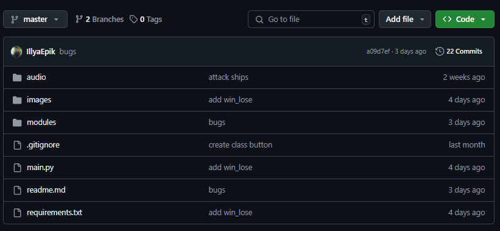

# Online game - Sea Battle

* [Ілля Епік / Illya Epik]
* [Денис Бондар / Denys Bondar]
* [Субач Максим / Subach Maksim]
* [Лебідь Ілля / Ilya Lebid]
* [Бобошко Ксюша/ Ksyusha Boboshko]

## Назва проекту: Онлайн гра морський бій/ name project: Online game sea battles

#### опис:
* Ця гра дозволяє грати у морський бій удвох на різних комп'ютерах.
#### description:
* This game allows two players to play the sea battles on different computers

#### модулі/modules:
+ os 
+ pillow
+ random
+ threading
+ pygame
+ socket 

# структура проекту / project structure:
* Перше вікно: введення IP-адреси/First window: IP address input
* Друге вікно: етап розташування кораблів/Second window: ship placement stage
* Третє вікно: етап битви/Third window: battle stage
* Четверте вікно: результат гри (програш чи перемога)/Fourth window: game result (lose or victory)

# інструкція для запуску:
1. Для початку потрібно встановити:
* Python останньої версії
- https://www.python.org/downloads/
2. Зайти на Git Hub
3. У репозиторії проекту натиснути зелену кнопку "Code"

4. Обрати "Завантажити ZIP"
5. Перейти до завантаженого архіву та розархівувати його(Права кнопка миші -> "Витягнути до поточної папки".)

# instructions for launch

